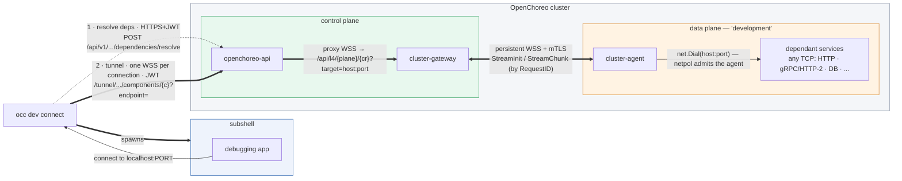
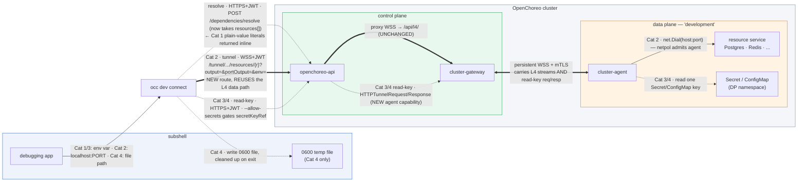

# `occ dev connect` — Design Worklog

A running record of the design for a developer-facing command that opens a subshell wired to a workload's remote dependencies, tunneled into an OpenChoreo cluster over authenticated TCP.

> **How to read this doc.** Newest decisions and explanations go at the top of the Changelog. The Design sections below are kept current (they describe the latest state, not the history). The Changelog is the history.

---

## 0. Handoff summary (for a fresh session)

Read this first, then §3a (design confidence), §10 (milestone status), §12 (testing), §13 (chart bug). This section holds the operational details not spelled out elsewhere.

### Current implementation state
- Feature is **functionally complete and proven live** end-to-end (M0–M6) on local k3d, plus the netpol reachability fix. Branch `dependency-tunnelling`, **5 commits** on top of upstream/main `ad065f0fc`:
  - `7028a89c6` M0/M1/M2 — agent label, agent raw-TCP bridge, gateway `/api/l4/`
  - `fe7996d99` M3 — `/dependencies/resolve` endpoint
  - `b08544488` M4 — api `/tunnel/` WS proxy
  - `f67449642` M5 — `occ dev connect` command
  - `7eadd1e07` fix — netpol admits the agent for any component (risk #0)
- **Untracked, intentionally not committed:** the worklog + other root `*.md` files; the `h2-greeter` sample CRs (live in-cluster only; full YAML in §12); no tests for the new tunnel code yet.
- **Live cluster state right now** (would need re-establishing after a cluster reset):
  - `controller-manager` is **live-patched to `imagePullPolicy: IfNotPresent`** and running the locally-built image with the netpol fix. A `helm upgrade` reverts this (see §13).
  - `cluster-agent-dataplane` carries `openchoreo.dev/system-component: cluster-agent` (committed in chart M0 + was also live-patched).
  - `h2-greeter` (project-only gRPC/HTTP-2, `hello-world-grpc:latest`) deployed in `default` → `dp-default-default-development-f8e58905`; `greeter-service` (HTTP) pre-existing.
  - Harmless leftovers: terminated ephemeral debug containers (`nettest*`, `h2probe*`) on the agent pod; clear on its next rollout.
  - The occ binary used for testing was built to `$CLAUDE_JOB_DIR/tmp/occ-dev` (ephemeral) — a fresh session must rebuild: `env -u GOROOT go build -o bin/occ ./cmd/occ`.

### Files touched (all committed)
- Agent: `internal/cluster-agent/l4.go` (new: `l4Session`, order-preserving `byteQueue`, `handleL4StreamInit`, `routeL4Chunk`); `internal/cluster-agent/agent.go` (`l4Streams` map + `New()` init + `case "l4"` in the StreamInit switch + `routeL4Chunk` in the inline chunk router ~`agent.go:260`).
- Gateway: `internal/cluster-gateway/l4.go` (new: `handleL4`, `chunkData`); `internal/cluster-gateway/server.go` (registered `mux.HandleFunc("/api/l4/", s.handleL4)` ~line 122).
- API: `internal/openchoreo-api/api/handlers/resolvedependencies.go` (new: `ResolveDependenciesHandler`, package-level `lookupProviderEndpoint`, `formatEndpointAddr`); `internal/openchoreo-api/api/handlers/l4tunnel.go` (new: `L4TunnelHandler`, `resolvePlane`, `buildGatewayL4URL`, `closeClientWS`); `cmd/openchoreo-api/main.go` (registered both on `topMux`, inside the `cfg.ClusterGateway.Enabled` block ~line 262).
- occ: `internal/occ/cmd/dev/cmd.go` + `internal/occ/cmd/dev/connect.go` (new); `internal/occ/root/root.go` (`dev.NewDevCmd()`).
- Netpol: `internal/networkpolicy/networkpolicy.go` + `_test.go` (Rule 3 broadened, both K8s + Cilium; 8 goldens).
- Chart: `install/helm/openchoreo-data-plane/templates/cluster-agent/deployment.yaml` (agent label).

### Likely-relevant files NOT touched
- Pattern templates: `internal/cluster-agent/exec.go`, `internal/cluster-gateway/exec.go` (the L4 code mirrors these; exec bidirectional bridge + `pendingStreamSessions`/`handleStreamChunk` router is reused unchanged).
- `internal/controller/releasebinding/controller.go:571` (calls `MakeComponentPolicies` → the netpol) and `controller_connections.go` (`resolveConnection`, whose logic `lookupProviderEndpoint` mirrors).
- `api/v1alpha1/workload_types.go`, `releasebinding_types.go` (types); `internal/occ/cmd/component/exec.go` + `internal/occ/auth/token.go` + `internal/occ/cmd/config/config.go` (occ WS/auth/config).

### Key decisions & why (not in §3 D1–D9)
- **Order-preserving `byteQueue` in the agent** (not exec's `stdinPipe`): `stdinPipe` drains its internal buffer before its channel, which **reorders bytes under backpressure** — harmless for keystrokes, stream-corrupting for L4. `byteQueue` is a strict FIFO drained by a writer goroutine; `routeL4Chunk` pushes non-blocking because it runs inline on the agent's single message loop.
- **API resolves the tunnel target server-side** (occ sends `component`+`endpoint`+`env`, not `host:port`): prevents tunneling to an arbitrary in-cluster address now that the agent can reach everything. Shared `lookupProviderEndpoint` used by both resolve and tunnel handlers.
- **Netpol fix = broaden the existing `system-component` rule to all ports** (vs a dedicated agent-only rule): reuses the M0 agent label + the existing rule; the agent is a trusted platform component and tunnel authz lives at the API, not the netpol.
- **Reused `component:view` for authz** (both endpoints): avoids adding a PDP action/policy for the prototype.
- **`h2-greeter` endpoint declared `type: TCP`** though it serves gRPC: keeps it protocol-agnostic and avoids `deployment/service` route-render assumptions for gRPC.

### Commands & gotchas
- **Always prefix Go/make with `env -u GOROOT`** — gvm exports GOROOT for 1.26.2 but go.mod pins 1.26.3; otherwise builds fail with `compile: version … does not match`.
- `make k3d.update.<cluster-agent|cluster-gateway|openchoreo-api>` works (those use `IfNotPresent`). **`make k3d.update.controller` does NOT deploy local changes** (pullPolicy `Always` → re-pulls ghcr) — see §13 for the workaround.
- Manual authed `curl` against the API for testing: 2-step OIDC discovery → `http://thunder.openchoreo.localhost:8080/oauth2/token` `refresh_token` grant with `client_id=openchoreo-cli`, then **write the rotated tokens back to `~/.openchoreo/config`** (Thunder rotates refresh tokens). Irrelevant when occ drives the call — occ refreshes via `auth.RefreshToken()`.
- Live-proof results already recorded: M2 (`404` via gateway), M4 (`404` full chain), M6 (`curl` in subshell → greeter `404`), netpol fix (project-only h2-greeter → agent `TCP_CONNECT_OK`, `occ dev connect` → `HTTP_VERSION=2`).

### Bugs/errors encountered (and resolved)
- **Controller `imagePullPolicy: Always`** silently ran the ghcr image, so the netpol fix appeared not to work through ~5 rebuilds. Root-caused via pod `imageID` being a ghcr `@sha256` repo digest. Fixed by reclaiming the local tag (`k3d image import …`) + patching to `IfNotPresent`. (§13)
- **Stale-netpol false positive**: right after re-applying a workload, the netpol still carried the old rule; polling loops broke early on it. Lesson: force a full re-render (delete+recreate the component, or inspect the `RenderedRelease` CR directly) rather than trusting an immediate read.
- Go toolchain mismatch (above).

### Constraints / do NOT change
- Tunnel access control is enforced at **openchoreo-api (JWT + PDP)**, not in the NetworkPolicy — don't try to make the netpol per-user.
- `routeL4Chunk` (agent) **must stay non-blocking** — it runs inline on the agent's single WS read loop; blocking stalls every tenant's tunnel.
- Never hand-edit generated code (`zz_generated_*`, `config/crd/bases/`, oapi `gen/`) — regenerate.
- Commits: `git commit -s` (DCO), Conventional Commits, **no `Co-Authored-By` trailer** (repo convention); license header uses the current year.
- Keep the worklog and sample CRs untracked unless asked.

### Remaining TODOs (priority order)
1. **Ship the chart fix** for controller pullPolicy (`values.yaml:227` `Always`→`IfNotPresent`) — otherwise no one can dev the controller on k3d (§13).
2. **Tests** — there are **none** for the new tunnel code (agent `l4.go`, gateway `l4.go`, api `resolvedependencies.go`/`l4tunnel.go`, occ `dev/connect.go`). Needed for PR; only `networkpolicy` is covered.
3. **Multiplexing (D8) + per-stream flow control** — collapse a session onto one occ→api WS; bound the `byteQueue`. Required for the "scalable, many users" goal (§3a residual risk).
4. **Verify the Cilium netpol variant live** — only the Kubernetes variant was exercised (local k3d has no Cilium); the Cilium path is unit-tested only.
5. occ **token refresh for long sessions** (currently fetched once at session start).
6. Dedicated PDP action (`component:connect`/tunnel) instead of `component:view`.
7. UDP decision (out of scope today).
8. **Subshell-only listener isolation** — local listeners bind host-wide `127.0.0.1:<port>` (reachable by any local process/user); scope them to the subshell via a Linux network namespace, with a loopback fallback on macOS/Windows. Documented known limitation (§3a); also lets concurrent sessions reuse the same preferred port.
9. **Dependency Resources not tunneled** — `dev connect` handles only `spec.dependencies.endpoints[]` (`GetDependencyEndpoints`), not `spec.dependencies.resources[]`. Resources resolve to `ResourceReleaseBinding` outputs (value/secretKeyRef/configMapKeyRef) + `fileBindings`, a different model — some outputs are network addresses (tunnelable), others are credentials/config/mounted files (inject verbatim). Extension, not a quick patch.
10. Run `/verify` (lint, full test, manifests-diff) + `/pr-prepare` before opening a PR.

### Assumptions that may be wrong — verify
- **Scale/concurrency untested** — single-user only; the persistent-tunnel-multiplex + HA-agent story is inherited from exec/wirelogs but not load-tested.
- **`byteQueue` is unbounded** — a fast producer with a slow consumer can grow memory (no flow control yet).
- **Cilium variant unverified live** (see TODO 4).
- **occ subshell signal handling** (`signal.Ignore(SIGINT)`) tested with zsh/bash on macOS only.
- **occ token fetched once** — a multi-hour session could 401 mid-stream; re-run occ to recover.
- Env-var scheme formatting assumes the resolver's `scheme` (http/https/ws/wss/tls → `scheme://…`, else `host:port`); verified for HTTP + TCP endpoints only.

---

## 1. Goal (the one-liner the user wants to run)

```
occ dev connect --workload workload.yaml --environment development
```

This should:

1. Authenticate to an OpenChoreo cluster using `occ`'s existing credentials.
2. Read the dependencies declared in `workload.yaml`.
3. Resolve where each dependency actually lives in the `development` environment.
4. Open a **TCP** tunnel into the cluster for each dependency (any protocol — Postgres, Redis, gRPC, plain TCP — not just HTTP).
5. Drop the developer into a **subshell** where each dependency is reachable on a local address (e.g. `localhost:6379`), with the workload's env-var names already set.
6. Be **authenticated** end-to-end and **scalable** — many developers tunneling into the same cluster at once.

Inspiration: `kubectl port-forward`. But we are **not** bound to its transport (SPDY). We use OpenChoreo's existing WebSocket tunnel instead.

---

## 2. What the codebase already gives us (grounding)

The design is not greenfield. Three existing pieces do most of the heavy lifting:

### 2.1 `occ` CLI — auth + streaming already exist
- Cobra-based CLI. Entry: `cmd/occ/main.go`, command tree in `internal/occ/root/root.go`.
- Already authenticates with **OAuth 2.0** (PKCE browser flow *and* client-credentials), stores JWT + refresh token in `~/.openchoreo/config`, auto-refreshes on expiry (`internal/occ/auth/token.go`, `internal/occ/cmd/login/login.go`).
- Talks to **`openchoreo-api`** via a generated OpenAPI client (`internal/occ/resources/client/openapi_client.go`).
- **`occ component exec`** already does interactive streaming over a **binary WebSocket** with stream-type byte prefixes (stdin/stdout/stderr/resize) — proof the streaming pattern is established (`internal/occ/cmd/component/exec.go`, `internal/openchoreo-api/api/handlers/exec.go`).
- There is **no** `dev`, `connect`, `port-forward`, or `tunnel` command yet → greenfield for the command surface, but built on proven plumbing.

### 2.2 `cluster-gateway` ↔ `cluster-agent` — a reverse tunnel that already exists
- `cluster-agent` (runs in each data plane) **dials out** to `cluster-gateway` (runs in the control plane) and keeps a **persistent WebSocket-over-mTLS** connection. (`internal/cluster-agent/agent.go`, `internal/cluster-gateway/server.go`)
  - Important: the data plane initiates the connection, so **no inbound firewall holes** are needed in the data plane.
- Message protocol (`internal/cluster-agent/messaging/types.go`):
  - `HTTPTunnelRequest` / `HTTPTunnelResponse` — synchronous request/response.
  - `HTTPTunnelStreamInit` — open a long-lived stream.
  - `HTTPTunnelStreamChunk` — carries `Data []byte`, a `StreamID` for **multiplexing many streams over one tunnel**, and an `IsClose` flag.
- **mTLS with per-CR (Custom Resource) CA validation**: the gateway validates each agent's cert against the specific DataPlane CR's CA and remembers which CRs that agent may serve (`internal/cluster-gateway/server.go` per-CR validation, `connection_manager.go`). Multiple agent replicas per plane → round-robin HA.
- Already implemented over this tunnel: **exec** (bridged to k8s SPDY *inside* the data plane) and **wirelogs** (Cilium Hubble → SSE).
- **Crucial gap:** raw **L4 / port-forward is stubbed and returns `501 Not Implemented`** (`internal/cluster-gateway/server.go` ~ streaming detection). The wire protocol (`StreamInit`/`StreamChunk` + `StreamID`) is ready; the handler is not. **This feature fills exactly that gap.**

### 2.3 Workload / Environment data model — dependencies are already declarative
- **Workload CRD** (`api/v1alpha1/workload_types.go`):
  - `spec.endpoints{}` — what the component *exposes* (type HTTP/gRPC/TCP/UDP/…, port, targetPort, visibility).
  - `spec.dependencies.endpoints[]` — other components this workload *consumes*, each a `WorkloadConnection` (target project/component/endpoint name + visibility) with `envBindings` mapping the resolved address into env-var names (`address`, `host`, `port`, `basePath`). A binding of `_` means "resolve but don't inject".
  - `spec.dependencies.resources[]` — external resources.
- **Environment CRD** (`api/v1alpha1/environment_types.go`): `spec.dataPlaneRef` points an environment (e.g. `development`) at a DataPlane/ClusterDataPlane (i.e. a physical cluster + its agent).
- **Address resolution already exists** in the control plane: the **ReleaseBinding controller** resolves each connection to a concrete in-cluster address and records it in status (`internal/controller/releasebinding/endpoint_resolve.go`, `controller_connections.go`, `releasebinding_types.go`).
  - In-cluster form: `{scheme}://{service}.{namespace}.svc.cluster.local:{port}{basePath}`.
  - `status.endpoints[]`, `status.resolvedConnections[]` hold the resolved host:port per dependency.
- Concrete example with dependencies: `samples/from-image/url-shortener/components/api-service.yaml` (depends on `snip-postgres` `tcp` and `snip-redis` `tcp`, the latter injected as `REDIS_ADDR`).

**Takeaway:** we already know, server-side, the exact in-cluster `host:port` + protocol for every dependency in a given environment. We don't invent resolution — we reuse it.

---

## 3. Design decisions (iteration 1)

| # | Decision | Why |
|---|----------|-----|
| D1 | **Reuse the existing gateway↔agent WebSocket tunnel** for L4; implement the stubbed port-forward handler rather than build a new transport. | The hard part (persistent reverse tunnel, mTLS, multiplexing, HA) already exists and is battle-tested for exec/wirelogs. |
| D2 | **No SPDY.** Carry raw TCP bytes as `StreamChunk` payloads, multiplexed by `StreamID`. | Works over standard 443/WSS, survives proxies/load-balancers, and supports *any* TCP protocol — not just k8s-style HTTP-upgrade. |
| D3 | **occ talks to `openchoreo-api`, which proxies to `cluster-gateway`** (same two-hop path as exec/wirelogs). | Keeps the **public JWT auth boundary** at `openchoreo-api` and the **mTLS boundary** at gateway↔agent. Consistent with existing code. |
| D4 | **One local TCP listener per dependency**; **one logical stream per accepted connection** (new `StreamID`). | Mirrors `kubectl port-forward`'s local-listener model; multiplexing lets thousands of connections share the persistent tunnel. |
| D5 | **Two-phase command**: (a) resolve dependencies once, set up listeners + subshell; (b) lazily open tunnel streams per connection. | Fast startup; only pay for tunnels actually used; clean teardown on shell exit. |
| D6 | **Authorize twice**: once at resolve time, and again per tunnel-open against the specific target component/environment, via the existing PDP/Casbin authz. | A long-lived session shouldn't outlive a permission change; per-stream re-check is cheap. |
| D7 | **Env-var injection follows the workload's `envBindings`**, but points at `localhost:<local-port>` instead of the in-cluster address. | The local app's config is identical to production; only the address is rewritten to the local tunnel mouth. |
| D8 | **One persistent tunnel WebSocket per `dev connect` session**, multiplexing all ports/connections by `StreamID` (not a WebSocket per connection). | Scales to many concurrent connections over one pipe; matches the existing gateway↔agent multiplexing. See section 8. |
| D9 | **The cluster-agent must be an allowed ingress source on component NetworkPolicies** — label it `openchoreo.dev/system-component` (prototype) or have the netpol generator add the agent's identity per target (productized). | Verified blocker (risk #1): components' generated policies otherwise reject the agent. The generated rule already admits `system-component`-labelled pods, so this reuses existing machinery. |

### Open questions (to resolve in later iterations)
- O1: Should the local listener bind a **fixed** port (from the dependency's declared port) or an **ephemeral** port mapped via env vars? (Leaning: prefer the declared port; fall back to ephemeral on conflict and rewrite the env var.)
- O2: How to authenticate the developer **as a workload identity** to the dependency itself (e.g. mTLS/service-account that the real component would have)? Or is L4 reachability enough for iteration 1?
- O3: UDP support (Workload allows UDP endpoints) — WebSocket stream is reliable/ordered; UDP semantics need a datagram framing decision.
- O4: Per-user/-session **quotas and rate limits** at the gateway for fair multi-tenant use.
- O5: Do we expose a new REST resolve endpoint, or extend the OpenAPI client? Exact endpoint paths TBD.

---

## 3a. Design & architecture confidence — ~92% (2026-07-01)

This rates the **design/architecture**, not the prototype code quality. It rose from ~80% (initial) → ~88% (pre-build feasibility) → **~92%** after building and live-validating the full slice. The strongest signal: **no architectural assumption required a redesign during implementation**, and the one genuine design gap discovered (agent reachability) had a clean fix that fit the existing model.

**Proven sound (validated live, so effectively de-risked):**
- **Transport bet — reuse the existing gateway↔agent WebSocket+mTLS reverse tunnel for raw L4, no SPDY.** Bytes flow end-to-end (M2/M4/M6). The core architectural choice holds.
- **Protocol-agnostic.** Both HTTP/1.1 (greeter) and HTTP/2/gRPC (h2-greeter) ride the raw tunnel unchanged → "any TCP protocol" is real, not aspirational.
- **Two-hop auth boundary** (JWT at openchoreo-api; mTLS gateway↔agent; per-target PDP authz) works with real tokens and rotation.
- **Server-side resolution** from `ReleaseBinding.status`, including for a not-yet-deployed consumer.
- **Reachability model** — agent admitted by the component NetworkPolicy — now correct for *any* component regardless of visibility (netpol generator fix), with the tunnel's access control deliberately at the API layer, not the netpol.
- **Fits the platform** — required zero new infrastructure and zero new transport; slotted onto existing rails. That coherence is itself strong evidence the design is sound.

**Residual design risk (the ~8%) — not yet validated, mostly about scale/concurrency:**
- **Multi-user scalability is the biggest open design question.** "Scalable, many users to one cluster" was an explicit goal. Single-user is proven; concurrent-many-user is architecturally reasonable (persistent multiplexed tunnel + round-robin agent replicas — patterns the gateway↔agent link already uses for exec/wirelogs) but **not stress-tested**. The prototype also uses one WebSocket per local connection rather than the designed single multiplexed session (D8, §8); at scale the multiplexed design likely matters. Confidence the *architecture* can scale is good; it's just unproven.
- **Per-stream flow control / back-pressure** (§9 risk #3) is designed only in outline; needed for high-throughput or many concurrent streams to avoid unbounded buffering.
- **openchoreo-api as a long-lived WS proxy** for every stream is an extra hop in the hot path; fine functionally, but its resource behaviour under load is unvalidated (a more direct occ→gateway path is a possible future optimization).
- **UDP** is out of scope by design (WS is ordered/reliable) — a documented limitation, not a risk.
- **Broadened agent netpol reach** (agent can dial all component ports) widens the network trust surface; acceptable because authz is enforced at the API, but it's a deliberate trade-off worth revisiting for stricter tenancy.
- **Local listeners are host-wide, not subshell-scoped (known limitation).** occ binds each dependency on `127.0.0.1:<port>` (`connect.go` `listenLocal`), reachable by any process/user on the machine — a TCP loopback port has no per-process access gate. The subshell scopes the *env vars* (address discovery) but not the *socket* (reachability), so a process outside the subshell that connects to `localhost:<port>` still tunnels straight through. Concurrent `dev connect` sessions compound this: they all share host loopback (the preferred port goes to the first session, later ones fall back to ephemeral ports), and every session's tunnels are mutually reachable. True subshell-only isolation is only OS-enforceable via a **Linux network namespace** (run listeners + subshell in a private netns — also lets concurrent sessions reuse the same preferred port); **Unix domain sockets** narrow it to the current user but break the protocol-agnostic goal for non-unix-socket clients; **macOS cannot scope a transparent TCP loopback port below machine-wide.** Accepted as a known limitation for now; netns isolation is the future improvement (§0 TODOs).

**Bottom line:** the fundamental architecture is validated and I'd build on it without hesitation. The remaining uncertainty is concentrated in *scale/concurrency behaviour*, which is a productization/validation task (load testing + implementing the multiplexed session and flow control), not a sign the design is wrong.

## 4. Architecture diagram

*As-built (matches the implementation on branch `dependency-tunnelling`).*



Box legend: `occ dev connect` runs the local listeners + tunnel client and spawns the **subshell**; the **debugging app** is your service inside it, reaching each dependency on `localhost:PORT`. In the **control plane**, `openchoreo-api` exposes two endpoints — `POST /api/v1/namespaces/{ns}/dependencies/resolve` (JWT + `component:view`, returns each dep's in-cluster `host:port`+scheme+envBindings) and the WebSocket `/tunnel/namespaces/{ns}/components/{component}?env=&project=&endpoint=` (JWT + authz, **resolves the target server-side** so a client can't tunnel to an arbitrary address) — and proxies the tunnel to `cluster-gateway` `/api/l4/{planeType}/{planeID}/{crNs}/{crName}?target=host:port`. The **data plane** `cluster-agent` `net.Dial`s the service; it is admitted by the component NetworkPolicy (system-component rule — §9 risk #0 fix).

**Connection model (as built):** one WebSocket **per accepted local connection** on the occ→api and api→gateway hops. The gateway↔agent link is the **single shared persistent tunnel** that multiplexes all users' streams by `RequestID`. Collapsing a session's many connections into one multiplexed occ→api WebSocket is designed (D8, §8) but deferred.

Any protocol rides the same raw-TCP tunnel: env vars are injected per the workload's `envBindings` pointed at `localhost` — e.g. `REDIS_ADDR=localhost:6379` (TCP → `host:port`) or `HR_SVC_URL=http://localhost:8080` (HTTP → `scheme://host:port`). Verified live with HTTP/1.1 (greeter-service) and HTTP/2/gRPC (h2-greeter).

**Scope:** this as-built diagram covers **endpoint** dependencies (`spec.dependencies.endpoints[]`) only. **Resource** dependencies (`spec.dependencies.resources[]`) are not built; their *designed* flow — reusing this L4 tunnel for endpoint-valued resource outputs, plus a new agent read-key path for config/secret outputs — has its own diagram in §14.4.

---

## 5. System sequence diagram

*As-built (matches the implementation and the live end-to-end runs).*

```mermaid
sequenceDiagram
  autonumber
  actor Dev as Developer
  participant OCC as occ dev connect
  participant API as openchoreo-api
  participant PDP as Authz (PDP / Casbin)
  participant GW as cluster-gateway
  participant AG as cluster-agent (data plane)
  participant SVC as In-cluster service

  Note over AG,GW: At startup the agent dials OUT and keeps ONE persistent WSS+mTLS tunnel to the gateway (shared by all users; streams keyed by RequestID)

  rect rgb(245,245,255)
  Note over Dev,API: Phase A — setup (runs once)
  Dev->>OCC: occ dev connect --workload wl.yaml --environment development
  OCC->>OCC: parse workload deps; load ~/.openchoreo/config (JWT, refresh if expired)
  OCC->>API: POST /api/v1/namespaces/{ns}/dependencies/resolve<br/>{project, environment, connections[]} + JWT
  API->>PDP: component:view per target component (ns / project / env)
  PDP-->>API: allow
  API->>API: per dep: find provider ReleaseBinding → status.endpoints[name].serviceURL
  API-->>OCC: resolved [{component, endpoint, scheme, host, port, address, envBindings}]
  OCC->>OCC: bind one local TCP listener per dep (preferred port → ephemeral)
  OCC->>Dev: spawn subshell with env vars (e.g. DEP_ADDR=localhost:PORT)
  end

  rect rgb(245,255,245)
  Note over Dev,SVC: Phase B — live (repeats per TCP connection; ONE WSS per connection on occ→api and api→gateway)
  Dev->>OCC: app connects to localhost:PORT
  OCC->>API: WSS /tunnel/namespaces/{ns}/components/{component}?env=&project=&endpoint= + JWT
  API->>PDP: component:view on target component
  PDP-->>API: allow
  API->>API: resolve target server-side (component+endpoint+env → host:port)
  API->>GW: WSS /api/l4/{planeType}/{planeID}/{crNs}/{crName}?target=host:port
  GW->>GW: GetForCR (mTLS-validated agent for this DataPlane CR)
  GW->>AG: StreamInit{target:"l4", path:host:port} over persistent tunnel (RequestID)
  AG->>SVC: net.Dial(host:port)
  Note over AG,SVC: allowed by the component NetworkPolicy (admits system-component pods)
  AG-->>GW: readiness (StreamChunk)
  loop bidirectional raw bytes
    Dev->>OCC: bytes
    OCC->>API: WS binary frame
    API->>GW: WS binary frame
    GW->>AG: StreamChunk (RequestID)
    AG->>SVC: bytes
    SVC-->>AG: bytes
    AG-->>GW: StreamChunk
    GW-->>API: WS binary frame
    API-->>OCC: WS binary frame
    OCC-->>Dev: bytes
  end
  Dev->>OCC: close connection
  OCC->>API: WS close
  API->>GW: WS close
  GW->>AG: StreamChunk(IsClose)
  AG->>SVC: close
  end

  rect rgb(255,245,245)
  Note over Dev,OCC: Phase C — teardown
  Dev->>OCC: exit subshell (or Ctrl-C)
  OCC->>OCC: close all local listeners + per-connection tunnels
  end
```

Notes on the as-built flow:
- **occ names the target, the API resolves it.** occ sends `component`+`endpoint`+`env` on the tunnel open; `openchoreo-api` resolves the concrete `host:port` server-side (same lookup as Phase A) — a client cannot request an arbitrary in-cluster address.
- **One WebSocket per accepted connection** on the occ→api and api→gateway hops (prototype). The gateway↔agent link is the single shared persistent tunnel carrying `StreamInit`/`StreamChunk` keyed by `RequestID`. Multiplexing a whole session onto one occ→api WebSocket is designed (D8, §8) but not yet built.
- **Reachability** depends on the component NetworkPolicy admitting the agent (system-component) — see §9 risk #0 (fixed so this holds for any endpoint visibility).
- **occ's own token refresh** (not shown per-step) handles expiry/rotation transparently on each API call.

---

## 11. M1 + M2 detailed design (grounded in `exec.go`)

The exec path is the working template. L4 is **exec minus the SPDY/typing**: one bidirectional raw-byte stream per connection instead of multiplexed stdin/stdout/stderr.

**Protocol mapping (reuse existing message types — no new wire types):**
- `HTTPTunnelStreamInit{ RequestID, Target: "l4", Path: "<host:port>", IsUpgrade: true, UpgradeProto: "tcp" }` — one `RequestID` per accepted TCP connection (the connection id; analogous to an exec session).
- `HTTPTunnelStreamChunk{ RequestID, Data: <raw bytes> }` both directions — **no 1-byte stream-type prefix** (exec uses one to fold stdout/stderr/stdin into a session; L4 doesn't need it). `IsClose: true` ends the connection.

### M2 — gateway (smaller than expected; mostly a clone of `handleExec`)
The gateway already routes inbound agent chunks generically: `handleStreamChunk` (`exec.go:247`) looks up `pendingStreamSessions[RequestID]` and pushes to `session.fromAgent` (with a 5s back-pressure timeout). **An L4 session registers in the same map and reuses this untouched.** So M2 = a new `handleL4` HTTP handler modelled on `handleExec` (`exec.go:35`):
1. Parse `/api/l4/{planeType}/{planeID}/{crNs}/{crName}?target=host:port`.
2. `GetForCR` → upgrade the api-facing connection to WS → register a `streamSession`.
3. Send the `Target:"l4"` `StreamInit` to the agent.
4. Two pumps (identical shape to exec): api-WS→agent as `StreamChunk`; `session.fromAgent`→api-WS as binary frames. `IsClose`/read-error on either side → send close + return.
- Register the route alongside the others at `server.go:~121`: `mux.HandleFunc("/api/l4/", s.handleL4)`.
- Differences from exec: no `buildK8sExecQuery`, no SPDY proto, raw bytes (skip the first-chunk "ack" or keep it as a connection-established signal).

### M1 — agent (the real net-new work)
Dispatch: in the message loop, add a `case "l4"` at `agent.go:247-252` → `go a.handleL4StreamInit(init)`. For inbound chunks, check an L4 registry before the exec one: `if !routeHubbleChunk && !routeL4Chunk { routeStreamChunk }` (`agent.go:260`).

`handleL4StreamInit` (model on `handleHTTPTunnelStreamInit`, `exec.go:168`):
1. `conn, err := net.Dial("tcp", init.Path)` (the host:port). Dial failure → `sendStreamClose(RequestID, err)`.
2. Register `l4Session{ requestID, conn, inbound chan []byte, done, once }` in a new `a.activeL4` map (parallel to `activeStreams`; exec's map is exec-typed, so a separate map is least-invasive).
3. **Outbound goroutine** (conn→tunnel): `for { n,err := conn.Read(buf); if n>0 { sendStreamChunk(StreamChunk{RequestID, Data: buf[:n]}) }; if err { sendStreamClose; cleanup; return } }`. `sendStreamChunk` writes synchronously under `a.mu` → **natural back-pressure** from the WS to the TCP read (good).
4. **Inbound writer goroutine** (tunnel→conn): `for data := range session.inbound { conn.Write(data) }`. `routeL4Chunk` feeds `session.inbound`.

**Critical correctness point (from reading the code):** inbound chunks are routed **inline** in the agent's single message loop (`agent.go:261` calls `routeStreamChunk` synchronously, not in a goroutine). So `routeL4Chunk` must **never block** — if it wrote to `conn` directly and the socket stalled, it would freeze *every tenant's* tunnel. Mirror exec's `stdinPipe`: a buffered channel (`inbound`, cap ~64) with a select/default + internal-buffer fallback, drained by the writer goroutine. (The fallback buffer is unbounded → that's risk #3, per-stream flow control, deferred for the prototype.)

**Close semantics (prototype):** `IsClose` from the gateway → close `conn` (unblocks the outbound goroutine → it cleans up). Outbound EOF → `sendStreamClose` + remove from map. Guard teardown with `sync.Once` to avoid double-close. **Half-close is not modelled** (full close on either end); fine for request/response DB protocols, noted as a limitation for protocols needing it.

**Reuse scorecard:** gateway inbound routing — reuse as-is; gateway handler — clone exec; agent — new `l4.go` (~exec.go size minus SPDY), new registry + 2 dispatch lines. No new message types, no new transport, no auth changes.

### M0 — the agent NetworkPolicy fix (diff)
Add the `system-component` label to the **pod template** only (NOT the immutable `selector`) in `install/helm/openchoreo-data-plane/templates/cluster-agent/deployment.yaml`:

```diff
   template:
     metadata:
       labels:
         app: cluster-agent
         app.kubernetes.io/component: cluster-agent
+        openchoreo.dev/system-component: cluster-agent
         {{- include "openchoreo-data-plane.selectorLabels" . | nindent 8 }}
```

The generated component NetworkPolicy rule keys on the label's **existence** (`operator: Exists`), so the value is free-form; `cluster-agent` is used for clarity. This is the durable form of the fix proven live in §9.

## 10. Vertical-slice prototype plan

**Goal:** prove the whole chain — `occ dev connect --workload wl.yaml --environment development` → one dependency → a single TCP stream that reaches a real in-cluster service. Target the already-deployed **`greeter-service:9090`** in `development` (reachability already proven). Build **bottom-up** so the riskiest piece (agent raw-TCP through the existing tunnel) is validated before any UX exists.

**Prototype simplifications (intentional, to cut risk):**
- TCP only; one dependency.
- **One WebSocket per local connection** (defer the single-multiplexed-session-WS, D8/section 8, to after the slice works).
- Reuse exec's auth path (JWT + `AuthzChecker`); no dedicated PDP action yet.
- Agent reachability via the proven label fix (D9).
- Deferred entirely: multiplexing, per-stream flow control, UDP, per-session dynamic NetworkPolicy, productized chart label, dedicated authz action.

| Milestone | What | Key files | Acceptance | Effort |
|---|---|---|---|---|
| **M0 — Unblock agent** | Add `openchoreo.dev/system-component: cluster-agent` to the agent pod template (the proven fix, now durable). | `install/helm/openchoreo-data-plane/templates/cluster-agent/deployment.yaml` | Deployed agent pod carries the label; agent can `net.Dial` greeter (proven). | S |
| **M1 — Agent L4 dial + bridge** | On an L4 `StreamInit{target host:port}`: `net.Dial("tcp", …)`, then bridge conn↔`StreamChunk` both directions; handle `IsClose`/errors. New target sentinel (e.g. `"l4"`) carrying host:port. | new `internal/cluster-agent/l4.go` (model on `exec.go`); dispatch in `agent.go`; `messaging/types.go` | Unit test bridges bytes; manual echo through a fake tunnel. | **L** |
| **M2 — Gateway L4 handler (fill the 501 stub)** | New `/api/l4/{planeType}/{planeID}/{crNs}/{crName}?target=host:port` (WS). `GetForCR` → send `StreamInit` → pump bytes WS↔`StreamChunk`, one stream per WS; close/timeout. | new `internal/cluster-gateway/l4.go` (model on `exec.go`); register at `server.go:~121` (`/api/l4/`) | **Risk-retirement checkpoint:** a throwaway WS client hitting `/api/l4/...` *directly* (in-cluster) reaches greeter:9090 → `404`. Proves the data path through the existing mTLS tunnel before api/occ exist. | M |
| **M3 — API resolve endpoint** | Given workload (file) + environment → `[{name, proto, in-cluster host:port}]`. Reuse releasebinding resolution (`internal/controller/releasebinding/endpoint_resolve.go`) / provider Service DNS. **Retires risk #2.** | new handler under `internal/openchoreo-api/api/handlers/`; client iface + `gen` | `POST` workload+env → correct host:port for the dep. | M |
| **M4 — API L4 tunnel proxy** | WS endpoint occ connects to (JWT + authz), proxying to the gateway L4 endpoint. Mirror exec proxy. | `internal/openchoreo-api/api/handlers/`; register at `cmd/openchoreo-api/main.go:~262` (`/tunnel/`) | occ-side WS reaches greeter through the full chain. | M |
| **M5 — `occ dev connect`** | Cobra cmd: parse workload+env → call resolve → open one local listener per dep → spawn subshell with env vars (per `envBindings`, pointed at `localhost`) → per accepted conn open WS to `/tunnel/` and bridge → teardown on exit. | new `internal/occ/cmd/dev/`; register in `internal/occ/root/root.go:~62`; reuse WS client + auth from `internal/occ/cmd/component/exec.go` | `occ dev connect …` opens a shell; `curl localhost:<port>` inside → greeter `404`; exit tears down. | **L** |
| **M6 — E2E on k3d** | `make k3d.update` for agent/gateway/api; build occ; run the flow; test 2+ concurrent conns; confirm teardown. | — | Full happy path + concurrency + clean teardown. | S |

**Suggested order & gating:** M0 → M1 → **M2 (stop and validate the data path here)** → M3 → M4 → M5 → M6. M1+M2 are where the real uncertainty lives; everything after is integration/UX. M3 can be built in parallel with M1/M2 (independent).

**Implementation status (branch `dependency-tunnelling`, off upstream/main `ad065f0fc`):**
- **M0 — done (code).** Label added to the agent pod template: `install/helm/openchoreo-data-plane/templates/cluster-agent/deployment.yaml`.
- **M1 — done (code).** New `internal/cluster-agent/l4.go` (`l4Session`, order-preserving `byteQueue`, `handleL4StreamInit`, `routeL4Chunk`); wired into `agent.go` (struct field + `New()` init + `case "l4"` dispatch + `routeL4Chunk` in the inline chunk router).
- **M2 — done (code).** New `internal/cluster-gateway/l4.go` (`handleL4`, reuses the generic `streamSession`/`handleStreamChunk` registry); route registered at `server.go` (`/api/l4/`).
- **Verification:** `go build` (pkgs + both binaries), `go vet`, `gofmt`, and existing unit tests for both packages all pass. *(Toolchain note: this env needs `env -u GOROOT go …` — gvm exports a stale `GOROOT` for 1.26.2 while go.mod pins 1.26.3.)*
- **M2 live checkpoint — PASSED (2026-06-30).** Built+deployed both images to k3d, patched the data-plane agent Deployment with the `system-component` label (agent reconnected: "connected to control plane"), then drove `/api/l4/dataplane/default/_cluster/default?target=greeter-service.dp-default-default-development-…:9090` with a throwaway WS client. Result: `CONNECTED → SENT_GET → RECV 176 bytes: "HTTP/1.0 404 Not Found … 404 page not found" → close 1000 (normal)`. Greeter's real response came back **through the tunnel**, proving the full path (WS client → gateway `/api/l4/` → StreamInit → mTLS tunnel → agent → `net.Dial(greeter:9090)` → bytes back) and that M0+M1+M2 work together (the labeled agent was admitted by the NetworkPolicy). The data-path risk is now retired.
- **M3 — done + PROVEN LIVE (2026-06-30).** New custom handler `internal/openchoreo-api/api/handlers/resolvedependencies.go` + registration in `cmd/openchoreo-api/main.go`: `POST /api/v1/namespaces/{ns}/dependencies/resolve`. Body `{project, environment, connections[]}` → per connection, finds the provider `ReleaseBinding` (in-memory filter by owner.projectName+componentName+environment), reads `status.endpoints[name].serviceURL`, returns `{scheme, host, port, path, address, envBindings}` (+ `pending[]` for unresolved). Authz reuses `component:view` per target (productized = dedicated `component:connect` action). Replicates the controller's `resolveConnection`/`formatEndpointAddress` but driven by request input, so it works for a **not-yet-deployed consumer**. Live test (deployed api): resolving a synthetic greeter-service connection returned HTTP 200 with `host=greeter-service.…svc:9090` — the exact target M2 tunneled to. Risk #2 retired. (Aside: Thunder rotates refresh tokens; occ refreshes in-memory and doesn't persist, so a manual bearer token must be minted via the refresh grant + written back — irrelevant once occ drives it in M5.)
- **M4 — done + PROVEN LIVE (2026-06-30).** New `internal/openchoreo-api/api/handlers/l4tunnel.go` (`L4TunnelHandler`) + registration `/tunnel/namespaces/{ns}/components/{component}?env=&project=&endpoint=` in `cmd/openchoreo-api/main.go`. Authorizes (`component:view`), **resolves the target server-side** via the shared `lookupProviderEndpoint` helper (extracted from M3's resolveOne — client cannot pick an arbitrary host:port), resolves env→plane coords (reusing exec's `resolveExecPlaneInfo` + `GetDataPlaneFromRef`), dials the gateway `/api/l4/` WS with `gwTLSConf`, and bridges client↔gateway (mirrors the exec proxy). Live test: an occ-style WS client → `ws://api.openchoreo.localhost:8080/tunnel/...greeter-service?env=development&endpoint=http` returned greeter's `HTTP/1.0 404` (`RESULT=BYTES_RECEIVED_THROUGH_FULL_CHAIN`), proving **the full authenticated server-side chain** (kgateway → api → gateway → agent → service). M0–M4 validated together.
- **M5 — done (2026-06-30).** New `internal/occ/cmd/dev/` (`NewDevCmd` + `connect`): parses the workload (`sigs.k8s.io/yaml` → `Workload`, reads `Spec.GetDependencyEndpoints()`), calls M3 resolve, opens one local TCP listener per dep (preferred port → ephemeral fallback), injects env vars per `envBindings` pointed at `localhost:<port>`, spawns `$SHELL`, and per accepted connection dials the M4 `/tunnel/` WS (bearer auth, occ's own token refresh) bridging raw bytes; tears down on shell exit. Registered in `internal/occ/root/root.go`. Builds/vets/gofmt clean.
- **M6 — FULL E2E PASSED (2026-06-30).** `occ dev connect --workload <wl> --environment development` against the live cluster: resolved greeter, printed `localhost:9090 -> greeter-service.…svc:9090`, spawned a subshell with `GREETER_URL=http://127.0.0.1:9090`, and a `curl $GREETER_URL/` inside returned greeter's `HTTP/1.1 404` (HTTP_STATUS=404), then `Tunnels closed.` on exit. Bytes flowed local curl → occ listener → api `/tunnel/` → gateway → agent → greeter and back. occ handled its own token refresh (production auth path). **The entire vertical slice works end-to-end.**

## 12. Testing guide (local k3d)

How to exercise the prototype end-to-end. Assumes branch `dependency-tunnelling`.

### Prerequisites
- **Code deployed to k3d:** rebuild the three components with the L4 code:
  `env -u GOROOT make k3d.update.cluster-agent && env -u GOROOT make k3d.update.cluster-gateway && env -u GOROOT make k3d.update.openchoreo-api`
- **Agent carries the netpol label** `openchoreo.dev/system-component: cluster-agent` (committed in the data-plane chart at M0). On an already-running release, apply it directly:
  `kubectl patch deployment cluster-agent-dataplane -n openchoreo-data-plane --type merge -p '{"spec":{"template":{"metadata":{"labels":{"openchoreo.dev/system-component":"cluster-agent"}}}}}'`
- **Control-plane gateway allows WS upgrades** (kgateway HTTPListenerPolicy — see `[[k3d-gateway-websocket-403]]`).
- **`occ login`** done; a target component deployed in `development`.
- **Toolchain:** this machine's gvm exports a stale `GOROOT`; prefix go commands with `env -u GOROOT` (gvm GOROOT 1.26.2 vs go.mod 1.26.3).

### 1. Build occ with the new command
```bash
env -u GOROOT go build -o bin/occ ./cmd/occ
```

### 2. HTTP target — greeter-service (already deployed)
```bash
cat > /tmp/workload-http.yaml <<'EOF'
apiVersion: openchoreo.dev/v1alpha1
kind: Workload
metadata:
  name: local-dev
spec:
  owner: { projectName: default, componentName: local-dev }
  dependencies:
    endpoints:
      - { project: default, component: greeter-service, name: http, visibility: project, envBindings: { address: GREETER_URL } }
EOF

./bin/occ dev connect --workload /tmp/workload-http.yaml --environment development
# inside the subshell:
echo $GREETER_URL            # -> http://127.0.0.1:9090
curl -i $GREETER_URL/        # greeter answers (404 for "/" = tunnel works)
exit                         # -> "Tunnels closed."
```

### 3. Raw-TCP / HTTP-2 target — gRPC hello-world (`h2-greeter`)
Deploy the sample component (NOT committed to the repo — apply this CR). Note `visibility: [external]` is required today so the netpol admits the agent (see caveat):
```bash
cat > /tmp/h2-greeter.yaml <<'EOF'
apiVersion: openchoreo.dev/v1alpha1
kind: Component
metadata: { name: h2-greeter, namespace: default }
spec:
  owner: { projectName: default }
  componentType: { kind: ClusterComponentType, name: deployment/service }
  autoDeploy: true
---
apiVersion: openchoreo.dev/v1alpha1
kind: Workload
metadata: { name: h2-greeter, namespace: default }
spec:
  owner: { componentName: h2-greeter, projectName: default }
  endpoints:
    grpc: { type: TCP, port: 9090, visibility: [external] }
  container: { image: "ghcr.io/openchoreo/samples/hello-world-grpc:latest" }
EOF
kubectl apply -f /tmp/h2-greeter.yaml
# wait until ready:
kubectl get releasebinding -n default h2-greeter-development -o jsonpath='{.status.endpoints[0].serviceURL.host}:{.status.endpoints[0].serviceURL.port}{"\n"}'

cat > /tmp/workload-h2.yaml <<'EOF'
apiVersion: openchoreo.dev/v1alpha1
kind: Workload
metadata:
  name: local-dev-h2
spec:
  owner: { projectName: default, componentName: local-dev-h2 }
  dependencies:
    endpoints:
      - { project: default, component: h2-greeter, name: grpc, visibility: project, envBindings: { address: H2_ADDR } }
EOF

./bin/occ dev connect --workload /tmp/workload-h2.yaml --environment development
# inside the subshell ($H2_ADDR = 127.0.0.1:9090):
curl -v --http2-prior-knowledge "http://$H2_ADDR/" 2>&1 | grep -iE 'HTTP/2|h2'   # proves h2 over the raw tunnel
# or, with grpcurl + server reflection:
grpcurl -plaintext -d '{"name":"Alice"}' "$H2_ADDR" greeter.Greeter/SayHello
exit
```

### Reachability caveat (risk #0)
The tunnel reaches a component only if its NetworkPolicy admits the agent (`system-component` rule), which is generated **only for gateway-visible endpoints**. That is why `h2-greeter` needs `visibility: [external]`. **Project/namespace-only internal deps are not reachable until the netpol generator is fixed.** See risk #0 in §9.

### Troubleshooting
- `401` / dial failed → token expired: `occ login`, retry.
- `no dependencies could be resolved` → provider not deployed in the env, or its endpoint not ready (`kubectl get releasebinding -n default <component>-<env> -o yaml`).
- `connection refused` to `localhost:<port>` → local port already in use; occ falls back to an ephemeral port — read the actual port from the banner.
- tunnel dial succeeds but bytes never return / agent-side `connection refused` → the target endpoint isn't gateway-visible (reachability caveat).

## 13. Known chart issue — controller `imagePullPolicy: Always` blocks local dev

**Symptom.** Local controller code changes never take effect on k3d: `make k3d.update.controller` builds + imports the image and restarts the pod, but controller behaviour is unchanged (agent/gateway/api updates DO work). Discovered while deploying the netpol generator fix (risk #0) — the fix was correct and unit-tested, but the running controller kept emitting the old policy.

**Root cause.** The controller-manager Deployment ships **`imagePullPolicy: Always`**, unlike `cluster-agent` / `cluster-gateway` / `openchoreo-api`, which use `IfNotPresent`. With `Always`, on pod (re)start the kubelet **re-pulls `ghcr.io/openchoreo/controller:latest-dev` from the remote registry**, overwriting the node's locally-imported `latest-dev` tag with the published image. So `k3d image import` (which `make k3d.update.controller` relies on) is effectively ignored for the controller. Tell-tale: the pod's `imageID` is a `ghcr.io/openchoreo/controller@sha256:…` **repo digest** (remote pull) rather than a bare `sha256:…` local image id.

- Source: `install/helm/openchoreo-control-plane/values.yaml:227` → `controllerManager.image.pullPolicy: Always` (template ref: `install/helm/openchoreo-control-plane/templates/controller-manager/deployment.yaml:56`). Other components' pullPolicy in the same values file (lines 909, 2353, …) are `IfNotPresent`.

**Durable fix.** Set the controller's pullPolicy to `IfNotPresent` for local/dev installs — i.e. change `values.yaml:227` `Always` → `IfNotPresent` (or override it in the k3d/dev values overlay), matching every other component. (Prod installs that genuinely want `Always` can keep it via a separate values overlay.)

**Live workaround applied (this cluster).** Reclaimed the tag with `k3d image import ghcr.io/openchoreo/controller:latest-dev --cluster openchoreo`, then patched the running Deployment: `kubectl patch deployment controller-manager -n openchoreo-control-plane --type=json -p='[{"op":"replace","path":"/spec/template/spec/containers/0/imagePullPolicy","value":"IfNotPresent"}]'` and restarted. The controller now runs the local build. Note: a `helm upgrade` would revert this patch until the chart is fixed. See `[[k3d-controller-pullpolicy-always]]`.

## 9. Feasibility assessment (verified against code)

**Verdict: data path PROVEN LIVE (M2 checkpoint, 2026-06-30)** — raw TCP flows occ-style WS client → gateway → mTLS tunnel → agent → in-cluster service and back. Remaining work (M3–M6: resolve endpoint, api proxy, occ UX) is integration on a proven transport. **Confidence: ~95%.** (Pre-M2 this was ~88%, gated on whether the agent could actually dial a component over the tunnel — now demonstrated.)

**Confirmed in code:**
- Gateway L4 path is a clean stub returning `501` with a TODO listing the exact steps (`GetForCR` → `StreamInit` → bidirectional channel → chunks → close) — `internal/cluster-gateway/server.go:564`; upgrade detection at `server.go:533`.
- Multiplexing field already present: `HTTPTunnelStreamChunk{ StreamID int; IsClose bool }` — `internal/cluster-agent/messaging/types.go:101`. `StreamInit`/`StreamChunk` are already used by exec/wirelogs → proven bidirectional template.

**Net-new work (effort, not blockers):**
- `occ`: new `dev connect` (listeners, subshell spawn, tunnel client, env injection) — low risk.
- `cluster-gateway`: fill the 501 stub; map each accepted TCP connection → a `StreamID` — low-med (TODO + exec.go template).
- `cluster-agent`: **new raw-TCP dial path** — the current router is HTTP-only (`http.NewRequest`+`RoundTrip`, backends `kubernetes`/`http` only — `internal/cluster-agent/router.go:92`, `:20`). L4 needs `net.Dial(host:port)` + byte-bridge, and `StreamInit` must carry the **target address** (not just a named route). This is the biggest new chunk. — med risk.
- `openchoreo-api`: on-demand resolve endpoint + WS tunnel proxy to gateway (exec already proxies WS) — low-med.
- authz: new PDP action/resource for "tunnel to dependency endpoint".

**Resolved prerequisite — control-plane gateway must allow WebSocket upgrades (done on local k3d).**
The kgateway/Envoy gateway fronting `api.openchoreo.localhost:8080` (`Gateway gateway-default` in `openchoreo-control-plane`) rejects *every* WS upgrade with `403` unless its HCM has `upgrade_configs` for `websocket` — this would otherwise block exec/wirelogs *and* the L4 tunnel. **Fix (applied & confirmed working 2026-06-30 on the current local cluster):** an `HTTPListenerPolicy` (`gateway.kgateway.dev/v1alpha1`) in `openchoreo-control-plane` targeting `gateway-default` with `spec.upgradeConfig.enabledUpgrades: ["websocket"]`. So this is **no longer a blocker** for local development. Productization note: it's likely an install bug — `install/helm/openchoreo-control-plane/` never enables WS upgrades out of the box, so the durable fix is to ship this HTTPListenerPolicy in that chart. See `[[k3d-gateway-websocket-403]]`.

**Real risks / potential blockers (ranked):**
0. **RESOLVED (2026-07-01) — netpol generator now admits the agent for ALL components regardless of visibility.** *Was:* the `system-component` ingress rule was generated only for gateway-visible endpoints, so project/namespace-only deps (the common dev case: DBs, internal services) were unreachable by the agent. *Fix:* in `internal/networkpolicy/networkpolicy.go`, broadened Rule 3 (both Kubernetes + Cilium variants) from `broadAccessPorts` (internal/external only) to `projectPorts` (all declared ports) — so every component's netpol admits `system-component` pods on all ports. Tunnel access control stays at the openchoreo-api layer. 8 golden unit tests updated; package tests green. **Proven live:** a project-only `h2-greeter` (no visibility) now gets the `system-component` rule (RenderedRelease + DP netpol), agent → `TCP_CONNECT_OK`, and full `occ dev connect` E2E returned `HTTP_VERSION=2` (HTTP/2 over the raw tunnel to an internal-only gRPC dep). See also the pullPolicy gotcha in §9 note.

   **Dev-loop gotcha found en route:** the **controller-manager Deployment ships `imagePullPolicy: Always`** (agent/gateway/api use `IfNotPresent`). So `make k3d.update.controller` imports the local build but the pod re-pulls the *ghcr* image — local controller changes silently don't deploy. Workaround applied on the live cluster: reclaim the `latest-dev` tag via `k3d image import` + patch the manager container to `IfNotPresent`. Durable fix candidate: set the controller's pullPolicy to `IfNotPresent` for local dev in the chart. See `[[k3d-controller-pullpolicy-always]]`.
1. **Data-plane NetworkPolicy blocks the agent — CONFIRMED on local k3d, with a cheap fix.** Each component gets a generated NetworkPolicy (`policyTypes: [Ingress]`) admitting only (a) same-namespace pods (`from: podSelector: {}`) and (b) any-namespace pods labelled `openchoreo.dev/system-component` (the sole holder is `gateway-default`). The `cluster-agent-dataplane` pod is neither, so it cannot dial component service ports directly. Verified empirically against `greeter-service:9090` (`10.43.156.98`): from the **agent's** network identity → `Connection refused`; from a **same-namespace** pod → `HTTP/1.1 404` (connection established, service live). Same target/port/moment, only the source differs → the policy is the cause. This is the first feature to hit it: exec uses API-server→kubelet, wirelogs uses the Hubble relay; the L4 tunnel is the first **direct agent→component-service** path. **Fix:** give the agent the `openchoreo.dev/system-component` label (leverages the existing generated rule — one line) or extend the NetworkPolicy generator to allow the agent's identity (more precise; scopes per target). See D9.

**Fix PROVEN LIVE (2026-06-30):** labelled the running agent pod `openchoreo.dev/system-component=cluster-agent` (no rollout — NetworkPolicy evaluates source labels in real time) and re-probed: the same agent→`greeter-service:9090` request flipped from `Connection refused` to `HTTP/1.1 404` (connected). The label was the only change. Reverted afterwards; agent stayed `Running`, `restarts=0`. Durable fix = add the label (or generator allow-rule) to the agent's Deployment pod template.
2. **Resolving deps for a not-yet-deployed workload**: resolution lives in `ReleaseBinding.status` (populated when consumer is deployed); the command may take an undeployed `workload.yaml`, so providers must be resolved on demand. Design wrinkle.
3. **Per-stream flow control**: `StreamChunk` is fire-and-forget; needs credit-based back-pressure for high-volume L4 (fine for a prototype).
4. **UDP**: WS is reliable/ordered → declare **TCP-only for v1**.

**Recommendation:** build a vertical slice (`occ dev connect` → one redis dep → single stream end-to-end) to retire risk #2 quickly. Risk #1 is now **proven fixed live** (label flip: refused → connected) and the WS-upgrade prerequisite is satisfied locally — so the two environmental/reachability unknowns are both retired. Remaining work is mostly build effort (agent raw-TCP path) plus the on-demand resolution design (risk #2). **Confidence ~88%.**

## 8. Multiplexing & wire format

**One physical tunnel, many logical streams.** A `dev connect` session uses a single persistent WebSocket (occ↔api, then proxied over the existing gateway↔agent tunnel). Every accepted local TCP connection becomes one **stream** with a unique integer **stream ID**; every frame is tagged with that ID and demuxed back to the right socket at each end.

A port is *not* a stream — a **connection** is. So multiple ports *and* multiple connections to the same port are all just distinct stream IDs:

```
stream id  ⇄  accepted TCP connection from the app  ⇄  backend host:port
   7            app's 1st connect to localhost:6379       redis:6379
   8            app's connect to localhost:9090           hr-svc:9090
   9            app's 2nd connect to localhost:6379       redis:6379   (same dep, new id)
```

Frame kinds (maps to the existing `HTTPTunnelStreamInit` / `HTTPTunnelStreamChunk{Data,StreamID,IsClose}`):
- **stream-init** (control, small JSON): open stream `id`, bind it to `{env, target host:port}`.
- **stream-data / stream-close**: raw TCP bytes for `id`, or close `id`. Data is best carried as **binary** frames `[id][flags][raw bytes]` to avoid base64 bloat from JSON `[]byte`.

**Session start** carries no app bytes — WS handshake + JWT only (resolve-deps happened earlier over plain HTTPS). The first app connection emits a `stream-init`; the agent dials the backend and replies `stream-init-ok`; only then do bytes flow.

**Concurrent calls** interleave freely on the one connection and are routed by `id`:

```
→ [init id=7 target=redis:6379]
→ [init id=8 target=hr-svc:9090]
← [init-ok id=7]   ← [init-ok id=8]
→ [data id=7 "*1\r\n$4\r\nPING\r\n"]
→ [data id=8 "GET /employees HTTP/1.1\r\nHost…"]
← [data id=8 "HTTP/1.1 200 OK\r\n…"]
← [data id=7 "+PONG\r\n"]
→ [close id=7]
```

Streams are independent (closing 7 doesn't touch 8) and back-pressure is tracked **per stream**, so a slow hr-svc response can't stall redis traffic. This per-stream multiplexing is what lets one user — and, at the gateway↔agent layer, all users — share one persistent tunnel and still scale (relates to D1/D4).

> Clarifies the sequence diagram's "open L4 tunnel stream": that means a new **logical stream** (a `stream-init`) over the one session WebSocket — not a new WebSocket per connection.

## 7. Clarifications (Q&A)

**Q: Does the debugging app run inside the subshell?**
Yes. The subshell is a normal shell that `occ` launches with the dependency env vars pre-set. The app runs as a child of that subshell and inherits e.g. `REDIS_ADDR=localhost:6379`. The subshell does no networking itself.

**Q: Who exposes `localhost:6379` for the app to connect to? Is the app "asking occ for the redis URL"?**
`occ` exposes it, and no — the app never asks occ for a URL. At startup, inside the single `occ dev connect` process, occ (a) opens a listening socket (`bind`+`listen`) on `127.0.0.1:<local-port>` per dependency, then (b) spawns the subshell with the matching `localhost:<port>` baked into the env vars. Loopback is shared across all processes on the host, so when the app does a plain TCP connect to `localhost:6379`, the OS routes it to occ's listener; occ accepts and tunnels the bytes. The app thinks it's talking to redis directly — it has no idea occ is the peer. This is the same model as `kubectl port-forward`. The `app → occ` edge in the architecture diagram is the TCP connection terminating in the occ process, not a request for connection metadata.

**Q: Does occ background itself after spawning the subshell?**
No. `occ dev connect` stays in the foreground; the interactive subshell is what you see, while occ's listener + tunnel goroutines run concurrently in the same process. Exiting the subshell tears down listeners and tunnels.

## 14. Resource dependency resolution (design)

**Status:** design only — not implemented. Extends `occ dev connect` from endpoint dependencies (`spec.dependencies.endpoints[]`, shipped M0–M6) to **resource dependencies** (`spec.dependencies.resources[]`), today untouched (§0 TODO 9). Grounded in `api/v1alpha1/resourcetype_types.go`, `resourcereleasebinding_types.go`, and the production wiring in `internal/pipeline/component/context/resourcedependency.go` (`BuildResourceDependencyItem`).

### 14.1 The unit: a *binding*, not a resource
A resource dependency is consumed output-by-output: `WorkloadResourceDependency{ ref, envBindings{output→envVar}, fileBindings{output→mountPath} }`. Each referenced output (declared on the ResourceType, resolved on `ResourceReleaseBinding.status.outputs[]`) is exactly one source kind: `value` | `secretKeyRef` | `configMapKeyRef`. A real resource (e.g. Postgres) is a *bundle* of bindings spanning several categories at once, so the thing we categorize is a **binding**, not a whole resource.

### 14.2 The four categories (canonical)
| # | Category | Defined by (source kind + mechanism) | occ must… | DP fetch? | Tunnel? | Result in subshell |
|---|---|---|---|---|---|---|
| **1** | **Plain value** | `value` + env, *not* an address | inject the literal | no | no | `DB_NAME=orders` |
| **2** | **Endpoint value** | `value` + env, *is* a network address | open an L4 tunnel, rewrite to loopback | no¹ | **yes** | `DB_HOST=127.0.0.1`, `DB_PORT=54xxx` |
| **3** | **Referenced value → env** | `secretKeyRef`/`configMapKeyRef` + env | fetch the bytes from the DP, inject as a literal | **yes** | no | `DB_PASSWORD=<fetched>` |
| **4** | **Referenced value → file** | `secretKeyRef`/`configMapKeyRef` + file | fetch the bytes, write a 0600 temp file, point the path env at it | **yes** | no | `/tmp/…/ca.crt` + `DB_CA=/tmp/…/ca.crt` |

¹ The *address* comes from the control plane (a `value` output); only the traffic is tunneled.

**Cross-cutting sensitivity flag** (not a category): `secretKeyRef` = sensitive → opt-in + authz gated; `value`/`configMapKeyRef` = not. It rides *across* the categories, which is why "secrets" isn't a category on its own.

Difficulty splits along two lines: **value location** — Cat 1/2 values are at the control plane (`ResolvedResourceOutput.Value`), Cat 3/4 hold only a `{name,key}` reference whose bytes live on the DP and need a new "read a DP key" path; and **semantics** — the Cat 1-vs-2 split is the only classification problem, since the model has no flag marking a value as an address (see 14.3).

Illustrative — one Postgres resource spans all four: `host`/`port` (Cat 2, tunnel), `database`/`username` (Cat 1, inject), `password` (Cat 3, fetch+inject, sensitive), `caCert` file binding (Cat 4, fetch+materialize).

### 14.3 Cat 1 vs Cat 2 — declaring a tunnellable endpoint (the linchpin)
Value outputs are opaque strings; `host` and `port` are separate outputs with no grouping; occ can't tell an address from config, pair host+port, nor distinguish an in-cluster address (tunnel) from an external SaaS one (don't). Heuristics on values/env-var names misfire.

**Decision — mark it on the ResourceType output.** Semantic source of truth: the PE who authors the ResourceType knows `host` is an address, annotates it once, and every consumer benefits. Keeps the production Workload spec free of dev-only hints, and keeps tunnel-target resolution server-side. Proposed minimal API addition to `ResourceTypeOutput` (value-kind only):

```go
Endpoint *OutputEndpoint `json:"endpoint,omitempty"` // valid only when value is set

type OutputEndpoint struct {
    // PortOutput names a sibling value-kind output whose value is the port.
    // Omit when this output's value already encodes host:port.
    PortOutput string `json:"portOutput,omitempty"`
    // Scheme records the protocol for local env-var formatting (tcp, http,
    // postgres, redis…). Defaults to tcp. Mirrors the endpoint resolver's scheme handling.
    Scheme string `json:"scheme,omitempty"`
}
```

Validation (CEL XValidation): `endpoint` requires `value`; `portOutput`, if set, must name another value-kind output in the same ResourceType. (Implemented by editing the hand-written type + `make manifests`/`make generate` — never hand-edit the generated CRD/deepcopy.)

**Server-side resolution invariant** (reused from the endpoint tunnel): occ never names a raw `host:port`. It names `(resource ref, output name, env)`; openchoreo-api loads the ResourceReleaseBinding, reads the marked output's value (host) + `portOutput`'s value (port), and dials. Same guarantee the component tunnel gives — a client can't tunnel to an arbitrary in-cluster address.

**Incremental-adoption fallback (Phase 2):** for ResourceTypes not yet annotated, an occ-side flag `--tunnel-resource <ref>:<hostOutput>[:<portOutput>]` lets a developer name the endpoint outputs ad-hoc. Resolution still happens server-side (occ passes output *names*, the API reads their values), so the invariant holds.

### 14.4 Architecture — flow per category

*Design state — not built. Extends the as-built §4 diagram (endpoints only) to resource bindings. Colour zones match §4; edge styles: dotted = request/response HTTPS or read-key, thick = the L4 tunnel WSS.*



**Diagram legend.** Three data movements, keyed to the 4-category taxonomy (§14.2). **Resolve** (dotted, Phase A, once): the existing `/dependencies/resolve` endpoint is extended to accept `resources[]` and returns each binding pre-categorized — **Cat 1** plain values come straight back in this response and occ injects them, with *no runtime path*. **Cat 2** (thick, endpoint values): a *new* `/tunnel/.../resources/{r}` API route that **reuses the endpoint L4 data path wholesale** (api→gateway `/api/l4/` proxy → persistent mTLS tunnel → agent `net.Dial` → resource service); only the route and its server-side target resolution (resource+output+portOutput → host:port) are net-new. **Cat 3/4** (dotted, DP-read): the *one genuinely new capability* — a synchronous read-key request rides the existing gateway↔agent tunnel as `HTTPTunnelRequest`/`Response`, the agent reads a single Secret/ConfigMap key in the DP namespace, and occ injects the value (Cat 3) or writes a 0600 temp file (Cat 4). Secrets are opt-in (`--allow-secrets`) + PDP-gated. **Net:** the L4 tunnel is reused unchanged; the resource work is a resolve-endpoint extension plus the DP-read path.

- **Resolve (Phase A, once):** extend the resolve endpoint (`POST /api/v1/namespaces/{ns}/dependencies/resolve`) to also accept `resources[]` and return, per binding, a categorized entry — Cat 1 `{envVar, literal}`; Cat 2 `{envVar, tunnel target = resource+output+portOutput refs, scheme}`; Cat 3/4 `{envVar|mountPath, DP fetch handle}` (Phase 2/3).
- **Tunnel (Cat 2, Phase B):** new resource tunnel endpoint `/tunnel/namespaces/{ns}/resources/{resource}?output=&portOutput=&env=` mirroring the component one; the API resolves host:port from the RRB output server-side, dials the gateway `/api/l4/` unchanged, and the agent bridge is unchanged — the entire L4 data path is reused.
- **DP-read path (Cat 3/4, Phase 2/3):** to bring a secret/configmap key value to the laptop, add a synchronous agent capability "read {secret|configmap} key in the DP namespace" over the existing gateway↔agent tunnel (fits `HTTPTunnelRequest`/`Response`); the API authorizes and returns the value. occ injects it (Cat 3) or writes a 0600 temp file cleaned up on subshell exit (Cat 4). **Secrets deliberately puncture "the value never leaves the DP" → opt-in (`--allow-secrets`) + a dedicated PDP action, reviewed separately.**
- **Reachability caveat (resource variant of risk #0):** the agent must be admitted by any NetworkPolicy fronting the resource's DP-side service. The M0 fix broadened the agent's reach for *component* netpols; resource-provisioned services (arbitrary ResourceType manifests) may ship their own netpol — open item for Cat 2 against locked-down resources.

### 14.5 Phased plan
- **Phase 1 — value only (Cat 1 + 2).** Resolve returns literals + endpoint targets; occ injects config and tunnels endpoints. No DP-read path, no secrets. Makes DB-style deps *reachable* (address tunneled) even if the dev supplies credentials manually. Needs: ResourceType `endpoint` marker + regen; resolve-endpoint `resources[]` support; resource tunnel endpoint; occ resource handling in `dev/connect.go`.
- **Phase 2 — configmap + files (Cat 3/4 non-sensitive).** Add the DP-read path (agent read-key capability) + local file materialization; the `--tunnel-resource` fallback flag.
- **Phase 3 — secrets (Cat 3/4 sensitive).** Add `--allow-secrets` opt-in + dedicated PDP action + audit; reuse the Phase-2 fetch/materialize path.

### 14.6 Open questions
- OR1: ResourceType `endpoint` marker (chosen) vs a first-class "endpoint" output kind — the latter is a bigger change (breaks the exactly-one-of value/secret/configmap validation, resolution, wiring); deferred.
- OR2: Multi-endpoint resources (primary/replica, multiple ports) — pairing via `portOutput` per host output; confirm it's sufficient.
- OR3: Secret-exposure policy — is dev-time secret fetch acceptable at all, and under what authz/audit? (Phase 3 gate.)
- OR4: Resource-service reachability when the ResourceType ships a restrictive netpol (risk #0 analogue for resources).
- OR5: Cross-project resources are deferred in the type (`WorkloadResourceDependency.Ref` is same-project) — dev connect inherits that limit.

## 6. Changelog

- **2026-07-02 — Iteration 1.26 (resource-dependency architecture diagram).** Added a design-state architecture diagram + legend to §14.4 (which previously had prose bullets but no diagram), showing the three resource-binding data movements against the §14.2 taxonomy: the extended `/dependencies/resolve` (Cat 1 literals returned inline), the Cat 2 endpoint-value tunnel (a *new* `/tunnel/.../resources/{r}` route that **reuses the endpoint L4 data path wholesale**), and the Cat 3/4 DP-read path (a *new* `HTTPTunnelRequest`/`Response` agent read-key capability → inject or materialize a 0600 file, secrets opt-in). Diagram marks REUSED vs NEW explicitly. Left the as-built §4 diagram unchanged but added a scope note pointing to §14.4, so unbuilt resource work is not shown as built. No code changes — resource tunneling remains design-only (§0 TODO 9).
- **2026-07-01 — Iteration 1.25 (resource dependency resolution design).** Added §14: extends dev connect to `spec.dependencies.resources[]`. Canonical 4-category taxonomy of resource *bindings* (plain value / endpoint value / referenced-value→env / referenced-value→file) with a cross-cutting sensitivity flag; difficulty splits by value location (CP vs DP) and the value-vs-address semantic. Resolved the linchpin (Cat 1 vs 2): mark tunnellable outputs on the ResourceType output (`endpoint{portOutput, scheme}`, value-kind only) as the semantic source of truth, with the server-side target-resolution invariant preserved (occ names resource+output, never a raw host:port) and an occ `--tunnel-resource` fallback for un-annotated types. Architecture per category (extended resolve endpoint, new resource tunnel endpoint reusing `/api/l4/`, a new agent read-key DP path for Cat 3/4). Phased plan: P1 values+tunnel, P2 configmap+files, P3 secrets (opt-in + PDP action). Open questions OR1–OR5 incl. secret-exposure policy and resource-service netpol reachability.
- **2026-07-01 — Iteration 1.24 (document scope limitations: listener isolation + resources).** Recorded two known limitations. (1) **Local-listener isolation:** `dev connect` binds each dependency on host-wide `127.0.0.1:<port>` (reachable by any local process/user — a TCP loopback port has no per-process gate), so the subshell scopes env-var *discovery* but not socket *reachability*; concurrent sessions share host loopback and are mutually reachable. netns is the fix (also frees the preferred-port reuse); Unix sockets = user-scope but break protocol-agnosticism; macOS can't scope transparent TCP below machine-wide. Added to §3a residual risk + §0 TODOs. (2) **Resources not tunneled:** `dev connect` reads only `spec.dependencies.endpoints[]`, not `spec.dependencies.resources[]` — resources use a different resolution model (ResourceReleaseBinding outputs + fileBindings), so it's an extension, not a quick patch. Added to §0 TODOs.
- **2026-07-01 — Iteration 1.23 (handoff summary).** Added §0 handoff summary for a fresh session: current state (5 commits, live-cluster mutations still active, untracked artifacts), exact files touched + relevant untouched files, decisions-and-why not in D1–D9 (byteQueue ordering, server-side target resolution, netpol-broaden approach), commands/gotchas (`env -u GOROOT`, controller pullPolicy, manual token mint), bugs encountered, do-not-change constraints, prioritized TODOs, and assumptions to verify.
- **2026-07-01 — Iteration 1.22 (diagrams updated to as-built).** Rewrote §4 architecture and §5 system-sequence diagrams to match the implemented+proven system: real endpoint paths (`/dependencies/resolve`, `/tunnel/...`, gateway `/api/l4/...`), server-side target resolution on the tunnel hop, one-WSS-per-connection on occ→api/api→gateway with the shared persistent gateway↔agent tunnel keyed by RequestID, the NetworkPolicy-admits-agent fact, and occ's own token refresh. Both marked "as-built".
- **2026-07-01 — Iteration 1.21 (design confidence assessment).** Added §3a rating the design/architecture (distinct from implementation) at ~92%: what's proven-sound (transport bet, protocol-agnosticism, auth boundary, resolution, reachability, platform fit) and the residual ~8% (multi-user scale/concurrency, per-stream flow control, api-proxy-under-load — all validation/productization, not redesign). Key signal: no architectural assumption needed a redesign during the build.
- **2026-07-01 — Iteration 1.20 (document controller pullPolicy chart issue).** Committed the netpol fix (`7eadd1e07`). Added §13 documenting the controller `imagePullPolicy: Always` chart bug (`values.yaml:227`) that blocks local controller dev on k3d, its root cause/symptom, the live workaround applied, and the durable chart fix (`Always`→`IfNotPresent`).
- **2026-07-01 — Iteration 1.19 (netpol generator fix — internal deps now tunnelable).** Broadened the per-component NetworkPolicy's system-component ingress rule to all declared ports (K8s + Cilium) in `internal/networkpolicy/networkpolicy.go`, so the agent reaches any component regardless of endpoint visibility. Updated 8 golden tests (green). Retired risk #0. Proven live: project-only `h2-greeter` → agent `TCP_CONNECT_OK` → full `occ dev connect` E2E `HTTP_VERSION=2`. Also uncovered + worked around the controller's `imagePullPolicy: Always` breaking the k3d local dev loop.
- **2026-06-30 — Iteration 1.18 (testing guide).** Added §12 Testing guide: prerequisites, build occ, HTTP (greeter) test, raw-TCP/HTTP-2 (`h2-greeter`) test with the full sample CR + consumer workloads, the reachability caveat inline, and troubleshooting.
- **2026-06-30 — Iteration 1.17 (h2/gRPC sample + reachability finding).** Deployed `h2-greeter` (gRPC `hello-world-grpc` on :9090, TCP endpoint) as a second test target. Finding: the agent reaches a component only if its netpol carries the `system-component` rule, which is generated ONLY for gateway-visible endpoints — so project/internal-only deps are NOT reachable (added as risk #0). Worked around for the demo by giving h2-greeter `visibility:[external]`; proper fix = netpol generator must admit the agent regardless of visibility. M0–M6 demos only worked because targets were externally visible.
- **2026-06-30 — Iteration 1.16 (M5 occ command + M6 full E2E PASSED).** Built `occ dev connect` (`internal/occ/cmd/dev/`): workload parse → resolve → local listeners → subshell with injected env vars → per-connection WS bridge to `/tunnel/`. Builds/vets/gofmt clean. End-to-end on the live cluster: a `curl $GREETER_URL` inside the spawned subshell reached the in-cluster greeter (`HTTP 404`) through the full authenticated tunnel, with occ doing its own token refresh. The complete `occ dev connect` vertical slice now works. Prototype goal achieved (M0–M6).
- **2026-06-30 — Iteration 1.15 (M4 api L4 tunnel proxy, full chain proven).** Added `/tunnel/namespaces/{ns}/components/{component}` WS handler (`l4tunnel.go`) that authorizes, resolves the target server-side (shared `lookupProviderEndpoint`, refactored out of M3), and proxies to the gateway `/api/l4/`. Builds/vets/gofmt clean. Live: occ-style client through the api reached greeter (`HTTP/1.0 404`) — the entire authenticated server-side chain (kgateway→api→gateway→agent→service) works. Only M5 (occ CLI) + M6 (E2E) remain.
- **2026-06-30 — Iteration 1.14 (M3 resolve endpoint, proven live).** Added `POST /api/v1/namespaces/{ns}/dependencies/resolve` (custom handler `resolvedependencies.go` + main.go registration) resolving a workload's connections to provider in-cluster addresses from ReleaseBinding status. Builds/vets/gofmt clean. Deployed to k3d; live call resolved greeter-service to `…svc:9090` (HTTP 200), including the undeployed-consumer case → risk #2 retired. Authz reuses `component:view`.
- **2026-06-30 — Iteration 1.13 (M2 checkpoint PASSED live).** Deployed agent+gateway to k3d, applied the `system-component` label, and drove the new `/api/l4/` endpoint with a throwaway WS client: greeter returned `HTTP/1.0 404` back through the tunnel (`RESULT=BYTES_RECEIVED_THROUGH_TUNNEL`). Full data path proven end-to-end; M0+M1+M2 validated together. Confidence ~88% → ~95%. Probe code discarded; commit `7028a89c6` unchanged.
- **2026-06-30 — Iteration 1.12 (M0/M1/M2 implemented).** Built the data-path slice on branch `dependency-tunnelling`: agent label (M0), agent L4 bridge `internal/cluster-agent/l4.go` + dispatch wiring (M1), gateway handler `internal/cluster-gateway/l4.go` + `/api/l4/` route (M2). Compiles (pkgs + binaries), `go vet`/`gofmt` clean, existing unit tests pass. No new wire types/transport/auth. Next: the live M2 checkpoint (needs a k3d deploy).
- **2026-06-30 — Iteration 1.11 (M1/M2 detailed design).** Read the exec streaming implementation on both sides (`internal/cluster-agent/exec.go`, `internal/cluster-gateway/exec.go`, agent dispatch at `agent.go:233-279`) and wrote section 11: a code-grounded design for the agent L4 bridge (M1) and gateway L4 handler (M2). Key findings baked in: gateway inbound-chunk routing (`pendingStreamSessions`/`handleStreamChunk`) is generic and reused as-is; agent routes inbound chunks **inline** so `routeL4Chunk` must be non-blocking (mirror exec's `stdinPipe`). Included the M0 label diff (pod template only, not the immutable selector). No new wire types/transport/auth needed.
- **2026-06-30 — Iteration 1.10 (prototype plan).** Added section 10: a bottom-up vertical-slice plan (M0–M6) targeting the live `greeter-service:9090`, with intentional simplifications (TCP-only, one WS per connection, reuse exec auth). Grounded each milestone in real files/routes (agent Deployment at `install/helm/openchoreo-data-plane/templates/cluster-agent/deployment.yaml`; gateway routes at `server.go:119-121`; api exec registration at `main.go:262`). M2 flagged as the data-path risk-retirement checkpoint.
- **2026-06-30 — Iteration 1.9 (fix proven live).** Labelled the running agent pod `openchoreo.dev/system-component=cluster-agent` (no rollout) and re-probed: agent→`greeter-service:9090` flipped `Connection refused` → `HTTP/1.1 404`. Reverted; agent stayed up (`restarts=0`). Risk #1 now proven-fixed end-to-end. Both reachability/environmental unknowns retired → confidence ~88%.
- **2026-06-30 — Iteration 1.8 (NetworkPolicy probe — risk #1 confirmed + fixed in design).** Ran the reachability check on local k3d. Found each component carries a generated NetworkPolicy admitting only same-namespace pods and `openchoreo.dev/system-component`-labelled pods (only `gateway-default` has it). Empirically: agent identity → `Connection refused`, same-namespace pod → `HTTP/1.1 404` against `greeter-service:9090`. Confirmed the agent is blocked from dialing component services directly (first feature to need that path). Added D9 (label agent / extend netpol generator) as the fix; updated risk #1 to CONFIRMED-with-fix. Also recorded D8 (single multiplexed session WebSocket). Confidence holds ~85%.
- **2026-06-30 — Iteration 1.7 (retire kgateway WS blocker).** The control-plane gateway WS-upgrade `403` is already fixed on the current local k3d cluster via an `HTTPListenerPolicy` (`enabledUpgrades: ["websocket"]`, confirmed working 2026-06-30). Moved it from "blockers" to a resolved prerequisite (with the chart-level durable-fix note), renumbered remaining risks, and removed the environmental gate from the recommendation.
- **2026-06-30 — Iteration 1.6 (feasibility check).** Read the actual gateway/agent/messaging code to ground a feasibility call (section 9). Confirmed the gateway L4 stub + multiplexing field exist; found the agent router is HTTP-only so a raw-TCP dial path is genuinely net-new. Ranked real blockers (kgateway WS 403, data-plane NetworkPolicy, on-demand dep resolution). Verdict: ~80% confidence for a vertical-slice prototype.
- **2026-06-30 — Iteration 1.5 (multiplexing explained).** Added section 8 documenting how one persistent tunnel serves many ports via per-connection stream IDs, the stream-init / stream-data / stream-close frame kinds, and what the wire looks like at session start vs. concurrent calls. Clarified that "open L4 tunnel stream" = a new logical stream over the single session WebSocket, not a new WebSocket per connection.
- **2026-06-30 — Iteration 1.4 (nest app in subshell).** Nested the **debugging app inside the subshell** box (it was a sibling node), reflecting that the app is a child process of the subshell `occ` spawns. Kept `hr-svc:9090` in the same diagram.
- **2026-06-30 — Iteration 1.3 (second dependency example).** Added `hr-svc:9090` (HTTP) alongside `redis:6379` (TCP) in the architecture diagram to show one local listener per dependency and that both protocols ride the same raw-TCP tunnel. No new boxes — one extra listener edge and an updated services box + legend.
- **2026-06-30 — Iteration 1.2 (simplify boxes).** Reduced the architecture diagram to ten boxes per request: `occ dev connect`, subshell, debugging app, and the OpenChoreo cluster wrapping a control plane (openchoreo-api, cluster-gateway) and a data plane (cluster-agent, dependant services). Folded the local listeners into the `occ` node, collapsed the individual services into one "dependant services" box, and dropped the CRD node. Detail that was in the boxes now lives in the box legend below the diagram. Sequence diagram unchanged.
- **2026-06-30 — Iteration 1.1 (readability pass).** Reworked the architecture diagram only: color-coded the three zones (dev / control / data), collapsed `occ`'s auth+resolver+tunnel-client into one client node to declutter the cross-plane edges, numbered the setup steps (1 login → 2 resolve → 3 tunnel), and made the **subshell an explicit child the `occ dev connect` process spawns and keeps open until exit**. Sequence diagram unchanged.
- **2026-06-30 — Iteration 1.** Initial architecture + system sequence diagrams. Grounded the design in three existing subsystems: `occ` OAuth/streaming, the `cluster-gateway`↔`cluster-agent` reverse WebSocket tunnel (with its stubbed L4 handler), and the Workload/Environment/ReleaseBinding dependency-resolution model. Recorded decisions D1–D7 and open questions O1–O5.
