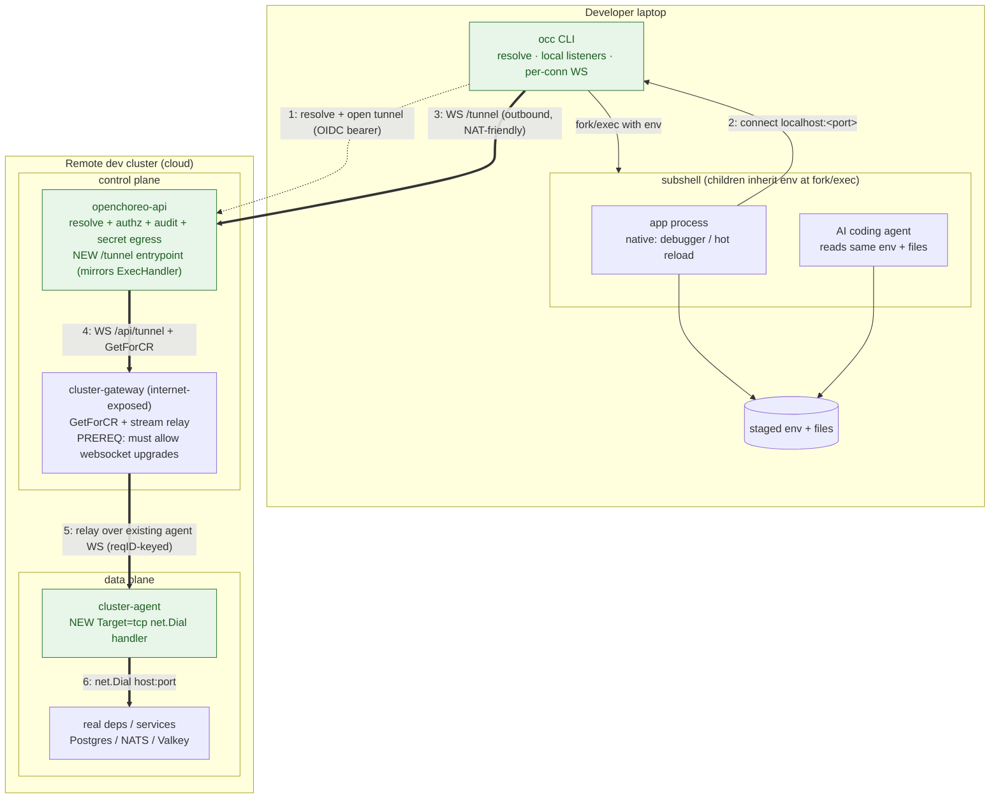

# Feasibility: forwarding the remote dev cluster's dependencies onto the local computer (Pillar 2, app-developer default)

## Verdict

**Feasible, and meaningfully lighter than the local-k3d variant — but it shares the one unavoidable core change (raw-TCP carriage) and the one unavoidable policy call (secret egress).** This is the `occ dev connect` path: the app runs *directly on the laptop* (the developer's normal process / debugger / IDE — no local cluster), and `occ` makes the dev cluster's dependencies reachable at `localhost:<port>` with the right env vars and files already materialized. Because nothing on the laptop is an OpenChoreo-reconciled object, this path **drops everything that made the k3d variant heavy** — no stub Services, no in-cluster DNS materialization, no consumer pod, and crucially **no fork of the dependency-resolution contract**. What remains hard is identical to the k3d case for exactly one dependency class: raw-TCP platform resources (Postgres/Valkey/NATS), which still need a capability the channel does not have today. The honest framing: the env/file materialization is *deterministic and small*; the raw-TCP data path is a *shared core build*; the secret-egress decision is *shared and load-bearing*.

This is the design that fills the **"The tunnel option in depth (local computer ↔ dev cluster)"** placeholder in `local_dev_story_new_proposal.md` — Option 1 for application developers (the fast default), as distinct from the local-k3d tunnel (`tunneling-dev-cluster-into-local-k3d-feasibility.md`, the advanced escalation).

## Validated against the codebase (2026-06-30) — corrections & a hard prerequisite

A working session traced the exec path end-to-end against the running code and a local k3d install. Three findings change how Option 1 should be built; they supersede any conflicting detail later in this doc.

**1. The routing is `occ → control-plane API → cluster-gateway → cluster-agent` (not `occ → gateway` directly).** `occ component exec` is the *only* `occ` command that opens a WebSocket today (`internal/occ/cmd/component/exec.go`). It dials the **control-plane API** at `/exec/namespaces/{ns}/components/{component}` with an OIDC Bearer token (auto-refreshed) — not the gateway. The server-side `ExecHandler` (`internal/openchoreo-api/api/handlers/exec.go`) resolves the component → pod/plane, authorizes (Casbin `component:exec`, per-environment), then itself dials the gateway's `/api/exec/{planeType}/{planeID}/{crNs}/{crName}`, which runs `GetForCR` (per-CR mTLS) and relays to the agent. So the tunnel is a **triple hop**, and the new client-facing entrypoint belongs on the **openchoreo-api** (mirroring `ExecHandler`), *not* on the gateway. `occ` never speaks plane/CR or mTLS — that stays server-side.

**2. The "new L4 stream type" is much smaller than this doc first assumed — no new message type.** The channel already runs many concurrent bidirectional byte streams over one agent WS, demultiplexed purely by `RequestID` (exec and Hubble wirelogs both rely on it), and dispatch is duck-typed with a `Target` switch, not a type tag (`internal/cluster-agent/agent.go`, `internal/cluster-gateway/server.go`). So raw TCP **reuses the existing `HTTPTunnelStreamInit`/`HTTPTunnelStreamChunk` verbatim** (`internal/cluster-agent/messaging/types.go`); the only protocol delta is a new `Target:"tcp"` whose `Path` carries the dial address. Net-new shrinks to: (a) an agent handler that, on `Target:"tcp"`, does `net.Dial(Path)` and pumps bytes through the existing `activeStreams`/`routeStreamChunk` machinery; (b) a gateway `/api/tunnel/…` handler that is a near-copy of `handleExec`; (c) an openchoreo-api `/tunnel` entrypoint mirroring `ExecHandler`; (d) the `occ` local listener. The `RequestID`-keyed multiplexing/demux is **reused, not built**.

**3. HARD PREREQUISITE — the gateway must allow WebSocket upgrades.** On the local k3d install the kgateway v2.3.1 / Envoy gateway fronting `api.openchoreo.localhost` rejected **every** WebSocket upgrade with `403` (empty body, `server: envoy`), on every route — its Envoy HCM had no `upgrade_configs` for `websocket`. This breaks `occ component exec`, Backstage wirelogs, **and** this tunnel, all at once, *before* any application code runs. Fix: a kgateway `HTTPListenerPolicy` on `gateway-default` with `spec.upgradeConfig.enabledUpgrades: ["websocket"]`. It is also an **install bug** (the chart ships WS features but never enables WS upgrades), so the durable fix is to template that policy into `install/helm/openchoreo-control-plane/`. *No streaming feature — including this tunnel — works until this is in place.*

**Wire-encoding note.** Chunks are `json.Marshal`ed and sent as WS **text** frames, so `Data []byte` is **base64** on the agent↔gateway leg (~33% bloat + a per-chunk marshal). Correct and proven (exec rides it), but budget a **binary frame** on that leg as a later optimization — not a correctness blocker.

**Env handoff: prefer a subshell over an `.env` file.** Rather than write `.env` and fight `set -a`/two-terminal races (see "Reading the env vars" below), have `occ` launch the app as a child that inherits the env at `fork/exec` — `occ dev run -- ./app` or `occ dev shell`. The same subshell also lets the IDE/debugger and any local AI-agent process inherit the tunnel env. The `.env` file remains a fallback for dotenv-expecting frameworks.

## What makes this lighter than the k3d variant — the consumer is `occ`, the address is `localhost`

The k3d feasibility doc identified two expensive, k3d-specific builds: (1) a new in-cluster **consumer-initiator** pod that dials out *and* initiates connections, and (2) **in-cluster DNS materialization** (stub Services / CoreDNS rewrite) so a pod resolves the dep's normal `<svc>.<dp-ns>.svc.cluster.local` name. Option 1 needs *neither*:

- **The consumer-initiator already exists — it's `occ`.** `occ` is an HTTP/WebSocket client against the OpenChoreo API (Bearer token over OIDC PKCE / client-credentials, no kubeconfig — `internal/occ/resources/client/openapi_client.go:47-89`, `internal/occ/cmd/login/login.go`). It already opens authenticated WebSocket streams to the gateway for `occ component exec` and `occ component logs`, with the same stdin/stdout/stderr framing the gateway uses (`internal/occ/cmd/component/exec.go:20-34`). A local TCP/HTTP listener that forwards into that same WebSocket is the *natural* next client on rails `occ` already rides — not a new component.
- **There is no in-cluster DNS to materialize.** The app is a laptop process, so the dep address is just `localhost:<port>` chosen by `occ`. No stub Service, no CoreDNS rewrite, no kube-proxy hop. The "DNS-transparency problem" that was a whole second project in the k3d doc collapses to "pick a free local port and write it into an env var."

## The ask decomposes into three cases, not one — same split, easier targets

A workload's declared dependencies (`Workload.spec.dependencies` — `api/v1alpha1/workload_types.go:210-226`) split by *how they're reached*, and the difficulty per class is wildly different — same three buckets as the k3d analysis, but the laptop target is simpler in each:

| Dependency class | How it's reached in the real env | Made available on the laptop as | Difficulty |
| --- | --- | --- | --- |
| **`external`-visibility endpoints** | already a public gateway HTTPS URL (`ExternalURLs`) | the same public URL, injected verbatim into the local env | **None** — laptop has internet egress; it calls the URL directly. No tunnel. |
| **HTTP/gRPC internal endpoints** | in-cluster `svc.<dp-ns>.svc.cluster.local` (the resolver emits this at `internal/controller/releasebinding/endpoint_resolve.go:199`, `clusterLocalSuffix` at `:20`) | a `localhost:<port>` HTTP listener `occ` runs, proxied over the **existing** HTTP proxy path | **Medium** — plain HTTP request/response rides the existing `/api/proxy/...` route today; gRPC (HTTP/2) and long-lived/upgrade streams need the streaming gap closed. |
| **Raw-TCP/UDP platform resources** (Postgres/Valkey/NATS) + raw-TCP endpoints | env-injected `host:port` from a `ResourceReleaseBinding` output (`api/v1alpha1/resourcereleasebinding_types.go:89-116`); raw wire protocols | a `localhost:<port>` raw-TCP listener `occ` runs, forwarded over a **new** raw-TCP/port-forward stream | **Hard — this is the shared core build.** No raw-TCP path exists in the channel today. |

The verdict is driven, as before, entirely by the third row. The channel carries HTTP request/response plus a few specific upgradeable streams (exec, Hubble wirelogs) — **never raw TCP** (`internal/cluster-gateway/server.go:564-574` returns HTTP 501 for "watch, logs -f, exec, port-forward … not yet supported through the HTTP proxy").

## What transfers vs. what's net-new

**Reusable as-is:**
- **Outbound-dial / NAT traversal** — the laptop is behind NAT, and `occ` already dials *out* to the CP over HTTPS/WSS; the cluster-agent likewise dials out (`internal/cluster-agent/agent.go:173-213`). The internet-exposed `cluster-gateway` stays the one rendezvous point, exactly as today.
- **Per-CR mTLS authZ** (`internal/cluster-gateway/server.go:670-791`, `verifyClientCertificatePerCR`; `connection_manager.go:277-323`, `GetForCR` filters to the agent's authorized CRs) — scopes *which* dev DataPlane a session may reach.
- **WS multiplexing + heartbeat/reconnect** (`connection_manager.go`; `HTTPTunnelStreamInit`/`HTTPTunnelStreamChunk` with `RequestID` correlation — `internal/cluster-agent/messaging/types.go:90-106`; PING/PONG at `server.go:304-326`) — a solid base for many concurrent forwarded connections.
- **The HTTP proxy, for row 2** — `/api/proxy/{planeType}/{planeID}/{namespace}/{crName}/{target}/{path...}` (`server.go:389-423`) already relays non-streaming HTTP into a DP service. A local HTTP listener that forwards plain request/response through this needs *no protocol extension* — it's the cheapest win in the whole design.
- **The OpenChoreo API + authz + audit**, for resolving coordinates (see "Resolution & secret egress" below).
- **The typed dependency contract** — `envBindings`/`fileBindings` are **real API fields today**, not aspirational (see next section). `occ` already parses them out of `workload.yaml` (`internal/occ/resources/workload/converter.go:55-76`).

> **Refined by the "Validated against the codebase" section above** — items 1 and 4 below are smaller/different than originally written: there is **no new message type** (reuse `HTTPTunnelStreamInit` with `Target:"tcp"` + the existing `RequestID`-keyed demux), and the relay is a **triple hop** (`occ → openchoreo-api → cluster-gateway → cluster-agent`), not a double hop.

**Net-new (the actual work):**
1. **A generic L4 stream type for the channel** — `TCPTunnelStreamInit` + bidirectional `TCPTunnelStreamChunk`, mirroring the exec framing (`internal/cluster-agent/exec.go:23-29`). *This is the same item-1 the k3d doc identified, and it is the single piece both options must share.* The good news specific to Option 1: it's the natural extension of the **exec** path, not the HTTP-proxy path — the gateway already relays a bidirectional SPDY exec stream over the WS (`internal/cluster-gateway/exec.go:109-118`, `UpgradeProto: "SPDY/3.1"`). *Caveat:* exec chunk payloads are `[]byte` marshaled into JSON text frames (base64) — fine for an interactive shell, wasteful for a chatty Postgres session; budget a binary frame.
2. **A local listener role in `occ`** — `occ` opens `localhost:<port>` and pumps bytes into the channel. For HTTP deps this is a local reverse proxy onto the existing `/api/proxy/...` route; for raw-TCP deps it's a local TCP `Accept()` loop onto the new L4 stream. *Both live in the `occ` process — no new pod, no k3d.* This is the consumer-initiator the k3d doc had to invent as a pod; here it's a CLI goroutine.
3. **The DP-side dial handler** — teach the remote **data-plane** cluster-agent to accept a stream and either (i) `dial(<svc>.<dp-ns>.svc.cluster.local:port)` and pump bytes, or (ii) drive the DP kube-apiserver `pods/<pod>/portforward` subresource and relay its SPDY stream (the agent already proxies the DP kube-apiserver, so (ii) reuses the exec/SPDY relay shape *and* inherits DP-side RBAC). Either way this is the *same request direction* as today (CP→DP), so it slots into the existing model cleanly — the easy half.
4. **Double-hop relay.** Dependencies live in the **data plane**; the gateway lives in the **control plane**. So the stream traverses **laptop(`occ`)→CP-gateway→DP-agent** — *both* hops are HTTP/exec-only today, so both carry the new stream type. Addressing extends the existing `/api/proxy/{planeType}/{planeID}/…` routing (`server.go:389-423`).
5. **A secret-value egress path in the API** (see "Resolution & secret egress").

## The addressing problem is trivial here (contrast: the k3d DNS-transparency project)

In the k3d variant, "reach the dep by its normal in-cluster DNS, single spec local+remote" was a second project (stub Services / CoreDNS). On the laptop there is no in-cluster name to honour, so addressing reduces to two deterministic rewrites that the **typed `envBindings` make unambiguous**:

- The endpoint binding type `ConnectionEnvBindings` names each value's *role* — `Address`, `Host`, `Port`, `BasePath` (`api/v1alpha1/workload_types.go:184-208`). So `occ` knows exactly which env vars carry a *network address* (rewrite those to `localhost:<local-port>`) versus which carry path/metadata (pass through). The real controller injects these for the in-cluster case at `internal/controller/releasebinding/controller_connections.go:224-263` (`buildEnvVarsForConnection`; `formatEndpointAddress` at `:268-291` produces `scheme://host:port/path` for http/ws/tls and `host:port` for grpc/tcp/udp) — `occ` produces the *same shape* with `host=localhost`, `port=<local>`.
- The resource binding's `EnvBindings`/`FileBindings` maps (`workload_types.go:244,252`) name which output goes to which env var / file path. `occ` redirects only the *address-bearing* outputs (host/port) to the local listener and passes the *credential* outputs (username/password/database) and *file* outputs (ca-bundle) through verbatim from the resolved binding.

So the laptop env ends up as, e.g., `DB_HOST=localhost`, `DB_PORT=<local-forwarded-port>`, `DB_USER`/`DB_PASSWORD`/`DB_NAME` from the resolved outputs, and `ca-bundle` written to the declared file path — which is precisely the `local_dev_story_new_proposal.md` Option-1 example, now grounded in real types.

## Resolution & secret egress — the load-bearing decision

`occ` does **not** hold a DP kubeconfig and must not. It resolves coordinates through the OpenChoreo API, which already enforces access and writes an audit record:

- **Resolution exists.** For resource deps, the controller looks up the active `ResourceReleaseBinding` by a `(project, resource, environment)` field index and reads `Status.Outputs` (`internal/controller/releasebinding/controller_resourcedependencies.go:142-211`). The same data is reachable over the REST API (`internal/openchoreo-api/mcphandlers/resources.go:25-282`; routes wired with auth + audit middleware at `cmd/openchoreo-api/main.go:227-230`). For endpoint deps, the rendered Service / `EndpointURL` gives `scheme/host/port/path` (`endpoint_resolve.go:191-206`).
- **AuthZ + audit are real.** Every API call is wrapped by a Casbin-backed PDP scoped per namespace/project/resource/**environment** (`internal/authz/core/interface.go:20-29`, `actions.go:11-53`, `services/resourcereleasebinding/service_authz.go:37-155`), and state-changing operations are audited with actor/action/result/requestID (`internal/server/middleware/audit/middleware.go:52-106`, `internal/openchoreo-api/audit/definitions.go:13-90`). So "who may forward which dep in which env" already has an enforcement point and a log — `occ` should resolve *through the API*, never around it.
- **But secret material does not transit today — and this is the decision.** By explicit design, secret outputs keep only a `{name, key}` reference on the control plane: *"the underlying value never leaves the data plane"* (`api/v1alpha1/resourcereleasebinding_types.go:107-109`; status doc at `:78-86`). In the real env those land in the consumer pod as mounted-Secret `valueFrom` references, not literals (`internal/pipeline/component/context/resourcedependency.go:100-114`). To make a *laptop* connect, the **actual** username/password/CA bundle must reach the laptop — directly contradicting that guarantee. There is **no API endpoint today that returns resolved secret values**; adding one (gated by env + access level, ideally minting short-lived/scoped credentials rather than handing over the long-lived DP secret) is net-new and is *the* security call. It is shared with the k3d variant, but more direct here: `occ` writes the values into a local `.env` and onto disk at the `fileBindings` paths.

## Cross-cutting risks (these, not the plumbing, are the load-bearing ones)

- **Secret egress onto the laptop** — as above. The mitigations live in the API/policy layer (per-env scope, access-level gating, short-lived creds, audit), not in tunnel code. Needs an explicit owner.
- **AuthZ scope + audit for a new principal.** A dev laptop becomes something that can open a line to *dev databases*. Per-CR mTLS handles "which plane"; the API authz handles "which dep / which env / which developer"; both must be on the resolve path, with the forwarding session itself audited (not just the initial resolve).
- **NetworkPolicy parity (DP side).** DP ingress is restricted by source-pod *labels*; a connection arriving from the agent won't carry the consumer's labels, so it may be silently blocked or need a carve-out. (Same as the k3d analysis; unchanged by where the consumer runs.)
- **HTTP-proxy semantics for row 2.** The existing proxy is request/response and explicitly *not* streaming (`server.go:564-574`); gRPC (HTTP/2) and long-lived/SSE/WebSocket upstreams won't ride it until the streaming gap is closed. Plain HTTP/1.1 request/response works today.
- **Performance.** Acceptable for dev, but JSON/base64-framed bytes is the wrong wire format for a DB session — budget a binary frame type (shared with the k3d build).
- **Sequencing.** This is the *lighter* sibling, so it's the right first thing to ship — but the raw-TCP capability it shares with the k3d variant is the long pole. The Pillar-1 local-source build is orthogonal here (the app runs natively on the laptop, however the developer already builds/runs it), which is another reason Option 1 unblocks app developers sooner.

## Product decision: this path does *not* fork the resolution contract — but `occ` owns a small parity surface

This is the sharpest contrast with the k3d variant, and it's good news. The k3d doc's central worry was that running the workload in a local cluster forces a *second, synthetic resolution mode*: there's no provider `ReleaseBinding`/`ResourceReleaseBinding` locally, so the controller's existence gate never passes and you must either synthesize provider CRs or inject env out-of-band — a fork of the resolution contract that needs an owner and a parity test.

**Option 1 sidesteps the fork entirely**, because **there is no OpenChoreo controller running on the laptop**. The app is just a process; nothing reconciles it; there is no existence gate to satisfy. `occ` resolves the *real* bindings in the *real* dev environment through the API and writes plain env vars + files. The "two resolution mechanisms" problem doesn't arise — there's one real resolution (in the cloud) whose *output* `occ` mirrors locally.

What remains is a *much smaller* parity surface: `occ` must mirror how a `ResolvedResourceOutput` maps into env/file — i.e. the `value` / `secretKeyRef` / `configMapKeyRef` three-way (`resourcereleasebinding_types.go:89-116`) and the rule that file bindings require a secret/configmap ref, not a literal (`resourcedependency.go` rejects value-kind file bindings with `ErrInvalidFileBinding`). Because `envBindings`/`fileBindings` are an **explicit declared contract in the API** — not the controller's internal resolution logic — `occ` is following the *same declared mapping* the controller follows, not re-deriving resolution semantics. The drift risk is real but narrow and easily covered by a single golden-output parity test ("`occ dev connect` produces the same env keys/files a real binding would inject"). Contrast the k3d path, where the fork touched the controller's existence gate itself.

**The decisions the product still owns** (both shared with the k3d variant, neither unique to it):
1. **The raw-TCP stream type is unavoidably core** — `cluster-gateway` + `cluster-agent` must learn it for row 3. This is the first local-dev-motivated behaviour to land in a core kept strictly environment-agnostic. *But it is the same capability both options need, so it's built once and amortized.*
2. **Secret-value egress is a security policy, not plumbing** — decide it (and its owner) before any data path ships.

## Effort read

- **`external` deps (row 1):** trivial — `occ` emits the public URL into the env; no tunnel.
- **HTTP/gRPC internal deps (row 2):** small-to-medium — a local HTTP listener over the *existing* proxy for plain HTTP; gRPC/h2 and long-lived streams wait on the streaming gap.
- **Raw-TCP resources (row 3):** the new L4 stream type × 2 hops + DP dial handler + the secret-egress API. This is the *same shared core* the k3d variant needs — but Option 1 **adds nothing else**: no k3d, no stub Services, no DNS materialization, no consumer pod, no resolution-contract fork. So Option 1's *total* is materially lighter than the k3d variant while sharing the one expensive piece. Net: **the raw-TCP capability is a real project; everything Option-1-specific (`occ` listeners + env/file materialization) is small.**

## How the app developer benefits — dependencies available to the developer *and* their AI agents

This is the point of Pillar 2's app-developer default, and it's where the local-computer variant pulls clearly ahead of the k3d one for everyday work.

**For the developer**, `occ dev connect` closes the *only* real gap between the shared dev cluster and the laptop: reachability to the databases, queues, and services the workload talks to. Once it runs, the app starts with its normal command, under the developer's normal debugger / hot-reload / profiler, and its dependency env vars and credential files are already populated — pointing at real dev dependencies through the tunnel. The inner loop becomes *edit → run locally → hit the real dev DB → repeat*, with no commit/push/build/deploy round-trip and no local cluster to operate. The dependency set is exactly what the committed `workload.yaml` declares — the same contract the cloud honours — so "works on my laptop against dev deps" tracks "works in the dev cluster" far more closely than ad-hoc port-forwards.

**For their AI agents**, the win is structural, not incidental. When `occ` materializes dependencies onto the laptop, it materializes them into the developer's *workspace* — environment variables and files that any local process can read, including an AI coding agent (Claude Code and the like) running in that workspace. That unlocks the loop AI agents are best at but are normally blocked from by missing dependencies:

- **Run and verify against real deps.** The agent can start the app, exercise it against the actual dev Postgres/Valkey/NATS, and *see real behaviour* — not mocks. "Reproduce this bug" becomes tractable when the data that triggers it is reachable.
- **Run integration tests locally.** Test suites that need a live database pass against the real dev binding, so an agent's red→green loop reflects reality.
- **Inspect and query the live dependency.** With the resolved coordinates on `localhost`, an agent can connect a SQL/CLI client to investigate schema, sample rows, or confirm a migration — grounding its edits in the actual system rather than guessing.
- **Read a machine-readable dependency manifest.** `workload.yaml`'s `dependencies` + `envBindings`/`fileBindings` are exactly the structured "here is what this app connects to, under these env-var names" map an agent needs to reason about wiring — no scraping of ad-hoc scripts.

**This is also where the risks bite hardest, and they must be designed-for, not bolted-on.** An AI agent in the loop means live dev credentials sit in the agent's reachable workspace and may be read, logged, or echoed by tooling. That sharpens every item in *Cross-cutting risks*: secret egress should prefer **short-lived, scoped, ideally read-only** credentials over the long-lived DP secret; the resolve-and-forward path must be **authz-gated per env + access level and audited** (the API already provides the enforcement and audit points — `services/.../service_authz.go`, `audit/definitions.go`); and `occ` should avoid printing secrets to stdout (already a stated proposal requirement) precisely because agent transcripts capture stdout. A natural forward design is to expose resolution + a managed forward as **MCP tools** over the existing control-plane MCP surface (`pkg/mcp/`): an agent asks "connect me to the `development` binding for resource X," and gets back a `localhost` endpoint and env — every grant access-controlled and audited at the API, with the secret material handled by `occ`/the API rather than pasted into the conversation.

## Recommendation

1. **Ship this as the app-developer default.** It's the lightest path that actually closes the dependency gap, it reuses `occ`'s existing auth/WebSocket client and the gateway's existing relay, and — uniquely among the options — it neither runs a local cluster nor forks the resolution contract. For HTTP deps it's nearly free (existing proxy); for raw-TCP deps it shares the one core capability with the k3d variant.
2. **Build the raw-TCP stream type once, reuse it twice.** It's the long pole for *both* Option 1 and the k3d tunnel. Frame it as a core channel capability (the exec-path extension), not a local-dev feature, and both options consume it.
3. **Settle secret egress before any row-3 data flows** — scope, lifetime, access-level gating, audit, and the no-stdout rule — with the AI-agent threat model explicitly in scope.
4. **De-risk in this order:** (a) land row 1 (emit external URLs) and row 2 (local HTTP listener over the existing proxy) — useful immediately, no protocol change; (b) prototype the L4 stream type as an extension of the exec relay between the gateway and a DP agent (proves the protocol cheaply, reusing the cross-cluster e2e harness); (c) settle the secret-egress policy; (d) only then wire `occ`'s local raw-TCP listener and the env/file materialization for resource deps.

## The `occ`-driven design (how we'd actually wire it)

The shape: the component **runs natively on the laptop**; the dev cluster's dependencies are **forwarded down to `localhost`** so the local process reaches them by `localhost:<port>` with credentials/files already in place; and `occ` drives the whole thing off the committed `workload.yaml`. Direction split, kept straight: *logical = remote→laptop; actual dial = laptop→remote* (the laptop is behind NAT, so every connection is dialed outward to the one internet-exposed `cluster-gateway`).

### `occ` command surface

```bash
# resolve everything workload.yaml depends on against the dev env, forward it to localhost,
# and emit the local env + files (long-running: holds the session open in this terminal)
occ dev connect --workload workload.yaml --env development

# emit the env under a custom name so it never clobbers a developer's own .env
occ dev connect --workload workload.yaml --env development --env-file .env.occ

# what's wired, on which local ports, and is each dep reachable
occ dev status

# tear down listeners + close the session
occ dev disconnect
```

Flags: `--only postgres-db,cache` (subset), `--env <name>` (target environment), `--env-file <name>` (where to write the generated env; **default `.env`**, e.g. `--env-file .env.occ` so it never overwrites a developer's existing `.env`), `--print` (emit shell `export` lines to stdout instead — non-secret values only), `--project/--component` (when not inferrable from `workload.yaml`).

> Naming note: the `local_dev_story_new_proposal.md` example uses `occ dev connect`/`occ dev disconnect` for this path, and `occ dev tunnel up/down` for the k3d path. Keeping the verbs distinct (`connect` = forward deps to the laptop; `tunnel` = join a local k3d to the dev cluster) signals which mechanism the developer is invoking.

### What `occ dev connect` does

1. **Reads `workload.yaml`** — collects `dependencies.endpoints[]` (component, name, visibility, `envBindings`) and `dependencies.resources[]` (ref, `envBindings`, `fileBindings`) via the existing descriptor parser (`internal/occ/resources/workload/converter.go:55-76`).
2. **Resolves them against the dev env via the OpenChoreo API** (not a raw DP kubeconfig) — so Casbin enforces *who* may connect to *which* env/dep and an audit record is written. Returns concrete coordinates: `planeID`, in-DP `svc/ns/port` for endpoints, and the resolved outputs for resources (host/port plus the resolved credential/CA values — *the secret-egress step*).
3. **Classifies each dep** by the three rows above. External → emit the public URL. HTTP/gRPC internal → plan a local HTTP listener over the existing proxy. Raw-TCP resource/endpoint → plan a local TCP listener over the L4 stream.
4. **Opens local listeners** — one `localhost:<port>` per forwarded dep, each backed by a scoped mTLS session `occ` holds open to the gateway.
5. **Materializes the env + files** — writes env vars per the typed `envBindings` into the env-file (default `.env`, overridable with `--env-file`), rewriting only the *address* bindings (`Address`/`Host`/`Port`) to the chosen local ports and passing credential/`BasePath` bindings through; writes `fileBindings` outputs (e.g. CA bundle) into the declared local paths. The env is written to a **file**, not exported into `occ`'s own shell — because the app is launched from a *separate* terminal (see next). Secrets go to a file, not stdout.

Then the normal inner loop runs on top: in a **separate terminal**, load the generated env-file and start the app natively; it reads `localhost:<port>` + creds from that env, and traffic flows through the session. Edit, rerun — the session stays up until `occ dev disconnect`.

### Reading the env vars from the app (started in a separate terminal)

`occ dev connect` is long-running — it blocks in its own terminal holding the listeners and the WSS session open — so the app is started in a **separate terminal**. This matters because of a hard Unix rule: environment variables are per-process and are copied to a child only at launch (`fork`/`execve`); a running process **cannot** inject variables into another, already-running shell. So the long-running `occ` in terminal A cannot set env vars in terminal B. The hand-off between the two terminals is the **file on disk** (the generated env-file plus the `fileBindings` outputs), and terminal B must load it at the moment it launches the app. Three ways, in increasing robustness:

- **Source it into the shell, then run** — `set -a && source ./.env && set +a && ./my-app`. The `set -a` (allexport) is required so the sourced assignments are *exported* to the child; `occ` must therefore emit a shell-safe file (quoted values / `export` lines), not a loose dotenv that breaks under `source`.
- **Let the app/framework load it** — a dotenv loader (`godotenv`, python-`dotenv`, node `dotenv`, `docker compose --env-file`, or an IDE run-config "env file" field) reads the env-file at startup; terminal B just runs the app.
- **A returning helper loads-and-execs** — because `occ` owns the file format, a second, *returning* invocation is the safest: `occ dev run -- ./my-app` (sets env on the child, then execs) or `eval "$(occ dev env --export)" && ./my-app` (prints `export` lines from the already-written session state). This sidesteps dotenv-quoting fragility entirely.

Two consequences to design for: (1) the child captures values **at launch**, so a port that changes on reconnect won't reach an already-running app — `occ` should keep each dep's local port **stable for the session**; and (2) terminal B must not load the file until `occ` has written it *and* the listeners are up — `occ` should write the env-file atomically and signal readiness (a "ready" line, or `occ dev status` exiting 0) so the second terminal can gate on it.

### Plumbing layout

**New pieces:**
- **Local listeners in `occ`** (the consumer-initiator, now a CLI goroutine — *not* a pod): a local HTTP reverse proxy for row 2, a local TCP `Accept()` loop for row 3.
- **L4 stream type** in `cluster-gateway` + `cluster-agent` — the raw-TCP capability (the shared core build), relayed across both hops; the DP agent gains a `dial(svc:port) + pump` (or kube-apiserver `portforward`) handler.
- **A secret-value egress API** — gated by env + access level, ideally minting short-lived/scoped credentials, audited.

**Reused as-is:** `occ`'s OIDC auth + WebSocket client; the gateway HTTP proxy (row 2); per-CR mTLS scoped to the session; WS multiplexing; the resolve + authz + audit API surface.

**Packet path (raw-TCP resource, e.g. Postgres):** `app process` → `localhost:<port>` → **`occ` local TCP listener** → **outbound WSS to `openchoreo-api` `/tunnel/…`** (OIDC bearer; the API authorizes + resolves coordinates) → **`cluster-gateway` `/api/tunnel/…`** (`GetForCR`, per-CR mTLS) relays over the WSS the **DP cluster-agent** already opened → DP agent `net.Dial`s `svc.<dp-ns>.svc.cluster.local:port` → bytes return the same way. *(Triple hop `occ → openchoreo-api → cluster-gateway → cluster-agent`, mirroring how `occ component exec` is wired today.)*
**Packet path (HTTP internal endpoint):** `app process` → `localhost:<port>` → **`occ` local HTTP listener** → existing `/api/proxy/{planeType}/{planeID}/…` → gateway relays to the DP service → response returns.

### Architecture (network plumbing)



> Both `occ` **and** the DP cluster-agent *dial out* to the gateway — the gateway is the only exposed endpoint, which keeps this NAT-friendly and "outbound only." Note there is no local cluster, no stub Service, and no CoreDNS — the address the app uses is just `localhost:<port>`.

### Lifecycle (setup → first request → teardown)

```mermaid
sequenceDiagram
  autonumber
  actor Dev as Developer / AI agent
  participant occ as occ CLI
  participant API as openchoreo-api (CP)
  participant App as app (subshell child)
  participant GW as cluster-gateway (CP)
  participant AG as cluster-agent (DP)
  participant DEP as remote dep (DP)

  Dev->>occ: occ dev connect --workload workload.yaml --env development
  occ->>API: resolve deps (+authz +audit +secret egress)
  API-->>occ: coords + outputs (creds, CA)
  occ->>occ: open localhost listeners; stage env
  Dev->>occ: occ dev run -- ./my-app
  occ->>App: fork/exec child with env

  App->>occ: connect localhost:<port>
  occ->>API: WS /tunnel/... (OIDC bearer) [gateway must allow WS upgrade]
  API->>GW: WS /api/tunnel/{planeType}/{planeID}/{crNs}/{crName}
  GW->>GW: GetForCR (per-CR mTLS)
  GW->>AG: HTTPTunnelStreamInit reqID, Target=tcp, Path=host:port
  AG->>DEP: net.Dial(tcp, host:port)
  Note over occ,DEP: bytes flow as HTTPTunnelStreamChunk reqID,Data — demuxed by reqID
  App->>DEP: request (through the tunnel)
  DEP-->>App: response

  Dev->>occ: occ dev disconnect
  occ->>occ: close listeners + WS
```

### Two decisions this forces (see `## Cross-cutting risks`)

- **Resource secrets land on the laptop (and in the AI agent's workspace).** `occ` resolves resource outputs (creds, CA bundles) via the API and writes them so local env bindings line up — the secret-egress call, scoped by env + access level, ideally as short-lived/read-only credentials, audited, and never printed to stdout (which agent transcripts would capture).
- **`occ` mirrors the output→env/file mapping, not the resolution gate.** Unlike the k3d variant, there is no local controller and *no resolution-contract fork*; the only parity surface is the `value`/`secretKeyRef`/`configMapKeyRef` mapping (`resourcereleasebinding_types.go:89-116`), covered by one golden-output parity test against what a real binding would inject.

---

*Companion docs:* `tunneling-dev-cluster-into-local-k3d-feasibility.md` (the advanced k3d-tunnel escalation) and `local_dev_story_new_proposal.md` (the persona split this fills Option 1 of). Next steps I can take: produce a plain-English version of this doc (mirroring `…-dumbed.md`), wire it into the proposal's placeholder, sketch the `occ dev connect` Go skeleton, or spin up the row-2 (HTTP-over-existing-proxy) spike, which needs no protocol change.
