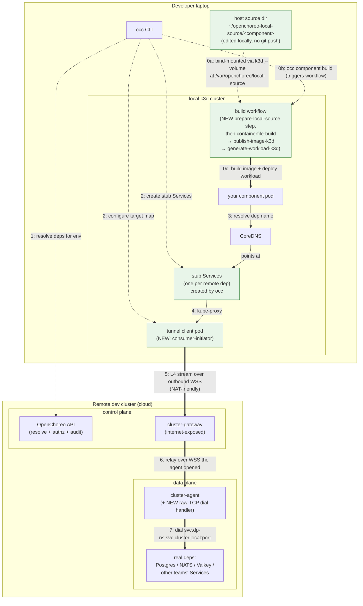
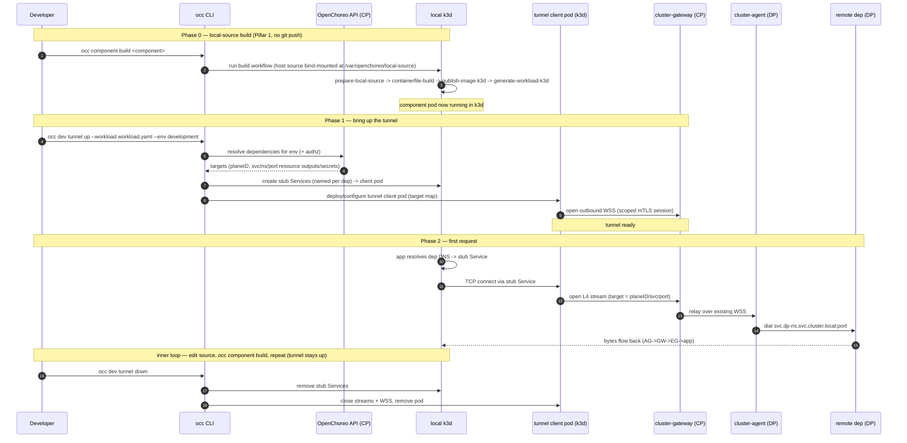

# Feasibility: tunnelling the remote dev cluster into local k3d (Pillar 2)

## Verdict

**Feasible, but it's a multi-component build on top of the existing channel — not a "reuse as-is" tweak.** The cluster-gateway/cluster-agent substrate gives you three things that genuinely transfer (NAT-friendly outbound dial, per-CR mTLS tenancy, WS multiplexing + reconnect). But the thing the dependencies actually need — **arbitrary L4 (raw TCP) forwarding with the laptop as the *consumer*** — is exactly what the channel does *not* do today, and the direction of the existing request flow is inverted relative to the use case. The honest framing: the foundation is reusable; the data path is new.

## First step: getting the app into k3d without a `git push` (the local-source build, Pillar 1)

Before any of the tunnel discussion below matters, the developer's app has to *become a running pod in the local k3d cluster* — and the whole point of the advanced-debugging path is that it gets there **without a `git push`**. This is the original proposal's "Pillar 1," and it is a strict prerequisite for the tunnel: the tunnel forwards dependencies *to* a running workload, so the workload must exist locally first. (Contrast Option 1 in `local_dev_story_new_proposal.md`, where the app runs as a native laptop process and this step is moot — which is exactly why Option 1 ships sooner.)

The mechanism is a host-directory mount plus a source-aware build step, swapped in for the git checkout the cloud build uses:

1. **Mount the host source into k3d.** The developer keeps their working source in a host directory (e.g. `~/openchoreo-local-source/<component>`) bind-mounted into the k3d cluster via k3d's `--volume` flag, landing at `/var/openchoreo/local-source` inside the cluster. k3d bind-mounts run into the node container, so the path is visible to workflow pods scheduled on that node.
2. **Copy it into the build workflow.** A `prepare-local-source` step copies the source from the host-mounted path (`/var/openchoreo/local-source`) into the build workflow's PVC (`/mnt/vol/source`) and **computes a content-hash image tag** so a rebuild with no source change is a no-op — the cheap-iteration property the inner loop depends on.
3. **Build and produce the workload as usual.** The remaining steps are the *existing*, merged ones: `containerfile-build → publish-image-k3d → generate-workload-k3d`, building into the in-cluster registry (`host.k3d.internal:10082`, per `publish-image-k3d.yaml`) and emitting the `Workload` CR. The developer triggers the whole chain with `occ component build <component>` (or from the Backstage UI).

Configuration surface is a `localSource` block on the Component (`path` relative to `~/openchoreo-local-source`, plus `appPath`), in place of a git repo/branch/commit. The single conceptual change versus the cloud build is replacing the git-based `checkout-source` template with a host-mount `prepare-local-source` template; everything downstream is unchanged.

**Status / caveat:** `prepare-local-source` and the `local-dockerfile-builder` chain are **not merged in `main`** — only the git-based `checkout-source` / `containerfile-build` / `publish-image-k3d` / `generate-workload-k3d` templates exist under `samples/getting-started/workflow-templates/`. So Pillar 1 is still a prototype, and it is orthogonal to (but sequenced before) the tunnel work this doc analyses: the tunnel can be prototyped against a workload deployed by any means, but the *usable* advanced-debugging loop needs both halves.

## The ask decomposes into three cases, not one

A local pod's declared dependencies (`Workload.spec.dependencies`, `api/v1alpha1/workload_types.go:210-285`) split by *how* they're reached, and the difficulty is wildly different per class:

| Dependency class                                                          | How it's reached today                                                                                 | Tunnel difficulty                                                                                              |
| ------------------------------------------------------------------------- | ------------------------------------------------------------------------------------------------------ | -------------------------------------------------------------------------------------------------------------- |
| **`external`-visibility endpoints**                                       | Already a public gateway HTTPS URL (`ExternalURLs`)                                                    | **None** — a local pod with internet egress calls it directly. No tunnel.                                      |
| **HTTP/gRPC internal endpoints**                                          | In-cluster `svc.<dp-ns>.svc.cluster.local` (`endpoint_resolve.go:199`)                                 | **Medium** — HTTP semantics *can* ride the existing HTTP-proxy path; needs a consumer entrypoint + addressing. |
| **Raw-TCP/UDP platform resources** (Postgres/Valkey/NATS) + TCP endpoints | env-injected `host:port` from ResourceType outputs (`resourcetype_types.go:49-77`); raw wire protocols | **Hard — this is the whole project.** No raw-TCP path exists.                                                  |

The verdict is driven entirely by the third row. DBs and queues speak raw TCP wire protocols, and the channel only carries HTTP request/response + upgradeable exec/log/Hubble streams — **never raw TCP** (raw port-forward is an explicit TODO at `internal/cluster-gateway/server.go:564-573`).

## What transfers vs. what's net-new

**Reusable as-is:**
- **Outbound-dial / NAT traversal** — the agent dials the gateway (`agent.go:173-214`); a laptop behind NAT can do the same. The CP gateway is the one internet-exposed rendezvous, so it stays the relay point.
- **Per-CR mTLS authZ** (`server.go:670-791`) — a natural hook to scope *which* dev DataPlane a given laptop may reach.
- **WS multiplexing + heartbeat/reconnect** (`connection_manager.go`, requestID correlation) — solid base for many concurrent tunneled connections.

**Net-new (the actual work):**
1. **A generic L4 stream type** — `TCPTunnelStreamInit` + bidirectional `TCPTunnelStreamChunk`, mirroring the existing exec framing (`exec.go:23-29`). *Caveat:* today chunk payloads are base64'd into JSON text frames — fine for exec, wasteful for a chatty Postgres session; you'd want a binary frame.
2. **A new "consumer-initiator" role on the laptop.** This is the subtle one: the existing *agent* dials out (TCP client) but then *serves* requests (logical server); the *gateway* accepts the TCP but *initiates* requests (logical client). Our case needs **TCP-initiator + logical-client** — a role neither binary plays. Naively dropping a cluster-agent in k3d (Tishan's literal phrasing) gives you the *reverse* tunnel (remote CP reaching *into* local k3d) — which is his own non-goal #3.
3. **The DP-side handler is the easy half** — teach the remote *data-plane* agent to accept a stream and `dial(<svc>.<dp-ns>.svc.cluster.local:port)` + pump bytes. That's the *same request direction* as today (CP→DP), so it slots into the existing model cleanly.
4. **Double-hop relay.** Dependencies live in the **data plane**; the gateway lives in the **control plane**. So the L4 stream must traverse **laptop→CP-gateway→DP-agent** — *both* hops are HTTP-only today, so both need the new stream type. Addressing extends the existing `/api/proxy/{planeType}/{planeID}/…` routing (`server.go:389-530`).

## The DNS-transparency problem (Goal 6 / Goal 3)

"Reach remote deps by their *normal in-cluster DNS*, single spec local+remote" is a second project beside the tunnel. The local k3d pod resolves `<svc>.<dp-ns>.svc.cluster.local` (the format the resolver emits — `endpoint_resolve.go:199`) or an env-injected DB host — neither exists locally. Three hooks, in increasing order of how well they fit:

- **Selector-backed stub Service (recommended — over the hand-managed variant):** create a plain ClusterIP `Service` named exactly `<svc>` in namespace `<dp-ns>` whose selector matches the single tunnel-client pod, `targetPort` pointing at that dep's local listener. kube-proxy then maintains Endpoints automatically — no Endpoints reconciler, no drift on pod restart — and in-cluster DNS resolves to the tunnel pod. This is the *same* Service idiom ComponentType templates already use for real component Services (`config/samples/.../clusterresourcetype.yaml:30-44`). OC has **no** hand-created-`Endpoints` code anywhere today, so the Skupper-style *no-selector + manual `Endpoints`* variant would be net-new machinery for no benefit here — the backend is a single pod we control, not arbitrary external IPs.
- **CoreDNS rewrite:** OC already ships exactly this trick (`install/k3d/common/coredns-custom.yaml` rewrites `*.openchoreo.localhost` → `host.k3d.internal`). Good for wildcard hosts; clumsier for specific service names and offers no port remapping.
- **`ExternalName` Service — does *not* fit, despite sounding like the obvious "external service":** an `ExternalName` Service is pure DNS (a CNAME from `<svc>.<dp-ns>.svc.cluster.local` to some external host). It has no ClusterIP, no kube-proxy path, and **no port remapping**, and it points *outward* to a host that must already be resolvable and reachable — which the private dev dep is not (that's the entire reason for the tunnel). It carries no transport, so it cannot deliver bytes into the tunnel-client pod. It is also used **nowhere** in the repo today (0 occurrences of `ServiceTypeExternalName`), so adopting it is itself net-new. The one place it *is* the right tool is the table's first row — `external`-visibility deps with an already-reachable public URL: there an `ExternalName` (or simply the injected URL) lets a local pod reach them directly, no tunnel. For the raw-TCP/internal deps that are the actual hard problem, `ExternalName` is the wrong primitive.

A different reading of "external service" — *expose the remote dep itself externally* (a public gateway URL for HTTP/gRPC, a LoadBalancer/NodePort/Gateway `TCPRoute` for raw TCP) and have the local pod dial it directly — collapses to row 1 for HTTP/gRPC (no tunnel; just consume the URL) but for DB/queue deps means publishing a **dev database to the internet** and still shipping creds to the laptop, and it abandons the in-cluster-DNS / single-spec goal. Viable as a narrow shortcut for already-HTTP deps; not a general substitute for the tunnel.

## Cross-cutting risks (these, not the plumbing, are the load-bearing ones)

- **Secret egress.** Resource credentials are designed to *never leave the data plane* (`secretKeyRef` outputs stay on the DP). To connect from a laptop you must get those credentials onto the laptop — directly contradicting that guarantee. This is a security decision, not plumbing, and needs an explicit owner.
- **AuthZ scope + audit.** A dev laptop becomes a new principal that can open raw TCP to *dev databases*. Per-CR mTLS handles "which plane," but you still need "which deps, which env, which developer," plus an audit trail (Tishan's stated auditability constraint).
- **NetworkPolicy parity.** DP ingress is restricted by source pod *labels* (`networkpolicy.go:32-193`); a relayed connection arriving from the agent won't carry the consumer's labels, so it may be silently blocked or need a carve-out.
- **Performance** is acceptable for dev, but JSON/base64-framed raw bytes is the wrong wire format for a DB session — budget for a binary frame type.
- **Sequencing:** the source-mount build (Pillar 1) is the prerequisite first step — see `## First step: getting the app into k3d without a git push`. Its `prepare-local-source`/`local-dockerfile-builder` chain isn't merged in `main` yet (only the git-based `checkout-source`/`containerfile-build`/`publish-image-k3d` exist under `samples/getting-started/workflow-templates/`), so the build half is still prototype and lands before the tunnel is useful end-to-end.

## Product decision: the local path forks OpenChoreo's dependency-resolution contract

This is a product/architecture call, not plumbing, and it needs an explicit owner. It is arguably the *more* consequential of the two builds, because it touches the resolution semantics every component already relies on — not just a dev convenience.

**Today the contract is uniform and environment-agnostic.** A consumer's dependencies resolve by looking up a *real provider binding* in the same namespace + environment — `ReleaseBinding` for endpoint deps (`controller_connections.go:90-144`), `ResourceReleaseBinding` for resource deps (`controller_resourcedependencies.go:142-211`) — gated on the provider *existing* (and, for resources, being `Ready`). Only then are the `*_HOST`/`*_PORT`/`*_ADDRESS` env vars and secret/file bindings injected (`controller_connections.go:224-262`). There is **zero** local-vs-remote branching anywhere in `api/` or `internal/controller/` (verified: no `k3d`/`stub`/`tunnel`/local-mode logic in the reconcilers); every local-dev concern lives in `occ` and `install/k3d/`. Controllers reconcile identically in k3d and in the cloud — and that uniformity is itself a design asset worth protecting.

**The proposed design introduces a second, synthetic resolution mode.** Remote dev cluster: genuine resolution, unchanged. Local k3d: there is no provider `ReleaseBinding`/`ResourceReleaseBinding`, so the *same* `workload.yaml`'s deps would otherwise sit `Pending` forever and **nothing gets injected**. To make local resolution "succeed," the design must **fabricate the provider's resolved output** — the stub Service (so DNS resolves) *plus* the host/port/creds env a real binding's `Status` would have produced.

**Correction to the stub-Service claim made earlier in this doc:** creating a stub *Service* does **not** make env-var injection "keep working unchanged." Injection keys on OpenChoreo's own CRD graph — a provider `ReleaseBinding`/`ResourceReleaseBinding` in the resolver's field index — **not** on the presence of a Kubernetes `Service`. A stub Service makes *pod-level DNS* resolve to the tunnel pod; it does nothing for the controller's existence gate. So the env vars that actually carry `<svc>:<port>`/creds into the pod will **not** appear locally unless we *additionally* do one of:

- **(a) Synthesize the provider CRs in k3d** — `occ` (or a new controller) creates fabricated `ReleaseBinding`/`ResourceReleaseBinding` objects with pre-populated `Status`, so the *existing* resolver runs unchanged. Keeps a single resolution path, but injects synthetic CRs into the local cluster and may need the resolver to trust a provider it never reconciled.
- **(b) `occ` injects env out-of-band** — `occ` resolves deps via the API and writes the env vars + a local Secret directly onto the deployed pod, bypassing the controller's resolution entirely. Keeps core pure, but `occ` now re-implements resolution semantics, so the two paths can silently drift (e.g., a future change to how a `ResourceType` output maps to an env var must be mirrored in `occ`, or local ≠ remote).

**The decision the product owns:**
1. **Does any of this belong in core?** The L4 tunnel stream type is *unavoidably* core — `cluster-gateway` + `cluster-agent` must learn raw TCP. That alone would be the **first** local-dev-motivated behavior to land inside a core that has so far been kept strictly environment-agnostic. The stub/synthesis half *can* stay in `occ` (path b); the question is whether the team draws the line there or accepts a deeper core change (path a, or a stub-Service controller) for one clean resolution path.
2. **Is a parallel/synthetic resolution contract acceptable, and who keeps it in parity?** Whichever of (a)/(b) is chosen, "same `workload.yaml`, two resolution mechanisms" needs an owner and a parity test, or local and remote diverge over time.
3. **Where does synthesis sit relative to the existence gate?** Picking (a) vs (b) is the concrete fork: (a) gives the controller a "trust local" path; (b) leaves the controller untouched and moves the semantics into `occ`.

The honest framing: the tunnel data path is a *build*; this is a *contract change*. Decide it before the data path ships, alongside the secret-egress call.

## Effort read

- **HTTP-only deps** (ride existing proxy + stub Services): ~small-medium.
- **Full raw-TCP tunnel** (new stream type × 2 hops + consumer role + DNS materialization + secret/authz/policy story): **a real project** — multiple components across `cluster-gateway`, `cluster-agent`, `occ`, and a new controller for stub-Service materialization. This is meaningfully heavier than the `occ` port-forward direction the thread converged on, because it *additionally* requires running the workload in k3d **and** solving in-cluster DNS materialization.

## Recommendation

1. **It's achievable and the architectural fit is real** — reusing the gateway/agent keeps one auth model and one operable component, and OC's per-CR tenancy maps cleanly onto "which dev plane can this laptop reach." Off-the-shelf (Skupper for L4+DNS, Telepresence for the workstation variant) would be *less build* but adds a parallel auth/tenancy model to reconcile.
2. **But it's strictly heavier than the `occ` port-forward** you and mevan landed on in the thread for persona 3. Worth being explicit that this Pillar-2 path mainly pays off for the *platform-engineer / run-in-cluster* persona, not the app developer — which loops back to the persona split that was the thread's main unresolved tension.
3. **If we proceed, de-risk in this order:** (a) prototype the generic L4 stream type over the existing WS between two local k3d clusters (proves the protocol extension cheaply, reusing the multi-cluster e2e harness that already wires cluster-gateway cross-cluster); (b) settle the secret-egress + authz/audit policy *before* any data path ships; (c) only then tackle stub-Service DNS materialization.

## The `occ`-driven design (how we'd actually wire it)

The shape: the component **runs in local k3d**, the dev cluster's dependencies are **pulled in** so local pods reach them by their normal names, and `occ` drives the whole thing off the committed `workload.yaml`. Keep the direction split straight — *logical = remote→local; actual TCP dial = local→remote* (the laptop is behind NAT, so every connection is dialed outward to the one internet-exposed `cluster-gateway`).

### `occ` command surface

```bash
# pull in everything workload.yaml depends on, resolved against the dev env
occ dev tunnel up --workload workload.yaml --env development

# what's wired, and is each dep reachable
occ dev tunnel status

# tear down stub Services + close the tunnel
occ dev tunnel down
```

Flags: `--only postgres-db,cache` (subset), `--context <k3d>` (target local cluster), `--project/--component` (when not inferrable from `workload.yaml`).

### What `occ dev tunnel up` does

1. **Reads `workload.yaml`** — collects `dependencies.endpoints[]` and `dependencies.resources[]`.
2. **Resolves them against the dev env via the OpenChoreo API** (not a raw DP kubeconfig) — so platform RBAC/Casbin enforces *who* may tunnel to *which* env/dep and emits an audit record. Returns concrete coordinates: `planeID`, in-DP `svc/ns/port`, and for resources the resolved outputs (host/port + secret refs).
3. **Programs local k3d** — creates a **stub Service per dependency**, named exactly what the workload expects, endpoints pointing at the tunnel client pod. This is what makes in-cluster DNS resolution succeed for local pods.
4. **Ensures the tunnel client pod** in k3d and hands it the target map (local listener → remote `planeID/svc/port`).
5. **The tunnel client pod dials out** to `cluster-gateway` over a scoped mTLS session and holds the connection open.

Then the normal inner loop runs on top: the **local-source build** (the prerequisite first step — `occ component build`, see `## First step: getting the app into k3d without a git push`) → deploy to k3d → the pod resolves its dependency names → traffic flows through the tunnel. Edit, rebuild, redeploy — the tunnel stays up until `occ dev tunnel down`.

### Plumbing layout

**New pieces:**
- **Tunnel client pod** (in k3d) — the missing "consumer-initiator" from `## What transfers vs. what's net-new` (item 2): dials *out* to the gateway *and* initiates connections for local pods. Can ship as a new mode of `cluster-agent`.
- **Stub Services** (k3d) — one per dep, created by `occ`, back-ended by the tunnel client pod. The materialization of `## The DNS-transparency problem` above.
- **L4 stream type** in `cluster-gateway` + `cluster-agent` — the raw-TCP capability (item 1). DP agent gains a `dial(svc:port) + pump` handler; relayed across both hops per item 4.

**Reused as-is:** outbound-dial/NAT, per-CR mTLS (scoped to a dev tunnel session), WS multiplexing.

**Packet path** (local app → remote DB): `app pod` → resolves dep DNS → **stub Service** → kube-proxy → **tunnel client pod** → L4 stream over outbound WSS → **cluster-gateway** relays over the WSS the **DP cluster-agent** already opened → DP agent dials `svc.<dp-ns>.svc.cluster.local:port` → bytes return the same way.

### Architecture (network plumbing)



> Step 0 is the prerequisite local-source build (Pillar 1): the host source dir is bind-mounted into k3d (no `git push`), built in place, and deployed as the component pod *before* the tunnel (steps 1–7) forwards its dependencies in. Both the tunnel client pod **and** the DP cluster-agent *dial out* to the gateway — the gateway is the only exposed endpoint, which is what keeps this NAT-friendly and "outbound only."

### Lifecycle (setup → first request → teardown)



### Two decisions this forces (see `## Cross-cutting risks`)

- **Resource secrets land on the laptop.** `occ` resolves resource outputs (creds, CA bundles) via the API and materializes them so local env bindings line up with the stub — the secret-egress call, scoped by env + access level, with the tunnel client pod only ever targeting local k3d.
- **Local dependency resolution forks the contract.** The k3d workload's deps would otherwise sit `pending` (real provider bindings aren't local) and **no env vars get injected**. Stub Services make pod-level DNS resolve — but **not** the controller's resolution gate, which keys on a provider `ReleaseBinding`/`ResourceReleaseBinding`, not on a Kubernetes Service. Actually producing the injected `*_HOST`/`*_PORT`/creds requires synthesizing the provider's output (occ-side env injection, or fabricated provider CRs). See `## Product decision: the local path forks OpenChoreo's dependency-resolution contract` — this is a product call, not a given.

---

Next steps I can take: turn this into a comment on discussion #3609 or a design note under `docs/` (I'd hold off on posting to GitHub until you've reviewed), sketch the `occ dev tunnel` command surface as a Go CLI skeleton, or spin up the two-k3d L4-stream spike.