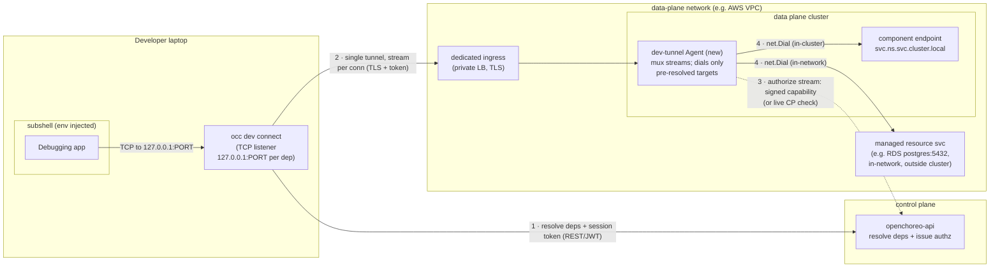
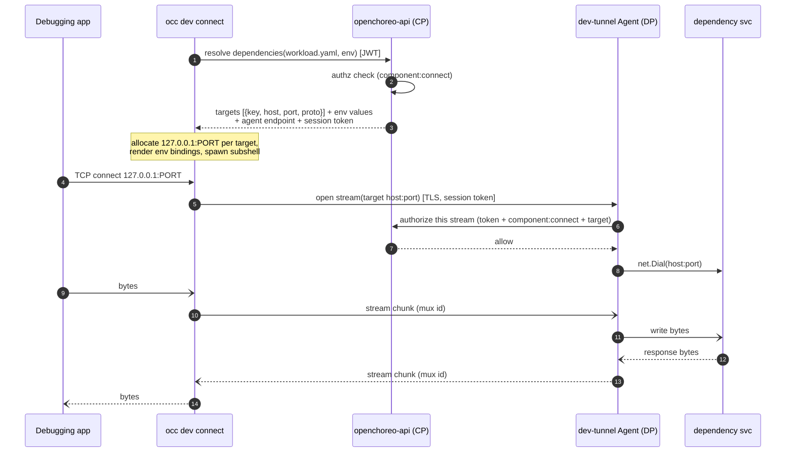

# `occ dev connect` — Design & Implementation Worklog

> Local-development dependency resolution for OpenChoreo application developers.
> Tunnel **network-reachable** dependencies (component endpoints + resource services
> like Postgres/NATS) from a dev laptop to the data plane, and inject matching env
> bindings into a subshell.
>
> **v1 scope — the connectivity layer:**
> - **Endpoint dependencies** — fully working (address/host/port env bindings; no
>   secrets involved).
> - **Resource dependencies** — establish **reachability** to the resource service
>   (whether it runs *inside* the data-plane cluster or *outside but in the same
>   network*), plus its **non-secret** env (host, port, database, username).
>
> **Deferred to later phases (designed for, not built in v1):**
> - **Secret resolution** — resolving secret-kind resource outputs (passwords, tokens,
>   ESO-composed URLs) into the subshell. Design is D3 (agent-resolves-locally).
> - **File resolution** — `fileBindings` / cert mounts written to local paths.

Status: **Implementing** (architecture locked; v1 scope set; **M1 dev-agent + M2 CP resolve API + M3 occ client built & tested**; **deployed to local k3d — tunnel data path + CP endpoint verified live**, §10.5; remaining: Helm charts, live occ-login run, docs). Last updated: 2026-07-02.

---

## 1. Goal

Give an app developer the inner loop they already have locally (code, debugger,
runtime) plus the one thing they lack: **reachability to the workload's upstream
dependencies** in a shared environment. One command:

```
occ dev connect --workload workload.yaml --env development
```

…resolves the workload's declared dependencies for the selected environment, opens
local TCP listeners for each, injects env bindings that point at those listeners, and
drops the developer into a subshell where the app "just works" against real upstreams.

The key observation from the design doc: the only real gap between the shared cluster
and the laptop is the **dependencies**. So this feature is fundamentally a
per-dependency TCP tunnel + an env-var generator.

---

## 2. Draft design (faithful to the whiteboard)

This is the original whiteboard sketch translated to mermaid, unchanged in intent.
Section 4 turns it into a concrete architecture (Option A, chosen).


**Reading it:** `occ` resolves dependencies and checks auth against the control-plane
API, spawns a subshell with generated env bindings, and opens local TCP listeners.
The debugging app connects to `127.0.0.1:<port>`; `occ` carries those bytes over a
single multiplexed tunnel **directly to a purpose-built dev-tunnel Agent** in the data
plane, which `net.Dial`s the actual dependency service. The `Agent` is **new** (not the
existing `cluster-agent`); it can call the control-plane API server, and the dashed
`API server ⇢ Agent` line means the **agent authorizes each stream by asking the
control plane** ("check auth for each stream request"). The data path is `occ ↔ Agent`
directly — it does **not** flow through the control plane.

---

## 3. What already exists in the codebase (findings)

Deep dive done across CLI, dependency schema, API server, and data-plane infra. The
headline: **most of the hard parts already exist.**

### 3.1 The `occ` CLI (`internal/occ/`)
- Cobra tree; every group is a package under `internal/occ/cmd/<name>/` exposing one
  `NewXxxCmd(f client.NewClientFunc)` constructor, registered centrally in
  `internal/occ/root/root.go`. No `dev` group exists yet.
- Idiomatic leaf command: `Args: cmdutil.ExactOneArgWithUsage()`, `PreRunE:
  auth.RequireLogin()`, build client lazily via `f()` in `RunE`, delegate to a logic
  struct. Flags via the shared `internal/occ/flags` package (`AddNamespace`,
  `AddProject`, `AddEnvironment`, …) so context defaults auto-inject.
- Current context (kubectl-style) lives in `~/.openchoreo/config`; env is **not**
  stored in context — it's a per-command `--env` flag.
- **Raw/streaming precedent on the client side:** `internal/occ/cmd/component/exec.go`
  bypasses the REST factory and opens a WebSocket directly using
  `config.GetCurrentControlPlane()` (URL) + `config.GetCurrentCredential()` (token),
  refreshing via `auth.RefreshToken()`. This is the pattern `dev connect` follows for
  its tunnel connection.

### 3.2 Dependency schema & resolution
- `api/v1alpha1/workload_types.go`:
  - `spec.dependencies.endpoints[]` = `WorkloadConnection{Project, Component,
    Name, Visibility(project|namespace), EnvBindings{Address,Host,Port,BasePath}}`.
  - `spec.dependencies.resources[]` = `WorkloadResourceDependency{Ref,
    EnvBindings map[outputName]envVar, FileBindings map[outputName]path}`.
- Resolution is done by the **ReleaseBinding controller**, not the API services:
  - Endpoints → `internal/controller/releasebinding/controller_connections.go`
    resolves each dependency to an `EndpointURL{Scheme,Host,Port,Path}` and caches it
    on the consumer's `ReleaseBinding.status.resolvedConnections[]`. For
    `project`/`namespace` visibility the host is the **in-cluster DNS name**
    `svc.ns.svc.cluster.local` (see `endpoint_resolve.go`).
  - Resources → `controller_resourcedependencies.go` finds the active
    `ResourceReleaseBinding` for `(project, ref, env)` via a field index, and reads
    `status.outputs[]` (`ResolvedResourceOutput`).
- **Critical constraint (drives the design):** resolved values split into two classes.
  - **value-kind** outputs (host, port, db name) and endpoint URLs are present on the
    **control plane** (in `status`).
  - **secretKeyRef / configMapKeyRef** outputs (passwords, tokens, ESO-composed URLs
    like the NATS `nats://<token>@host:port`) are **only** on the **data plane** —
    the control plane holds just a `{name, key}` reference. Materializing them requires
    reading a DP Secret/ConfigMap. (Confirmed by `samples/from-image/doclet/README.md`:
    "the token never reaches the control plane".)

### 3.3 API server (`internal/openchoreo-api/`)
- Spec-first OpenAPI (oapi-codegen v2). Add an endpoint by editing
  `openapi/openchoreo-api.yaml`, `make openapi-codegen`, implement the method on
  `Handler`, delegate to a service. Services hold a controller-runtime client to the
  **control plane**.
- Auth = JWT bearer (JWKS/static). Authz via `services.AuthzChecker.Check(ctx,
  CheckRequest{Action, ResourceType, Hierarchy, …})` against a PDP built from
  `AuthzRole`/`AuthzRoleBinding` CRDs. Actions live in `internal/authz/core/actions.go`
  (e.g. `ActionExecComponent = "component:exec"`).
- **Streaming blueprint = `internal/openchoreo-api/api/handlers/exec.go`.** It is
  registered on the **top-level mux, outside** the OpenAPI middleware chain (the strict
  response wrappers break `http.Hijacker` needed for WS upgrade), auth'd directly with
  the JWT middleware, and does authz **inside** the handler before upgrading — exactly
  the "check auth per stream request" requirement. `dev connect`'s tunnel endpoint will
  be a sibling of this.

### 3.4 Data plane & the existing tunnel (the big one)
- **OpenChoreo already has the reverse tunnel.** `internal/cluster-agent/` runs in each
  data plane and dials **outbound** over a single persistent **mTLS WebSocket** to
  `internal/cluster-gateway/` in the control plane. Multiple logical streams are
  multiplexed over that one socket, **keyed by `RequestID`** (see
  `internal/cluster-agent/messaging/types.go`: `HTTPTunnelStreamInit`,
  `HTTPTunnelStreamChunk{RequestID, Data, StreamID, IsClose}`).
- **Bidirectional byte-stream already works** over it: `kubectl exec` and Hubble flow
  tailing. The gateway `handleExec` (`cluster-gateway/exec.go`) registers a
  `streamSession` by `RequestID` and pumps bytes both ways; the agent
  (`cluster-agent/exec.go`) has a `streamWriter` + `stdinPipeReader` byte pump that a
  TCP proxy can mirror almost verbatim.
- **The one gap:** raw **TCP / port-forward over the tunnel is NOT implemented** —
  `cluster-gateway/server.go handleStreamingProxy` returns **501** with a `TODO`. No
  `net.Dial`/`net.Listen` tunneling anywhere. No yamux/smux (mux is hand-rolled JSON).
  No gRPC server (gRPC is client-only, to Hubble).
- **Deployment:** the agent is a Helm-deployed `Deployment` + cert-manager mTLS cert
  (`install/helm/openchoreo-data-plane/templates/cluster-agent/`). The same binary
  serves dataplane/workflowplane/observabilityplane via `--plane-type`. Agent routing
  is `internal/cluster-agent/router.go`; `Routes` is currently empty — a natural place
  to add a "dial TCP to host:port" backend.
- **Reachability inside the DP:** egress is unrestricted; an agent pod can reach
  ClusterIP services / DBs directly over TCP. If the DP uses Cilium/NetworkPolicy, the
  agent pod likely needs the system-component label (or an allow rule) to be admitted
  to workload endpoint ingress. (`internal/networkpolicy/networkpolicy.go`.)
- **`agents/` (sre-agent etc.) is unrelated** — those are Python LLM agents, not the
  tunnel.

---

## 4. Architecture options

There are two viable ways to move the bytes. They differ only in **who runs the tunnel
endpoint** and **where the data path goes** — resolution (§3.2) and the env-generation /
subshell logic are identical in both.

### Option A — Dedicated dev-tunnel Agent, `occ` connects directly *(the whiteboard; recommended)*

A **new**, purpose-built agent runs in the data plane, reachable at one endpoint
(ingress/LoadBalancer, TLS). `occ` connects to it **directly** and multiplexes a stream
per accepted local connection. The agent **calls the control-plane API to authorize
each stream** (the dashed line in the whiteboard), then `net.Dial`s the target. The
control plane is used only for resolution + auth decisions — **never in the data path.**

Key property: the developer only needs to reach the **agent's** endpoint; the agent
(inside the VPC) reaches every dependency. So a remote dev reaches an in-VPC RDS *through
the agent* without VPN. Cost: one secured, exposed (or VPN-internal) endpoint per data
plane.



### Option B — Reuse the existing `cluster-agent` + `cluster-gateway`, relayed through the CP

Add a `tcp` stream kind to the existing management tunnel. `occ` connects to the
already-reachable `cluster-gateway`, which relays over the `cluster-agent`'s outbound
WebSocket (mux by `RequestID`, §3.4). No new exposed endpoint on the data plane.

Trade-offs vs A: **every developer's data flows through the shared control-plane
gateway** (bandwidth / connection-count / blast-radius bottleneck), and it **couples an
experimental dev feature to production-critical management infra** and expands the
high-trust `cluster-agent`'s privilege to arbitrary egress dialing. Reuses mTLS / mux /
HA that already exist.

```
laptop app → occ → cluster-gateway (CP) → [cluster-agent outbound WS] → cluster-agent → target
```

### Decision driver

Both options let a remote developer reach in-VPC dependencies. The choice hinged on:
*is exposing one secured dev-agent endpoint per data plane acceptable (→ A), or is "no
new inbound surface on the data plane" a hard requirement (→ B)?*

**✅ Decided: Option A** (the bastion model). Exposing a secured, dedicated dev-agent
endpoint is acceptable, and keeping dev traffic off the control-plane data path is a
goal. Option B is retained only as a fallback if the no-new-endpoint constraint ever
becomes hard. (Q1 resolved — see §6.)

### 4.1 Connect sequence — Option A (happy path)



---

## 5. Design decisions (running log)

- **D1 — ✅ Dedicated dev-tunnel Agent; `occ` connects to it directly (Option A, the
  bastion model).** A new, purpose-built agent — **not** the existing `cluster-agent` —
  owns the dev data path. Rationale: keeps developer traffic off the control-plane data
  path, keeps this feature decoupled from production-critical management infra, and lets
  the agent be least-privilege / per-env opt-in / kill-switchable. **Always-on** for v1
  (single Deployment per data plane; scale/HA later — Q1a). The existing
  cluster-agent/gateway relay (Option B) is retained only as a fallback. The `exec.go`
  byte-pump and the `messaging` stream framing remain useful references for the new agent
  even though we don't route through the gateway.

- **D2 — Auth: `occ` authenticates to the control plane; the Agent authorizes each
  stream.** `occ` gets a short-lived **session token** from the CP at resolve time (bound
  to user + component + env + the resolved target set). It presents that token to the
  agent per stream. Two ways for the agent to authorize a stream (the whiteboard's "check
  auth for each stream request"):
  - **(a) live CP check** — agent calls the CP to validate the token + `component:connect`
    + that the target is in the allowed set. Instant revocation; adds a CP round-trip and
    DP→CP chatter per stream.
  - **(b) signed capability** *(recommended for v1)* — the resolve response is a
    short-TTL **CP-signed** capability listing the allowed targets; the agent verifies the
    signature **locally** per stream, no CP call. Scales without loading the CP↔DP path
    (honors Q1b); revocation waits for the short TTL.

  Either way authz policy is authored in the CP; the data path stays `occ ↔ agent`.

- **D3 — Split resolution into control-plane part + data-plane part.**
  - value-kind outputs + endpoint targets (host/port/scheme) come from the control
    plane (`ReleaseBinding.status.resolvedConnections`,
    `ResourceReleaseBinding.status.outputs`).
  - secret/configmap-kind outputs (passwords, tokens, composite URLs) must be read from
    the DP. Under Option A the **dev-tunnel Agent is the natural resolver**: it already
    lives in the DP with a ServiceAccount, so it reads the referenced Secret/ConfigMap and
    returns values to `occ` over the same connection — secrets never transit the control
    plane, and we avoid the management gateway k8s-proxy entirely. (Under Option B the
    fallback is the API server fetching them via `GatewayClient.ProxyK8sRequest`, at the
    cost of secret bytes transiting CP→laptop.) *(See Q2.)*

- **D4 — Per-dependency local listener + env rewrite.** `occ` allocates
  `127.0.0.1:<localport>` per target. Env bindings are rewritten to the local
  listener: `DB_HOST=127.0.0.1`, `DB_PORT=<localport>`; `Address`-style bindings keep
  scheme+basePath but swap host:port (`BACKEND_API_URL=http://127.0.0.1:<localport>`).

- **D5 — Subshell model.** `occ dev connect` spawns the user's `$SHELL` with the env
  bindings exported (like the doc's "subshell"); tunnels live for the shell's lifetime;
  exiting the shell tears down listeners and streams. Consider a `--print-env` /
  `--json` mode for non-interactive use (direnv, IDE launch configs).

- **D6 — New authz action `component:connect`** (`internal/authz/core/actions.go`),
  distinct from `component:exec`, so platform teams can grant dev-connect without shell
  exec. Checked at resolve time and per stream.

- **D7 — Tunnel target = any host:port reachable from the data-plane's network, not
  just in-cluster.** The Agent runs inside the data-plane cluster, which itself sits in
  a network (e.g. an AWS VPC). It therefore forwards to two classes of target with the
  same `net.Dial`: (a) **in-cluster** component endpoints (`svc.ns.svc.cluster.local`,
  ClusterIP) and (b) **in-network but out-of-cluster** managed services — e.g. an RDS
  Postgres or a managed NATS whose endpoint lives elsewhere in the VPC. This is why a
  single in-DP agent is sufficient for both endpoint *and* resource dependencies: the
  data plane is the one place that already has network reachability to everything the
  deployed workload can reach. Consequence: resolution just needs to yield a
  `host:port` reachable *from the agent*; `occ` never needs to know whether the target
  is inside or outside the cluster. (Some ResourceTypes provision in-cluster services;
  others front managed/external endpoints — the agent handles both identically.)

- **D8 — ✅ Exposure: the dev-agent gets its own dedicated, isolated ingress (Q1b).**
  Not the workload kgateway (would strain the workload data path and share its blast
  radius) and not the cluster-agent/gateway channel (would strain DP↔CP management
  comms). Instead a **dedicated `Service` for the dev-agent**, default **internal /
  private LoadBalancer** (reachable via VPN / VPC peering — true bastion posture); a
  **locked-down public LoadBalancer** is opt-in for fully-remote devs. Security layers:
  **TLS** on the endpoint (server auth) + a **CP-issued short-lived session token** the
  dev must present (so an exposed port is useless without CP-granted access) + optional
  **mTLS** (client cert) later. The agent runs as a low-privilege Deployment with a
  narrow ServiceAccount. `occ` discovers the endpoint from the CP resolve response.

- **D9 — ✅ The dev-agent is NOT a general egress proxy — it only dials pre-resolved
  dependency targets.** Because the agent is always-on and shared, an "dial any
  host:port" capability would be an SSRF / lateral-movement risk. So the set of dialable
  targets for a session is **fixed at resolve time** to exactly the workload's resolved
  dependencies for that `(component, env)`, and the agent refuses any stream whose target
  isn't in that CP-authorized set (enforced via the signed capability / live check in
  D2). The agent never accepts a free-form destination from `occ`. Per-stream authz is
  scoped to the developer's identity + `component:connect` + membership in the allowed
  target set.

- **D10 — ✅ Phased delivery. v1 = connectivity layer only.**
  - **Phase 1 (v1):** the tunnel + local listeners + subshell, wired end-to-end for
    **endpoint dependencies** (fully usable) and **resource reachability** (TCP tunnel to
    the resource service in/out of the cluster) with **non-secret** env only (host, port,
    database, username). Goal: prove bytes flow laptop → agent → dependency for both
    dependency classes.
  - **Phase 2:** secret-kind output resolution (passwords/tokens/composed URLs) via the
    agent (D3), so resource connections actually authenticate.
  - **Phase 3:** file resolution (`fileBindings` / cert mounts → local paths).

  Rationale: endpoint deps need no secrets, so they're complete in v1; resource deps are
  split so the hard/again-designed connectivity plumbing lands first and credential
  handling (the sensitive part) is a focused follow-up.

- **D11 — ✅ Input = the local `workload.yaml` file only** (`--workload`, no
  `--component`). The file carries `spec.owner.{projectName,componentName}` (consumer
  identity) and `spec.dependencies` (declared endpoint + resource deps with their
  env-binding names). `occ` sends the consumer identity + declared deps + env to the CP
  resolve API, which turns each declared dep into a concrete `{host, port, proto}` target
  (resolved against the *provider's* published status:
  `ReleaseBinding.status.endpoints[].serviceURL` / `ResourceReleaseBinding.status.outputs`)
  and issues the signed capability. Resolving against the provider (not the consumer's own
  binding) means the consumer need not be deployed — supporting pre-deploy local dev. This
  is file-driven yet the concrete addresses come authoritatively from the CP for the env.

- **D12 — ✅ Resource dial target is identified by output-name convention (`host` +
  `port`).** `ResourceType` has no first-class endpoint/host/port concept (outputs are
  untyped named strings — verified in `api/v1alpha1/resourcetype_types.go`). So v1 pairs
  the value-kind outputs named `host` and `port` into the dial target for a resource
  dependency. Consequence: v1 supports resources exposing **discrete `host`/`port`**
  outputs (e.g. Postgres). Resources whose endpoint is embedded in a **composite secret**
  output (e.g. NATS `url = nats://<token>@host:port`) are out of v1 — they need phase-2
  secret resolution *and* URL host:port rewriting anyway. The resolve API reports such
  resources as `unconnectable`. (A first-class endpoint declaration on `ResourceType` is
  the eventual robust fix — Q7.)

- **D13 — ✅ Transport tech: raw TLS + `hashicorp/yamux`; capability = `golang-jwt/v5`
  JWT.** Because the agent has a dedicated endpoint (not the HTTP gateway), occ dials TLS
  directly and multiplexes streams with yamux (mature, flow-controlled) — no WebSocket
  framing needed. `golang-jwt/jwt/v5` is already vendored, so the signed capability reuses
  it. yamux is a new (small) dependency; the no-new-dep fallback is hand-rolled framing
  over `gorilla/websocket` mirroring `exec.go`. (See §8.)

---

## 6. Open questions

### Resolved

- **Q1 — ✅ Architecture = Option A** (dedicated dev-agent bastion, direct data path).
- **Q1a — ✅ Availability = always-on** single Deployment per data plane for v1;
  scale/HA deferred.
- **Q1b — ✅ Exposure = dedicated isolated ingress**, private LoadBalancer by default,
  TLS + CP session token; must not burden workload gateway or DP↔CP channel. (See D8.)
- **Q2 — ✅ Secret resolution is deferred (phase 2).** v1 delivers connectivity + the
  non-secret env only. When built, the **dev-agent resolves secrets locally** (D3). File
  resolution is deferred to phase 3. (See D10.)
- **Q3 — ✅ Input = `--workload workload.yaml` only.** The file already carries the
  consuming component identity (`spec.owner.projectName/componentName`) and the declared
  dependencies + env-binding names; no `--component` flag. (See D11.)
- **Q6 — ✅ Protocol = TCP only for v1.** UDP added later only if a real need appears
  (unlikely). A TCP-stream tunnel is the right shape.

### Still open (implementation-detail; defaults chosen)

- **Q4.** Local port allocation: ephemeral (OS-assigned, printed) vs deterministic/
  stable per dependency (nicer for repeat runs, IDE configs). *Default: print an
  allocation table; add stable `--port-map` later.*
- **Q5 — ✅ diagnosed live (2026-07-02).** What the **dev-agent** pod needs to reach
  targets: **component endpoints are fenced** by an OpenChoreo-generated NetworkPolicy
  (`openchoreo-<component>`, `policyTypes: [Ingress]`) that admits the endpoint port only
  from (a) same-namespace pods or (b) pods **anywhere** carrying the
  `openchoreo.dev/system-component` label. The dev-agent runs in `openchoreo-data-plane`
  with no such label, so cross-namespace dials to fenced endpoints get **`connection
  refused`** (observed against `greeter-service` + `h2-greeter`). **Fix = run the dev-agent
  with the `openchoreo.dev/system-component` label** (it *is* a system component → matches
  rule (b)); a dedicated allow rule is the alternative. **Resource services are not fenced
  this way** (Postgres dialed fine — §10.5), and in-VPC managed services just need egress.
  Ships as part of the dev-agent Helm chart (§10.4). (§3.4)
- **Q7 (future, not v1).** Should `ResourceType` gain a first-class **endpoint
  declaration** (e.g. `spec.endpoints: [{name, host: <outputRef>, port: <outputRef>,
  protocol}]`) to replace the v1 `host`/`port` naming convention (D12)? Would make
  resource connectivity explicit + support multi-endpoint resources, but it's a CRD schema
  change — defer until the convention proves limiting.

---

## 7. Proposed implementation milestones (TODO)

Architecture is **Option A**; v1 = **Phase 1 (connectivity layer)** per D10. Phases 2–3
(secret + file resolution) are separate follow-ups, listed at the end.

### Phase 1 (v1) — connectivity for endpoints + resources, non-secret env

- [x] **M0 — Design sign-off.** Architecture (Option A, always-on agent, dedicated
      private-LB ingress), phasing (D10), input (D11), TCP-only (Q6) all settled.
      Q4/Q5 are implementation-detail with chosen defaults.
- [~] **M1 — Dev-tunnel Agent (new).** *(§8.3)* — **core built + tested**; deployment TODO.
  - [x] Shared contract `internal/devconnect`: wire framing (`protocol.go` —
        length-prefixed JSON `Hello`/`HelloResult`/`StreamOpen`/`StreamResult` with size
        guard) + JWT capability (`capability.go` — EdDSA sign/verify, audience-scoped,
        expiry-enforced). Unit-tested (round-trip, wrong-aud, expired, wrong-key, oversize).
  - [x] Agent `internal/dev-agent` + `cmd/dev-agent`: TLS listener; `Hello{capability}`
        handshake → **yamux** session (D13); per stream read `StreamOpen{key}`, `net.Dial`
        the target, bidirectional pipe (`proxyConns`). Per-stream authz (D2): verify JWT
        locally (sig/exp/aud), require `key` ∈ capability targets, dial only that entry
        (D9). E2E-tested: authorized echo through the tunnel, unauthorized-target refusal,
        bad-capability handshake refusal. `go build`/`vet`/`test` green. yamux added as a
        direct dep (go.mod).
  - [ ] Capability verification key: currently a Helm-mountable PEM (`LoadEd25519PublicKeyPEM`);
        CP JWKS fetch is a follow-up.
  - [ ] Deployment: Helm chart (single Deployment, Q1a) + server cert/TLS + **dedicated
        private LoadBalancer** Service (D8/Q1b). **No k8s RBAC needed in Phase 1** (targets
        are pre-resolved in the capability); NetworkPolicy for egress (Q5).
- [~] **M2 — Resolve API + capability signer (control plane).** *(§8.1–8.2)* — **built + tested**.
  - [x] `component:connect` authz action (D6): constant + `systemActions` registry +
        `conditionRegistry` (env-scoped like exec) in `internal/authz/core`.
  - [x] `DevConnectConfig` sub-config (`internal/openchoreo-api/config/dev_connect.go`,
        wired into `config.go`): enable flag, Ed25519 `signing_key_path`, `key_id`,
        `issuer`, `agent_endpoint`, `agent_ca_bundle_path`, `plane_id`, `ttl_seconds`.
  - [x] `DevConnectHandler` (`internal/openchoreo-api/api/handlers/devconnect.go`):
        decode → authz (`component:connect`, env-scoped, subject via `auth.GetSubjectContext`)
        → resolve → sign → JSON. **Resolution reads provider status directly** (uncached
        client → `List(InNamespace)` + in-memory filter on `Spec.Owner`/`Environment`,
        skipping `Undeploy`): endpoints from `ReleaseBinding.status.endpoints[].serviceURL`
        (project/namespace visibility), resources from `ResourceReleaseBinding.status.outputs`
        with the `host`/`port` value-kind convention (D12), Ready-gated, secret outputs
        omitted (phase 2, listed in `omittedSecretEnv`), unresolvable deps → `unconnectable`.
        Capability signed as EdDSA JWT (reuses `devconnect.SignCapability`).
  - [x] Wired in `cmd/openchoreo-api/main.go`: registered on `baseMux` beside `/mcp`
        (`POST /api/v1/dev/connect:resolve`), `jwtMiddleware`-authed, gated on
        `cfg.DevConnect.Enabled` — independent of the cluster gateway.
  - [x] Tests: fake-client resolve (endpoint + resource → targets + verifiable capability
        with correct signed host:port) and unready-resource → `unconnectable`. Reused the
        controller's `resolveURLForVisibility` logic (reimplemented — the originals are
        unexported); a shared-package refactor is a follow-up, not required for v1.
  - [ ] Remaining: JWKS exposure of the verification key (v1 uses a mounted PEM); optional
        live agent→CP authz endpoint (D2a).
- [~] **M3 — `occ dev connect` command.** — **built + tested e2e against the real agent**.
  - [x] Shared client in `internal/devconnect`: `TunnelClient` (handshake + yamux +
        `OpenStream`), `DialTLS`, `Pipe` (dedup'd — agent now uses it too), and the
        resolve contract (`resolve.go`: `ResolveRequest`/`ResolveResponse` + pure
        `RenderEnv`/`ComposeAddress`).
  - [x] New `internal/occ/cmd/dev/` group + `connect` leaf; registered in `root.go`.
        `--workload <file>` (required) + `--env` + `--print-env`.
  - [x] Parse `--workload`: `loadWorkloadFromFile` (multi-doc YAML → picks the `Workload`)
        → `buildResolveRequest` (owner + `spec.dependencies`, D11) → `Resolver` (HTTP
        client to the CP resolve endpoint; ready for M2).
  - [x] `forward`: local listener per target → tunnel stream per accepted conn → `Pipe`.
        Non-secret env render (D4) via `RenderEnv`; subshell (D5) with merged env, or
        `--print-env` holding tunnels open until Ctrl-C. Signal-based teardown in the leaf.
  - [x] Tests: full `Connect` e2e (occ → real dev-agent → echo dependency, asserting
        `DB_HOST=127.0.0.1`, tunnelled bytes round-trip) + `buildResolveRequest` +
        `RenderEnv`/`ComposeAddress`. `go build ./...`/`vet`/`gofmt` green; `occ dev
        connect --help` wired.
  - [ ] Remaining: real run needs M2 (resolve endpoint) live; `--json` output mode.
- [ ] **M4 — Tests & docs.**
  - [ ] Unit tests for resolution + env rewrite; e2e against the doclet sample proving
        **connectivity**: an HTTP endpoint dependency end-to-end, and a raw TCP reach to
        the Postgres/NATS port through the tunnel.
  - [ ] User docs + sample walkthrough; clearly note secret/file resolution is phase 2/3.

### Phase 2 (fast-follow) — secret resolution

- [ ] Agent resolves secret-kind outputs (D3): read referenced Secret/ConfigMap via its
      ServiceAccount, return values to `occ` over the connection; `occ` injects the
      secret-backed env vars (e.g. `DB_PASSWORD`, composed URLs). Resource connections now
      authenticate end-to-end.

### Phase 3 — file resolution

- [ ] Resolve `fileBindings` (CA bundles, certs) → write to local paths; env/file bindings
      that reference mounted files work locally.

---

## 8. Detailed design — Phase 1 (the contract between the 3 components)

The system is three components joined by two contracts: the **resolve API** (occ ↔ CP)
and the **tunnel protocol** + **signed capability** (occ ↔ agent, with the capability
minted by the CP). This section pins those down.

| Component | New artifact | Talks to |
|---|---|---|
| `occ dev connect` | `internal/occ/cmd/dev/` | CP (resolve, HTTPS/JWT), dev-agent (tunnel, TLS) |
| control plane | resolve endpoint + capability signer in `openchoreo-api` | k8s (read provider status), signs capabilities |
| dev-agent | `cmd/dev-agent` + `internal/dev-agent` | occ (tunnel server), dependency services (`net.Dial`) |

### 8.1 Control-plane resolve API

A normal REST endpoint (JSON, not streaming) requiring a JWT bearer token.

> **Implementation note:** rather than regenerate the 424 KB OpenAPI spec, the endpoint is
> **hand-registered on `baseMux` beside `/mcp`** and wrapped with the JWT middleware
> (`DevConnectHandler`, gated on `cfg.DevConnect.Enabled`). Same auth, no codegen. Promoting
> it into the OpenAPI spec is an optional follow-up.

```
POST /api/v1/dev/connect:resolve      (Bearer JWT)
```

**Request** — built by `occ` from the local `workload.yaml` (D11):

```jsonc
{
  "project": "doclet",           // spec.owner.projectName
  "component": "doclet-document", // spec.owner.componentName
  "environment": "development",   // --env
  "endpoints": [                  // spec.dependencies.endpoints[] verbatim
    { "project": "", "component": "backend-api", "name": "http",
      "visibility": "project",
      "envBindings": { "address": "BACKEND_API_URL" } }
  ],
  "resources": [                  // spec.dependencies.resources[] verbatim
    { "ref": "doclet-postgres",
      "envBindings": { "host": "DB_HOST", "port": "DB_PORT",
                       "database": "DB_NAME", "username": "DB_USER",
                       "password": "DB_PASSWORD" } }
  ]
}
```

**Authz:** `component:connect` on `(project, component, environment)` (new action, D6).

**Resolution (server-side, per declared dependency — resolves against the *provider's*
published status, so the consumer need not be deployed → supports pre-deploy dev):**

- *Endpoint dep* → find the provider `ReleaseBinding` for `(project||self, component,
  env)` (field index `IndexKeyReleaseBindingOwnerEnv`), read
  `status.endpoints[name].serviceURL` → `EndpointURL{scheme, host, port, path}`. Only
  `project`/`namespace` visibility (in-cluster) is tunnelled; `external` already has a
  public URL and is returned as-is (no tunnel). Logic exists in
  `controller_connections.go` (`resolveConnection`, `resolveURLForVisibility`,
  `formatEndpointAddress`) — **lift the pure helpers into a shared package**
  (e.g. `internal/dependency/resolve`) callable from both the controller and this service.
- *Resource dep* → find the active `ResourceReleaseBinding` for `(project, ref, env)`
  (index `IndexKeyResourceReleaseBindingOwnerEnv`), read `status.outputs[]`
  (`ResolvedResourceOutput`). Identify the dial target by convention (D12): the value-kind
  outputs named `host` + `port`. Collect the other **value-kind** outputs for non-secret
  env; **secret-kind** outputs are omitted (phase 2). A resource that exposes no discrete
  `host`/`port` (e.g. NATS' composite secret `url`) is returned as `unconnectable` with a
  reason — `occ` warns and skips it.

**Response** — two audiences: `targets[]` tells **occ** how to render local env and how
many listeners to open; `capability` is opaque to occ and consumed by the **agent**.

```jsonc
{
  "agent": { "endpoint": "dev-tunnel.dp-1.example.com:8443", "caBundle": "<PEM>" },
  "capability": "<compact signed token — see 8.2>",
  "targets": [
    { "key": "ep/backend-api/http", "proto": "tcp",
      "render": { "kind": "endpoint", "scheme": "http", "basePath": "/",
                  "bindings": { "address": "BACKEND_API_URL" } } },
    { "key": "res/doclet-postgres", "proto": "tcp",
      "render": { "kind": "resource", "hostEnv": "DB_HOST", "portEnv": "DB_PORT",
                  "staticEnv": { "DB_NAME": "doclet", "DB_USER": "doclet-postgres-user" },
                  "omittedSecretEnv": ["DB_PASSWORD"] } }
  ],
  "unconnectable": [ /* { ref, reason } for e.g. NATS in v1 */ ]
}
```

Note the resolved dial `host:port` is **not** in `targets[]` — it lives (CP-signed) inside
`capability`, so occ never needs it and the agent gets it authenticated.

### 8.2 Signed capability

A compact **JWT** (reuse `github.com/golang-jwt/jwt/v5`, already vendored) minted by the
CP, presented by occ to the agent at connection setup, verified by the agent with the
CP's public key.

```jsonc
// header: { "alg": "EdDSA", "kid": "cp-dev-connect-1", "typ": "JWT" }
{
  "iss": "https://cp.example.com",
  "sub": "user:alice@corp",              // developer identity from their occ session
  "aud": "dev-agent:dp-1",               // scoped to this plane — no cross-plane replay
  "iat": 1750000000, "exp": 1750001800,  // short TTL (~30 min)
  "jti": "…",
  "occ.component": { "project": "doclet", "name": "doclet-document" },
  "occ.env": "development",
  "occ.targets": [                        // the ONLY dialable targets for this session
    { "key": "ep/backend-api/http", "proto": "tcp",
      "host": "backend-api-development-abc.dp-ns.svc.cluster.local", "port": 8080 },
    { "key": "res/doclet-postgres", "proto": "tcp",
      "host": "r-doclet-postgres-development-x.dp-ns.svc.cluster.local", "port": 5432 }
  ]
}
```

- **Signing:** CP signs with a private key; **key distribution to the agent = the CP's
  JWKS endpoint** (the API server already runs JWKS for inbound auth — reuse it), or a
  Helm-mounted public key as a simpler v1. Rotation via `kid`.
- **Verification (agent):** signature, `exp`, `aud == dev-agent:<its planeID>`. On failure,
  refuse the connection.
- **Per-stream authorization (D2):** the requested stream `key` must be in
  `occ.targets`; the agent dials that entry's `host:port` and nothing else (D9). This *is*
  the whiteboard's "check auth for each stream request" — done locally against the signed
  capability, **no CP round-trip** (honors Q1b). Live-CP-check remains the alternate
  (D2a) for instant revocation.

### 8.3 Dev-agent tunnel protocol

- **Transport:** occ dials **TLS/TCP** to `agent.endpoint`, verifying the server cert
  against `agent.caBundle` from the resolve response. (No HTTP/WebSocket needed — this is a
  dedicated endpoint, unlike the gateway model.)
- **Multiplexing:** **`github.com/hashicorp/yamux`** over the single TLS conn (occ =
  client, agent = server). Gives many bidirectional streams + flow control + keepalive for
  free. *(Alternative if we avoid a new dep: hand-rolled length-prefixed framing over
  `gorilla/websocket`, mirroring `internal/cluster-agent/exec.go` + `messaging` — more
  code, no new dep. Recommendation: yamux.)*
- **Handshake (pre-yamux):** occ sends one length-prefixed `Hello{ capability }`; agent
  verifies (8.2) and replies `HelloAck{}` or `HelloErr{reason}` then closes. On ack, both
  wrap the conn in yamux. Keeps data streams pure.
- **Per stream (one per accepted local connection):**

  ```
  occ:   accept 127.0.0.1:L  ── maps to key K ──▶  yamux.OpenStream()
         write  StreamOpen{ key: K }              (length-prefixed, small)
  agent: AcceptStream() ▶ read StreamOpen
         K ∈ capability.occ.targets ?  no ▶ StreamResult{err:"not authorized"}; close
         net.Dial("tcp", target.host:port)  (dial timeout)
                       fail ▶ StreamResult{err:"dial failed: …"}; close
                       ok   ▶ StreamResult{ok:true}
         io.Copy(stream ⇄ conn) both directions until either half-closes
  ```
- **Framing structs** (JSON for v1, protobuf optional): `Hello{Capability string}`,
  `HelloAck{}`/`HelloErr{Reason}`, `StreamOpen{Key string}`,
  `StreamResult{OK bool, Err string}`. Only these are framed; after `StreamResult{ok}` the
  yamux stream is a transparent byte pipe.
- **Limits/robustness:** yamux keepalive; per-stream dial + idle timeouts; caps on
  streams/session and sessions/agent (single replica for now, Q1a); half-close
  propagation; structured refusal reasons surfaced back to `occ`.
- **RBAC:** in **Phase 1 the agent needs no Kubernetes API access at all** — targets come
  pre-resolved in the capability; it only needs network egress. (K8s read access for
  Secret/ConfigMap arrives in Phase 2.)

### 8.4 `occ dev connect` internals

1. **Parse** `--workload <file>` → decode into the `Workload` type (reuse
   `internal/occ/fsmode/typed/workload.go` / `resources/workload`); read
   `spec.owner.{projectName,componentName}` + `spec.dependencies`.
2. **Resolve:** call 8.1 using `config.GetCurrentControlPlane()` + credential token
   (new client method; auth per `internal/occ/cmd/component/exec.go`). Get `targets`,
   `capability`, `agent`.
3. **Listeners:** for each target, `net.Listen("tcp","127.0.0.1:0")` → local port `L`;
   keep a `key → (listener, L)` map. Warn for each `unconnectable`.
4. **Tunnel:** dial TLS to `agent.endpoint` (verify `caBundle`), `Hello{capability}`,
   establish one shared yamux session.
5. **Accept loop** per listener: accepted conn → `OpenStream` → `StreamOpen{key}` →
   pipe (§8.3).
6. **Env rendering (D4)** — build the subshell env:

   | Dep kind | Binding | v1 value |
   |---|---|---|
   | endpoint | `address` | `{scheme}://127.0.0.1:{L}{basePath}` (http/ws…) or `127.0.0.1:{L}` (grpc/tcp) |
   | endpoint | `host` / `port` / `basePath` | `127.0.0.1` / `{L}` / `{basePath}` |
   | resource | env bound to `host` output | `127.0.0.1` |
   | resource | env bound to `port` output | `{L}` |
   | resource | env bound to other value-kind output | resolved literal (pass-through) |
   | resource | env bound to secret-kind output | **omitted in v1** (phase 2) |

7. **Subshell (D5):** spawn `$SHELL` with env; on exit / SIGINT close listeners + yamux
   session. `--print-env` / `--json`: print bindings instead and hold the tunnels open in
   the foreground until Ctrl-C (documented).

### 8.5 Detailed sequence (Phase 1)

```mermaid
sequenceDiagram
    autonumber
    participant App as Debugging app
    participant OCC as occ dev connect
    participant API as openchoreo-api (CP)
    participant AG as dev-tunnel Agent (DP)
    participant SVC as dependency svc

    OCC->>OCC: parse workload.yaml (owner + dependencies)
    OCC->>API: POST /dev/connect:resolve (deps, env)  [JWT]
    API->>API: authz component:connect; resolve provider status;<br/>mint signed capability (targets)
    API-->>OCC: targets[] + capability + agent{endpoint,caBundle}
    OCC->>OCC: listen 127.0.0.1:L per target; render env
    OCC->>AG: TLS dial; Hello{capability}
    AG->>AG: verify sig/exp/aud (no CP call)
    AG-->>OCC: HelloAck; open yamux session
    App->>OCC: TCP connect 127.0.0.1:L
    OCC->>AG: OpenStream + StreamOpen{key}
    AG->>AG: key ∈ capability.targets? dial target
    AG->>SVC: net.Dial(host:port)
    AG-->>OCC: StreamResult{ok}
    App-)OCC: bytes
    OCC-)AG: stream bytes
    AG-)SVC: bytes
    SVC--)AG: bytes
    AG--)OCC: stream bytes
    OCC--)App: bytes
```

### 8.6 Security summary

TLS everywhere on the data path; exposed agent port is inert without a valid CP-signed
capability; the agent dials **only** the capability's pre-resolved targets (D9, no
free-form SSRF); short capability TTL; per-plane `aud` prevents replay; Phase-1 agent has
zero k8s privileges. Authz policy authored centrally in the CP (`component:connect`).

---

## 9. Reference index (file paths)

| Area | Path |
|---|---|
| CLI root / registration | `internal/occ/root/root.go`, `cmd/occ/main.go` |
| CLI streaming precedent | `internal/occ/cmd/component/exec.go` |
| CLI config/auth | `internal/occ/cmd/config/`, `internal/occ/auth/` |
| Dependency schema | `api/v1alpha1/workload_types.go` |
| Endpoint resolution | `internal/controller/releasebinding/controller_connections.go`, `endpoint_resolve.go` |
| Resource resolution | `internal/controller/releasebinding/controller_resourcedependencies.go`, `api/v1alpha1/resourcereleasebinding_types.go` |
| API server wiring | `cmd/openchoreo-api/main.go` |
| Streaming handler blueprint | `internal/openchoreo-api/api/handlers/exec.go` |
| Authz | `internal/openchoreo-api/services/authz.go`, `internal/authz/core/actions.go` |
| Tunnel — agent | `internal/cluster-agent/` (`agent.go`, `exec.go`, `router.go`, `messaging/types.go`) |
| Tunnel — gateway | `internal/cluster-gateway/` (`server.go`, `exec.go`) |
| Agent deployment | `install/helm/openchoreo-data-plane/templates/cluster-agent/` |
| Sample app (deps) | `samples/from-image/doclet/` |

---

## 10. Deployment status & testing guide (local k3d)

### 10.1 Current status — **deployed to k3d `openchoreo` and verified live** (data path + endpoint).

Now on the cluster (deployed via the runbook below; all images built locally and
`k3d image import`-ed — **nothing pushed to any registry**):

- ✅ `openchoreo-api` rebuilt from source (my resolve endpoint) — logs
  `"Dev-connect resolve endpoint registered" path=/api/v1/dev/connect:resolve`.
- ✅ `dev_connect` enabled in the api config (ConfigMap `openchoreo-api-config`), signing
  key + agent CA mounted from Secret `dev-connect-keys` at `/etc/dev-connect`.
- ✅ **dev-agent** deployed in `openchoreo-data-plane` (Deployment + Service, image
  `ghcr.io/openchoreo/dev-agent:latest-dev`, `--plane-id=dev-dp`), listening on `:8443`.
- ✅ **doclet sample** deployed in `default`; `doclet-postgres-development` is `Ready`
  (value-kind `host`/`port` outputs; `password`/`url` are secret → phase 2).
- ✅ `component:connect` grantable and covered — the logged-in `admin` (group `admins`)
  holds `actions: ['*']`.

**Verified live (see §10.5):** the tunnel data path (occ-side client → deployed dev-agent →
real Postgres across namespaces) and the CP endpoint (deployed + JWT-enforced). **Not
verified live:** the full `occ dev connect` HTTP call to the CP — the machine's stored
`occ` credential is expired and a fresh token needs interactive browser login (pure
platform-auth blocker; the resolve logic itself is covered by the fake-client test).

### 10.2 Verify now — Go tests (no cluster needed) ✅

The three components + shared contract are fully covered by tests that pass today:

```bash
# From repo root
go test ./internal/devconnect/... \
        ./internal/dev-agent/... \
        ./internal/occ/cmd/dev/... \
        ./internal/openchoreo-api/api/handlers/... -run 'TestResolve' -v

# What they prove:
#  - devconnect: capability sign/verify (aud/exp/key), wire framing, RenderEnv/ComposeAddress
#  - dev-agent:  handshake → yamux → authorized echo through the tunnel; unauthorized target
#                + bad-capability refused
#  - occ/dev:    Connect() end-to-end against a REAL dev-agent (bytes round-trip, DB_HOST→127.0.0.1)
#  - handlers:   CP resolve over a fake k8s client → targets + a verifiable signed capability;
#                unready resource → unconnectable
```

Also `go build ./...`, `go vet`, and `gofmt -l` are clean across all touched packages.

### 10.3 Deploy & test end-to-end on k3d — runbook

> ⚠️ **Not yet a supported one-command flow.** Steps marked ⚠️ require plumbing that is not
> in the repo yet (§10.4); the manifests below are provided inline so the runbook is
> executable by hand. `IMAGE_REPO_PREFIX=ghcr.io/openchoreo`, `TAG=latest-dev`,
> cluster=`openchoreo`. Pick a `PLANE_ID` and use it consistently (below: `dev-dp`).

**B1 — Rebuild the control plane with the resolve endpoint** (ready):

```bash
make k3d.update.openchoreo-api   # docker build + k3d image import + rollout restart
```

**B2 — Generate keys** (ready) — one Ed25519 keypair for capabilities, one self-signed
TLS cert for the agent (SAN `IP:127.0.0.1`, since we reach it via port-forward locally):

```bash
mkdir -p /tmp/devconnect && cd /tmp/devconnect
openssl genpkey -algorithm ed25519 -out cap-priv.pem          # CP signs with this
openssl pkey -in cap-priv.pem -pubout -out cap-pub.pem        # agent verifies with this
openssl req -x509 -newkey ec -pkeyopt ec_paramgen_curve:P-256 -nodes \
  -keyout agent-tls.key -out agent-tls.crt -days 30 \
  -subj "/CN=dev-agent" -addext "subjectAltName=IP:127.0.0.1"
# agent cert is self-signed, so it IS its own CA → occ trusts agent-tls.crt as the caBundle
```

**B3 — Enable dev-connect on the control plane** ⚠️ (needs mounting the key + config):

```bash
# private signing key + agent CA, mounted into openchoreo-api
kubectl -n openchoreo-control-plane create secret generic dev-connect-keys \
  --from-file=cap-priv.pem=cap-priv.pem --from-file=agent-ca.crt=agent-tls.crt

# add a dev_connect: block to the api config ConfigMap (openchoreo-api-config,
# mounted at /etc/openchoreo/config.yaml) — edit and append:
#   dev_connect:
#     enabled: true
#     signing_key_path: /etc/openchoreo/dev-connect/cap-priv.pem
#     key_id: dev-connect-1
#     issuer: openchoreo-control-plane
#     agent_endpoint: 127.0.0.1:8443          # what occ dials (see B6 port-forward)
#     agent_ca_bundle_path: /etc/openchoreo/dev-connect/agent-ca.crt
#     plane_id: dev-dp                          # MUST match the dev-agent --plane-id
#     ttl_seconds: 1800
kubectl -n openchoreo-control-plane edit configmap openchoreo-api-config

# patch the Deployment to mount the secret at /etc/openchoreo/dev-connect, then restart
kubectl -n openchoreo-control-plane patch deploy openchoreo-api --type=json -p='[
  {"op":"add","path":"/spec/template/spec/volumes/-","value":{"name":"dev-connect-keys","secret":{"secretName":"dev-connect-keys"}}},
  {"op":"add","path":"/spec/template/spec/containers/0/volumeMounts/-","value":{"name":"dev-connect-keys","mountPath":"/etc/openchoreo/dev-connect","readOnly":true}}
]'
kubectl -n openchoreo-control-plane rollout restart deploy openchoreo-api
```

**B4 — Build & deploy the dev-agent** (Dockerfile + make targets now exist; manifest still by hand ⚠️):

```bash
# Build the dev-agent image locally and import it into k3d (no registry push).
make k3d.build.dev-agent && make k3d.load.dev-agent

# TLS cert + capability public key as secrets in the data plane
kubectl -n openchoreo-data-plane create secret tls dev-agent-tls \
  --cert=/tmp/devconnect/agent-tls.crt --key=/tmp/devconnect/agent-tls.key
kubectl -n openchoreo-data-plane create secret generic dev-agent-cap-pub \
  --from-file=cap-pub.pem=/tmp/devconnect/cap-pub.pem

kubectl apply -f - <<'EOF'
apiVersion: apps/v1
kind: Deployment
metadata: { name: dev-agent, namespace: openchoreo-data-plane, labels: { app: dev-agent } }
spec:
  replicas: 1
  selector: { matchLabels: { app: dev-agent } }
  template:
    metadata: { labels: { app: dev-agent } }
    spec:
      containers:
        - name: dev-agent
          image: ghcr.io/openchoreo/dev-agent:latest-dev
          args:
            - --plane-id=dev-dp
            - --listen=:8443
            - --tls-cert=/certs/tls.crt
            - --tls-key=/certs/tls.key
            - --capability-pubkey=/keys/cap-pub.pem
          ports: [ { containerPort: 8443 } ]
          volumeMounts:
            - { name: tls, mountPath: /certs, readOnly: true }
            - { name: cap, mountPath: /keys, readOnly: true }
      volumes:
        - { name: tls, secret: { secretName: dev-agent-tls } }
        - { name: cap, secret: { secretName: dev-agent-cap-pub, items: [ { key: cap-pub.pem, path: cap-pub.pem } ] } }
---
apiVersion: v1
kind: Service
metadata: { name: dev-agent, namespace: openchoreo-data-plane }
spec:
  selector: { app: dev-agent }
  ports: [ { port: 8443, targetPort: 8443 } ]
EOF
```

**B5 — Deploy the doclet sample + promote** (ready) — provides real endpoint + Postgres deps:

```bash
kubectl apply -f samples/from-image/doclet/project.yaml
kubectl apply -f samples/from-image/doclet/resources/ -f samples/from-image/doclet/components/
kubectl apply -f samples/from-image/doclet/bindings/development/
# promote each resource binding to its latest release (see the sample README §3)
for r in doclet-postgres doclet-nats; do
  rel=$(kubectl get resource $r -n default -o jsonpath='{.status.latestRelease.name}')
  kubectl patch resourcereleasebinding $r-development -n default --type=merge \
    -p "{\"spec\":{\"resourceRelease\":\"$rel\"}}"
done
kubectl get releasebinding,resourcereleasebinding -n default | grep doclet   # wait Ready
```

**B6 — Reach the agent + run occ** (agent build ready; occ ready):

```bash
kubectl -n openchoreo-data-plane port-forward svc/dev-agent 8443:8443 &   # 127.0.0.1:8443
go build -o /tmp/occ ./cmd/occ
# ensure occ points at the control-plane API and is logged in (or security disabled);
# if authz is enabled, grant the caller component:connect on doclet-document.
/tmp/occ dev connect --workload samples/from-image/doclet/components/service-document.yaml \
  --namespace default --env development
```

**B7 — Verify inside the subshell** — env is injected and the local port tunnels to Postgres:

```bash
echo "$DB_HOST $DB_PORT $DB_NAME"          # 127.0.0.1 <local-port> doclet
nc -z "$DB_HOST" "$DB_PORT" && echo "postgres reachable through the tunnel"
# (DB_PASSWORD is intentionally absent in v1 — secret resolution is phase 2)
```

**Teardown:** `kill %1` (port-forward); `kubectl -n openchoreo-data-plane delete deploy/dev-agent svc/dev-agent secret/dev-agent-tls secret/dev-agent-cap-pub`; `kubectl delete -f samples/from-image/doclet/project.yaml`; revert the api ConfigMap/Deployment patch.

### 10.4 Plumbing to make §10.3 a supported flow (M4 backlog)

**Goal: the developer runs `occ dev connect` and nothing else** — no `kubectl`, no manual
`port-forward`, and **no data-plane cluster access at all** (only `occ login` + a network
path to the agent's own endpoint, per D1/D8). The `kubectl port-forward` used in §10.3/B6
is a local scaffold standing in for the agent's not-yet-built ingress; it ironically
reintroduces the exact DP cluster access this feature exists to remove. The items below
retire it.

- [x] `cmd/dev-agent/Dockerfile` + make targets — `docker.build.dev-agent`,
      `k3d.build.dev-agent`, `k3d.load.dev-agent`, `k3d.update.dev-agent` (added to
      `make/golang.mk`, `make/docker.mk`, `make/k3d.mk`, mirroring cluster-agent). All
      local — `k3d image import`, no push.
- [ ] Helm chart for the dev-agent under `install/helm/openchoreo-data-plane/templates/dev-agent/` (Deployment + Service + cert-manager cert + public-key mount + NetworkPolicy), values-gated. *(Deployed by hand via manifests for now — §10.3 B4.)*
- [ ] Control-plane Helm: `dev_connect` config block + a signing-key Secret (cert-manager or generated) + the volume mount on `openchoreo-api`. *(Done by hand: ConfigMap edit + `dev-connect-keys` Secret + Deployment patch.)*
- [ ] **Expose the dev-agent so occ dials it directly — retire `kubectl port-forward`.**
      *Local (k3d):* give the dev-agent `Service` a k3d-reachable type (LoadBalancer via the
      built-in `svclb`, or a NodePort) so occ reaches it at a stable `localhost` address with
      no forward. *Prod:* the dedicated **private LoadBalancer** (D8), public opt-in for
      remote devs. Either way **wire `agent_endpoint` (+ CA bundle) from the chart** so the
      CP resolve response hands occ the real address and the developer never touches
      `kubectl`. (This session set it by hand to `127.0.0.1:18443` + a port-forward.)
- [ ] **Network-authorize the dev-agent to reach fenced component endpoints (Q5).** Run the
      dev-agent pod with the `openchoreo.dev/system-component` label (or add a dedicated
      allow rule) so the workload's ingress NetworkPolicy admits it; bake this into the
      dev-agent Helm chart. Without it, endpoint-dependency tunnels connect at the agent but
      get `connection refused` at the target (resource deps are unaffected). (§10.5, Q5)
- [ ] `occ login` / `component:connect` role sample for the guide.
- [ ] Optional: an automated e2e suite step under `test/e2e/suites/` driving B5–B7.

### 10.5 Live verification results (k3d `openchoreo`, 2026-07-02)

- ✅ **Images built locally + imported** (`make k3d.build.dev-agent`,
  `k3d.build.openchoreo-api` → `k3d image import`). No registry push.
- ✅ **Crypto path**: openssl Ed25519 PEMs parse via Go `x509` as a matching pair (the CP
  signs, the agent verifies).
- ✅ **CP endpoint deployed + secured**: `POST /api/v1/dev/connect:resolve` returns
  `401 MISSING_TOKEN` (no token) and `401 INVALID_TOKEN` (bad token); startup log confirms
  registration.
- ✅ **Tunnel data path end-to-end** against the *deployed* dev-agent: a self-minted
  capability (signed with the agent-trusted key) → `DialTLS(127.0.0.1:8443)` → `OpenStream`
  → the agent `net.Dial`ed the real Postgres in namespace
  `dp-default-doclet-development-…` and a Postgres **`SSLRequest` got a byte reply through
  the tunnel** (laptop → dev-agent pod → Postgres). Agent logs: *tunnel established* →
  *stream connected* to the Postgres FQDN.
- ✅ **Authorization enforced live** (D9): a stream to a key **not** in the capability was
  refused (`target not authorized`), matching the agent's `stream target not authorized` log.
- ⚠️ **Full `occ dev connect` HTTP leg not run live**: the machine's stored `occ` token is
  expired and its refresh token is rejected by Thunder (`invalid_grant`); a fresh token
  needs interactive `occ login`. The resolve logic is covered by the fake-client unit test
  and the occ↔CP wire is guaranteed by the shared `internal/devconnect` types. To finish
  the live demo: `occ login`, then §10.3 B6 (`occ dev connect … --print-env`) with the
  port-forward from B6 active.
