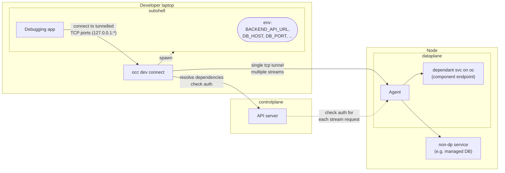

# `occ dev connect` — Design & Implementation Worklog

> Local-development dependency resolution for OpenChoreo application developers.
> Tunnel **network-reachable** dependencies (component endpoints + resource services
> like Postgres/NATS) from a dev laptop to the data plane, and inject matching env
> bindings into a subshell.
>
> **v1 scope — the connectivity layer:**
> - **Endpoint dependencies** — fully working (address/host/port env bindings; no
>   secrets involved).
> - **Resource dependencies** — establish **reachability** to the resource service
>   (whether it runs *inside* the data-plane cluster or *outside but in the same
>   network*), plus its **non-secret** env (host, port, database, username).
>
> **Deferred to later phases (designed for, not built in v1):**
> - **Secret resolution** — resolving secret-kind resource outputs (passwords, tokens,
>   ESO-composed URLs) into the subshell. Design is D3 (agent-resolves-locally).
> - **File resolution** — `fileBindings` / cert mounts written to local paths.

Status: **Implementing — architecture changed from Option A to Option B (2026-07-16).**
The dedicated dev-tunnel agent (Option A) has been **retired**; the tunnel now rides
through the *existing* cluster-gateway/cluster-agent management tunnel (Option B).
**M1 (agent dial support) + M2 (CP resolve API, plane-aware) + M1.5 (cluster-gateway
relay) + M3 (occ client) are built and unit/integration tested** across all four
touched packages (`internal/devconnect`, `internal/cluster-agent`,
`internal/cluster-gateway`, `internal/openchoreo-api/api/handlers`,
`internal/occ/cmd/dev`). Not yet re-verified live on k3d against the new transport
(§10.5's live run predates this rewrite and exercised Option A). See §4/§8 for the
new architecture and §10 for what's now obsolete. Last updated: 2026-07-16.

---

## 1. Goal

Give an app developer the inner loop they already have locally (code, debugger,
runtime) plus the one thing they lack: **reachability to the workload's upstream
dependencies** in a shared environment. One command:

```
occ dev connect --workload workload.yaml --env development
```

…resolves the workload's declared dependencies for the selected environment, opens
local TCP listeners for each, injects env bindings that point at those listeners, and
drops the developer into a subshell where the app "just works" against real upstreams.

The key observation from the design doc: the only real gap between the shared cluster
and the laptop is the **dependencies**. So this feature is fundamentally a
per-dependency TCP tunnel + an env-var generator.

---

## 2. Draft design (faithful to the whiteboard)

This is the original whiteboard sketch translated to mermaid, unchanged in intent.
Section 4 turns it into a concrete architecture — the whiteboard sketched a dedicated
agent (Option A, §4), but that's since been superseded by Option B (§4), which reuses
the existing management tunnel instead of drawing a new one.



**Reading it (historical — see §4 for what was actually built):** the whiteboard's
"Agent" was originally meant to be a new, purpose-built component the data path flows
through directly. As built, that role is played by the **existing** `cluster-agent`,
reached via the **existing** `cluster-gateway` rather than directly — see §4.

---

## 3. What already exists in the codebase (findings)

Deep dive done across CLI, dependency schema, API server, and data-plane infra. The
headline: **most of the hard parts already exist.**

### 3.1 The `occ` CLI (`internal/occ/`)
- Cobra tree; every group is a package under `internal/occ/cmd/<name>/` exposing one
  `NewXxxCmd(f client.NewClientFunc)` constructor, registered centrally in
  `internal/occ/root/root.go`.
- Idiomatic leaf command: `Args: cmdutil.ExactOneArgWithUsage()`, `PreRunE:
  auth.RequireLogin()`, build client lazily via `f()` in `RunE`, delegate to a logic
  struct. Flags via the shared `internal/occ/flags` package (`AddNamespace`,
  `AddProject`, `AddEnvironment`, …) so context defaults auto-inject.
- Current context (kubectl-style) lives in `~/.openchoreo/config`; env is **not**
  stored in context — it's a per-command `--env` flag.
- **Raw/streaming precedent on the client side:** `internal/occ/cmd/component/exec.go`
  bypasses the REST factory and opens a WebSocket directly using
  `config.GetCurrentControlPlane()` (URL) + `config.GetCurrentCredential()` (token),
  refreshing via `auth.RefreshToken()`. `dev connect`'s stream dialer
  (`internal/occ/cmd/dev/stream.go`) follows the same auth pattern, but dials a raw
  HTTP-Upgrade connection instead of a WebSocket (§8).

### 3.2 Dependency schema & resolution
- `api/v1alpha1/workload_types.go`:
  - `spec.dependencies.endpoints[]` = `WorkloadConnection{Project, Component,
    Name, Visibility(project|namespace), EnvBindings{Address,Host,Port,BasePath}}`.
  - `spec.dependencies.resources[]` = `WorkloadResourceDependency{Ref,
    EnvBindings map[outputName]envVar, FileBindings map[outputName]path}`.
- Resolution is done by the **ReleaseBinding controller**, not the API services:
  - Endpoints → `internal/controller/releasebinding/controller_connections.go`
    resolves each dependency to an `EndpointURL{Scheme,Host,Port,Path}` and caches it
    on the consumer's `ReleaseBinding.status.resolvedConnections[]`. For
    `project`/`namespace` visibility the host is the **in-cluster DNS name**
    `svc.ns.svc.cluster.local` (see `endpoint_resolve.go`).
  - Resources → `controller_resourcedependencies.go` finds the active
    `ResourceReleaseBinding` for `(project, ref, env)` via a field index, and reads
    `status.outputs[]` (`ResolvedResourceOutput`).
- **Critical constraint (drives the design):** resolved values split into two classes.
  - **value-kind** outputs (host, port, db name) and endpoint URLs are present on the
    **control plane** (in `status`).
  - **secretKeyRef / configMapKeyRef** outputs (passwords, tokens, ESO-composed URLs
    like the NATS `nats://<token>@host:port`) are **only** on the **data plane** —
    the control plane holds just a `{name, key}` reference. Materializing them requires
    reading a DP Secret/ConfigMap. (Confirmed by `samples/from-image/doclet/README.md`:
    "the token never reaches the control plane".)

### 3.3 API server (`internal/openchoreo-api/`)
- Spec-first OpenAPI (oapi-codegen v2). Add an endpoint by editing
  `openapi/openchoreo-api.yaml`, `make openapi-codegen`, implement the method on
  `Handler`, delegate to a service. Services hold a controller-runtime client to the
  **control plane**.
- Auth = JWT bearer (JWKS/static). Authz via `services.AuthzChecker.Check(ctx,
  CheckRequest{Action, ResourceType, Hierarchy, …})` against a PDP built from
  `AuthzRole`/`AuthzRoleBinding` CRDs. Actions live in `internal/authz/core/actions.go`
  (e.g. `ActionExecComponent = "component:exec"`).
- **Streaming blueprint = `internal/openchoreo-api/api/handlers/exec.go`.** It is
  registered on the **top-level mux, outside** the OpenAPI middleware chain (the strict
  response wrappers break `http.Hijacker`), auth'd directly with the JWT middleware,
  and does authz **inside** the handler before upgrading. `dev connect`'s stream
  endpoint (`devconnectstream.go`) is a sibling of this, registered the same way.

### 3.4 Data plane & the existing tunnel (the big one)
- **OpenChoreo already has the reverse tunnel.** `internal/cluster-agent/` runs in each
  data plane and dials **outbound** over a single persistent **mTLS WebSocket** to
  `internal/cluster-gateway/` in the control plane. Multiple logical streams are
  multiplexed over that one socket, **keyed by `RequestID`** (see
  `internal/cluster-agent/messaging/types.go`: `HTTPTunnelStreamInit`,
  `HTTPTunnelStreamChunk{RequestID, Data, StreamID, IsClose}`).
- **Bidirectional byte-stream already works** over it: `kubectl exec` and Hubble flow
  tailing. The gateway `handleExec` (`cluster-gateway/exec.go`) registers a
  `streamSession` by `RequestID` and pumps bytes both ways; the agent
  (`cluster-agent/exec.go`) has a `streamWriter` + `stdinPipeReader` byte pump.
  `handleWirelogs`/`handleHubbleStreamInit` are a closer analog for dev-connect: a
  raw, non-HTTP byte/event stream relayed the same way, with no client-supplied
  destination.
- **This feature adds a third stream kind, `"tcp"`, to that same framing** — see
  §8.3/§8.4. No yamux/smux; mux stays hand-rolled JSON keyed by `RequestID`, exactly as
  it already was for exec/hubble. Generic raw TCP/port-forward over the *other*
  (`/api/proxy/`) gateway endpoint is still unimplemented (`handleStreamingProxy`
  returns 501) — dev-connect doesn't go through it; it adds its own sibling endpoint.
- **Deployment:** the agent is a Helm-deployed `Deployment` + cert-manager mTLS cert
  (`install/helm/openchoreo-data-plane/templates/cluster-agent/`). The same binary
  serves dataplane/workflowplane/observabilityplane via `--plane-type`. This feature
  needed **no new Deployment, Service, or Helm chart** — it's a new case in the
  existing agent's message dispatch (`internal/cluster-agent/devconnect.go`).
- **Reachability inside the DP:** egress is unrestricted; an agent pod can reach
  ClusterIP services / DBs directly over TCP. If the DP uses Cilium/NetworkPolicy, the
  agent pod likely needs the system-component label (or an allow rule) to be admitted
  to workload endpoint ingress — this is **still an open item under Option B**, now
  against the production `cluster-agent` rather than a throwaway dev-agent (Q5).
- **`agents/` (sre-agent etc.) is unrelated** — those are Python LLM agents, not the
  tunnel.

---

## 4. Architecture: Option B (reuse the existing management tunnel)

There are two viable ways to move the bytes, differing only in **who runs the tunnel
endpoint** and **where the data path goes** — resolution (§3.2) and the env-generation
/ subshell logic (D4/D5) are identical in both. **Option A was implemented first,
then retired in favor of Option B** (this session, 2026-07-16); both are recorded here
so the trade-off and the reason for the switch are legible later.

### Option A — Dedicated dev-tunnel Agent, `occ` connects directly *(retired)*

A **new**, purpose-built agent would run in the data plane, reachable at one endpoint
(ingress/LoadBalancer, TLS), multiplexed with `hashicorp/yamux`. `occ` would connect to
it **directly**. Key property: the developer only needs to reach the **agent's**
endpoint; the agent (inside the VPC) reaches every dependency — a remote dev reaches an
in-VPC RDS *through the agent* without VPN. Cost: a new binary, a new Helm chart, a new
Deployment/Service/cert per data plane, a new exposed (or VPN-internal) endpoint, a new
capability-distribution problem (the agent needs the CP's public key), and a new
dependency (`yamux`). This was **fully built and tested** (§10.5 records a live k3d
run) before being retired.

### Option B — Reuse the existing `cluster-agent` + `cluster-gateway` *(✅ chosen, built)*

Add a `"tcp"` stream kind to the existing management tunnel. `occ` connects to
`openchoreo-api` (the same control-plane endpoint it already talks to for everything
else, including `occ exec`), which relays through the already-reachable
`cluster-gateway`, which relays over the `cluster-agent`'s outbound WebSocket (mux by
`RequestID`, §3.4). **No new exposed endpoint on the data plane, no new binary, no new
Helm chart, no new dependency.**

```
laptop app → occ → openchoreo-api (CP) → cluster-gateway (CP)
           → [cluster-agent's existing outbound WS] → cluster-agent (DP) → target
```

Each hop is a **raw HTTP-Upgrade byte pipe** (§8), not WebSocket-over-WebSocket-over-
WebSocket: `occ ↔ openchoreo-api` and `openchoreo-api ↔ cluster-gateway` each use a
hand-rolled `Upgrade: devconnect-tcp` + `http.Hijacker` handshake (`internal/devconnect
/upgrade.go`) instead of `gorilla/websocket`, since the payload is arbitrary TCP bytes
(Postgres wire protocol, HTTP, WebSocket-inside-the-tunnel, Redis, ...) with no framing
of its own to preserve — WebSocket's message framing would be pure overhead. Only the
innermost `cluster-gateway ↔ cluster-agent` hop keeps its existing transport (the
persistent mTLS WebSocket, JSON-framed, keyed by `RequestID`) because that's
pre-existing production infrastructure, not something this feature owns.

### Why the switch (Option A → B)

Both options let a remote developer reach in-VPC dependencies. Option A's whole cost —
new agent, new endpoint, new capability-distribution problem, new dependency — buys
*less* control-plane blast-radius exposure to developer tunnel traffic. That trade was
initially taken (§4 originally recorded "✅ Decided: Option A"), but reconsidered: the
`cluster-agent`/`cluster-gateway` path this feature ends up needing (net.Dial a
resolved host:port, pipe bytes) is **less** privileged than what that same tunnel
already does for `occ exec` (arbitrary shell exec in any DP pod). Reusing it costs no
new trust; building a parallel channel just to avoid adding one more capability to an
already-more-powerful channel wasn't worth the operational cost (a whole new
component to deploy, secure, and keep reachable, per data plane). See §5 for the
specific decisions this changed.

### 4.1 Connect sequence — Option B (happy path)

```mermaid
sequenceDiagram
    autonumber
    participant App as Debugging app
    participant OCC as occ dev connect
    participant API as openchoreo-api (CP)
    participant GW as cluster-gateway (CP)
    participant AG as cluster-agent (DP)
    participant SVC as dependency svc

    OCC->>API: POST /api/v1/dev/connect:resolve (deps, env)  [JWT]
    API->>API: authz component:connect; resolve provider status + plane;<br/>mint capability (targets incl. plane routing)
    API-->>OCC: targets[] + capability
    Note over OCC: allocate 127.0.0.1:L per target,<br/>render env bindings, spawn subshell
    App->>OCC: TCP connect 127.0.0.1:L
    OCC->>API: GET /devconnect/.../{component}?key=K  [JWT + capability header, Upgrade: devconnect-tcp]
    API->>API: verify capability locally (sig/exp/key ∈ targets) — no CP round-trip
    API->>GW: GET /api/devconnect/{plane}/.../?host=&port=  [Upgrade: devconnect-tcp]
    GW->>AG: HTTPTunnelStreamInit{Target:"tcp", DialAddr} over the existing mgmt WS
    AG->>SVC: net.Dial(host:port)
    AG-->>GW: dial-ack chunk
    GW-->>API: 101 Switching Protocols (raw pipe)
    API-->>OCC: 101 Switching Protocols (raw pipe)
    App-)OCC: bytes
    OCC-)API: raw bytes
    API-)GW: raw bytes
    GW-)AG: stream chunk (RequestID)
    AG-)SVC: write bytes
    SVC--)AG: response bytes
    AG--)GW: stream chunk (RequestID)
    GW--)API: raw bytes
    API--)OCC: raw bytes
    OCC--)App: bytes
```

Note each of the first three hops resolves success/failure **before** committing to
the 101 response for that hop (§8.3) — a dial failure at the agent surfaces as an
ordinary HTTP error status all the way back to occ, not an upgrade followed by a
silent close.

---

## 5. Design decisions (running log)

Decisions below are annotated **[Option A — retired]** where Option B replaced them
outright, and left as-is where they still hold.

- **D1 — [Option A — retired].** ~~Dedicated dev-tunnel Agent; `occ` connects to it
  directly.~~ **Superseded by Option B (§4): no new agent.** The dial-and-pipe logic
  lives in the *existing* `cluster-agent` (`internal/cluster-agent/devconnect.go`),
  dispatched from a new `Target == "tcp"` case alongside the existing exec/hubble
  cases. It needs zero new Kubernetes RBAC (same as Option A's D9 intent) — just
  network egress, which the agent already has.

- **D2 — Auth: `occ` authenticates to the control plane; the control plane authorizes
  each stream via a locally-verified capability.** Unchanged in spirit from the
  original design, but the verifier moved: under Option A the **agent** verified the
  capability (needing the CP's public key distributed to it); under Option B
  **`openchoreo-api` verifies its own capability** (`DevConnectStreamHandler`,
  `internal/openchoreo-api/api/handlers/devconnectstream.go`) — the verify key is just
  the public half of the signing key, derived in-process
  (`DevConnectHandler.VerifyKey()`). This removes the key-distribution problem
  entirely (no JWKS-to-agent story needed) and removes the "live CP check" alternative
  from consideration — there's no longer a separate party that *could* ask the CP,
  since the CP is the one enforcing it. Per-stream authorization is still done locally
  against the signed capability, no extra round trip.

- **D3 — Split resolution into control-plane part + data-plane part.**
  - value-kind outputs + endpoint targets (host/port/scheme) come from the control
    plane (`ReleaseBinding.status.resolvedConnections`,
    `ResourceReleaseBinding.status.outputs`), plus (new under Option B) **which data
    plane** serves the target (`resolveDevConnectPlane`, reusing the same
    `Environment.Spec.DataPlaneRef` → `controller.GetDataPlaneFromRef` lookup
    `ExecHandler` already does) — needed to route the tunnel to the right
    `cluster-agent`, which Option A never needed (its one agent *was* the plane).
  - secret/configmap-kind outputs (passwords, tokens, composite URLs) must still be
    read from the DP (phase 2, unchanged). Under Option B the natural resolver is the
    **`cluster-agent`** (it already lives in the DP; a future phase would give it a
    ServiceAccount and a new stream case to read the referenced Secret/ConfigMap and
    return values to occ over the same connection) — the same "secrets never transit
    the control plane" property Option A's D3 described, just via the existing agent
    instead of a dedicated one.

- **D4 — Per-dependency local listener + env rewrite.** Unchanged. `occ` allocates
  `127.0.0.1:<localport>` per target. Env bindings are rewritten to the local
  listener: `DB_HOST=127.0.0.1`, `DB_PORT=<localport>`; `Address`-style bindings keep
  scheme+basePath but swap host:port (`BACKEND_API_URL=http://127.0.0.1:<localport>`).

- **D5 — Subshell model.** Unchanged. `occ dev connect` spawns the user's `$SHELL`
  with the env bindings exported; tunnels live for the shell's lifetime; exiting the
  shell tears down listeners and streams. `--print-env` holds tunnels open for
  non-interactive use (direnv, IDE launch configs) instead of spawning a shell.

- **D6 — `component:connect` authz action** (`internal/authz/core/actions.go`).
  Unchanged. Distinct from `component:exec`, so platform teams can grant dev-connect
  without shell exec. Checked at resolve time; per-stream authorization is via the
  capability (D2), not a repeated authz call.

- **D7 — Tunnel target = any host:port reachable from the data-plane's network, not
  just in-cluster.** Unchanged in substance. Whichever component does the `net.Dial`
  (the `cluster-agent`, under Option B) sits inside the data-plane cluster, which
  itself sits in a network (e.g. an AWS VPC), so it reaches both in-cluster component
  endpoints (`svc.ns.svc.cluster.local`) and in-network-but-out-of-cluster managed
  services (RDS, managed NATS, ...) with the same `net.Dial`. Resolution just needs to
  yield a `host:port` reachable *from the agent*; `occ` never needs to know whether
  the target is inside or outside the cluster.

- **D8 — [Option A — retired].** ~~Exposure: the dev-agent gets its own dedicated,
  isolated ingress.~~ **Moot under Option B: there is no new endpoint to expose.**
  `occ` reaches the tunnel through the same `openchoreo-api` HTTPS endpoint it already
  uses for everything else (login, `occ exec`, ...); `openchoreo-api` reaches
  `cluster-gateway` over the same mTLS-ish internal channel `ExecHandler` already
  uses. Deployment for this feature is now just: enable `dev_connect` on
  `openchoreo-api` + mount a signing key (§10) — no Service, no LoadBalancer, no
  cert-manager cert, no Helm chart.

- **D9 — The stream endpoint dials only pre-resolved, CP-authorized targets — never a
  free-form destination from occ.** Unchanged in intent, moved in enforcement point.
  Under Option A the **agent** refused unauthorized targets by checking the signed
  capability itself. Under Option B, **`openchoreo-api`'s stream handler** is the one
  that looks the key up in the capability and rejects unknown keys (403) *before ever
  contacting the gateway or agent* — the `cluster-agent` receives an already-resolved
  `host:port` from the gateway and dials it unconditionally, the same way it already
  runs an unconditional `kubectl exec` command the gateway/CP told it to. No SSRF
  surface is added: the set of dialable targets for a session is still fixed at
  resolve time to exactly the workload's resolved dependencies for that
  `(component, env)`.

- **D10 — Phased delivery. v1 = connectivity layer only.** Unchanged.
  - **Phase 1 (v1):** the tunnel + local listeners + subshell, wired end-to-end for
    **endpoint dependencies** (fully usable) and **resource reachability** (TCP tunnel
    to the resource service in/out of the cluster) with **non-secret** env only (host,
    port, database, username).
  - **Phase 2:** secret-kind output resolution (passwords/tokens/composed URLs) via
    the `cluster-agent` (D3), so resource connections actually authenticate.
  - **Phase 3:** file resolution (`fileBindings` / cert mounts → local paths).

- **D11 — Input = the local `workload.yaml` file only** (`--workload`, no
  `--component`). Unchanged. The file carries `spec.owner.{projectName,componentName}`
  (consumer identity) and `spec.dependencies`. `occ` sends the consumer identity +
  declared deps + env to the CP resolve API, which resolves each declared dep against
  the *provider's* published status — the consumer need not be deployed, supporting
  pre-deploy local dev.

- **D12 — Resource dial target is identified by output-name convention (`host` +
  `port`).** Unchanged. `ResourceType` outputs are untyped named strings, so v1 pairs
  the value-kind outputs named `host` and `port` into the dial target. Resources whose
  endpoint is embedded in a composite secret output (e.g. NATS `url =
  nats://<token>@host:port`) are `unconnectable` in v1 (need phase-2 secret resolution
  + URL rewriting). A first-class endpoint declaration on `ResourceType` is the
  eventual robust fix (Q7).

- **D13 — [Option A — retired, replaced].** ~~Transport tech: raw TLS +
  `hashicorp/yamux`; capability = `golang-jwt/v5` JWT.~~ **Replaced:** no dedicated
  endpoint exists to dial TLS directly to, so there's no yamux session to establish.
  Instead, **each accepted local connection opens its own hand-rolled HTTP-Upgrade
  connection** (`Upgrade: devconnect-tcp`, `internal/devconnect/upgrade.go`) at both
  the `occ ↔ openchoreo-api` and `openchoreo-api ↔ cluster-gateway` hops — one
  connection per accepted local TCP connection, mirroring exactly how `occ exec` opens
  one WebSocket per exec session (no new multiplexing layer was added; see the
  discussion that led here — a persistent multiplexed session was considered and
  explicitly not built, to keep the wire contract as close to the existing
  exec/wirelogs shape as possible). `golang-jwt/jwt/v5` is still used for the
  capability (unchanged, D2). `yamux` was removed from `go.mod`.

---

## 6. Open questions

### Resolved

- **Q1 — ✅ Architecture = Option B** (reuse the existing management tunnel; see §4
  for why this superseded the originally-chosen Option A).
- **Q1a / Q1b — moot.** Both were about the retired dev-agent's availability model and
  dedicated ingress (D1/D8); there is no dev-agent or new ingress under Option B.
- **Q2 — ✅ Secret resolution is deferred (phase 2).** v1 delivers connectivity + the
  non-secret env only. When built, the **`cluster-agent` resolves secrets locally**
  (D3, now against the existing agent rather than a dedicated one). File resolution is
  deferred to phase 3 (D10).
- **Q3 — ✅ Input = `--workload workload.yaml` only.** See D11.
- **Q6 — ✅ Protocol = TCP only for v1.** UDP added later only if a real need appears.

### Still open (implementation-detail; defaults chosen)

- **Q4.** Local port allocation: ephemeral (OS-assigned, printed) vs deterministic/
  stable per dependency (nicer for repeat runs, IDE configs). *Default: print an
  allocation table; add stable `--port-map` later.*
- **Q5 — still open under Option B; the actor changed.** Component endpoints are
  fenced by an OpenChoreo-generated NetworkPolicy (`openchoreo-<component>`,
  `policyTypes: [Ingress]`) that admits the endpoint port only from (a) same-namespace
  pods or (b) pods **anywhere** carrying the `openchoreo.dev/system-component` label
  (`internal/networkpolicy/networkpolicy.go`). Under Option A this was diagnosed and
  fixed against the throwaway dev-agent (label it, done in the tryout scripts). Under
  Option B, **the `cluster-agent`'s Helm chart does not currently carry that label
  either** (confirmed: no `system-component` reference under
  `install/helm/openchoreo-data-plane/templates/cluster-agent/`), so endpoint-dependency
  tunnels will hit the same `connection refused` at the target once deployed for real.
  Resource dependencies are unaffected (not fenced this way, per the Option A live
  run, §10.5). **Still needs a decision:** label the `cluster-agent` deployment
  unconditionally (broadens what can reach fenced endpoints even when dev-connect is
  disabled — cluster-agent is production infra, unlike the old throwaway dev-agent),
  or add a dedicated NetworkPolicy allow rule scoped to dev-connect instead. Not yet
  implemented either way.
- **Q7 (future, not v1).** Should `ResourceType` gain a first-class **endpoint
  declaration** (e.g. `spec.endpoints: [{name, host: <outputRef>, port: <outputRef>,
  protocol}]`) to replace the v1 `host`/`port` naming convention (D12)? Would make
  resource connectivity explicit + support multi-endpoint resources, but it's a CRD
  schema change — defer until the convention proves limiting.

---

## 7. Implementation milestones

Architecture is **Option B** (§4); v1 = **Phase 1 (connectivity layer)** per D10.
Phases 2–3 (secret + file resolution) are separate follow-ups, listed at the end.

### Phase 1 (v1) — connectivity for endpoints + resources, non-secret env

- [x] **M0 — Design sign-off.** Architecture (now Option B), phasing (D10), input
      (D11), TCP-only (Q6) all settled. Q4/Q5 are implementation-detail /
      still-open respectively.
- [x] **M1 — `cluster-agent` TCP dial support.** *(§8.3)*
  - [x] `HTTPTunnelStreamInit.DialAddr` field added
        (`internal/cluster-agent/messaging/types.go`) — the only wire-format change to
        the pre-existing management protocol.
  - [x] `internal/cluster-agent/devconnect.go`: `dialSession` + `handleDialStreamInit`
        (net.Dial the target, sentinel ack chunk, then a plain read-loop → chunk
        pump) + `routeDialChunk` (writes inbound chunks to the dialed conn). Dispatched
        from `Agent.handleConnection` on `Target == "tcp"`, alongside the pre-existing
        exec/hubble cases. **No new Kubernetes RBAC** — only network egress, same as
        Option A's agent needed.
  - [x] Tests (`internal/cluster-agent/devconnect_test.go`): echo round-trip through a
        real dialed listener, dial failure, missing `DialAddr`, duplicate `RequestID`
        rejection, unknown-`RequestID` chunk routing.
- [x] **M1.5 — `cluster-gateway` devconnect relay (new; didn't exist under Option A).**
  - [x] `internal/cluster-gateway/devconnect.go`: `handleDevConnect`, registered at
        `/api/devconnect/{planeType}/{planeID}/{crNamespace}/{crName}?host=&port=`
        (`server.go`). Mirrors `handleExec`/`handleWirelogs`'s `streamSession`
        machinery, but — like `handleWirelogs` — waits for the agent's dial-ack chunk
        **before** hijacking/upgrading its caller, so a dial failure surfaces as an
        ordinary HTTP error status rather than an upgrade followed by a silent close.
  - [x] Tests (`internal/cluster-gateway/devconnect_test.go`): all fast-fail paths
        (bad URL, missing host/port, no agent, agent-refused-dial) plus a full happy-path
        integration test using the real `devconnect.DialUpgrade`/`CompleteUpgrade`
        helpers against an `httptest.Server`.
- [x] **M2 — Resolve API + capability signer (control plane), now plane-aware.**
      *(§8.1–8.2)*
  - [x] `component:connect` authz action (D6): constant + `systemActions` registry +
        `conditionRegistry` (env-scoped like exec) in `internal/authz/core`.
  - [x] `DevConnectConfig` (`internal/openchoreo-api/config/dev_connect.go`) simplified:
        `enabled`, `signing_key_path`, `key_id`, `issuer`, `ttl_seconds`. The
        Option-A-only fields (`agent_endpoint`, `agent_ca_bundle_path`, `plane_id`) are
        gone — there's no separate agent to address or scope an audience to.
  - [x] `DevConnectHandler` (`internal/openchoreo-api/api/handlers/devconnect.go`):
        decode → authz (`component:connect`) → resolve → sign → JSON. Resolution now
        also calls `resolveDevConnectPlane` **once per request** (an Environment has
        exactly one `DataPlaneRef`, so every dependency for that environment shares a
        plane) via `controller.GetDataPlaneFromRef`, reusing the exact mapping
        `ExecHandler.resolveExecPlaneInfo` already does. Each signed `Target` now
        carries `PlaneType/PlaneID/CRNamespace/CRName` alongside `Host/Port`, so the
        stream handler (M3-adjacent, below) knows which gateway route to dial without
        a second resolution pass. `VerifyKey()` derives the verification key from the
        signing key in-process (no PEM to mount for a separate agent, no JWKS).
  - [x] Wired in `cmd/openchoreo-api/main.go`: resolve endpoint still on `baseMux`
        beside `/mcp`; the new stream handler (below) is wired further down, alongside
        exec/wirelogs, once `gwTLSConf` is known.
  - [x] Tests (`internal/openchoreo-api/api/handlers/devconnect_test.go`): endpoint +
        resource resolve → targets + a verifiable capability carrying the correct
        signed host:port *and* plane routing; unready resource → `unconnectable`;
        missing `DataPlaneRef` → hard error (not silently-unconnectable, since it's a
        structural misconfiguration affecting every dependency, not a per-dependency
        one).
- [x] **M2.5 — `DevConnectStreamHandler` (new; didn't exist under Option A).**
      *(§8.3)*
  - [x] `internal/openchoreo-api/api/handlers/devconnectstream.go`: registered at
        `/devconnect/namespaces/{ns}/components/{component}?key=...` on the same
        top-level mux as `/exec/` (outside the OpenAPI strict chain, for `http.Hijacker`),
        JWT-authed. Verifies the capability locally (D2/D9), looks up the target by
        key, dials the gateway's devconnect endpoint (`devconnect.DialUpgrade`), and —
        only once *that* succeeds — hijacks occ's connection and bridges the two raw
        pipes with `devconnect.Pipe`.
  - [x] Tests (`devconnectstream_test.go`): missing/invalid/mismatched capability,
        unknown target key, and a full happy-path test against a fake gateway that
        itself speaks the devconnect-tcp upgrade protocol.
- [x] **M3 — `occ dev connect` command**, adapted for the new transport.
  - [x] `internal/devconnect/upgrade.go` (new, shared by all three hops that need it):
        `IsUpgradeRequest`, `CompleteUpgrade` (server-side hijack + 101 response),
        `DialUpgrade` (client-side dial + Upgrade request + 101 parsing),
        `UpgradeError` (carries the upstream status for propagation). Replaces the
        retired `protocol.go` (Hello/StreamOpen framing) and `client.go` (yamux
        `TunnelClient`) entirely.
  - [x] `internal/devconnect/pipe.go` generalized from `net.Conn` to
        `io.ReadWriteCloser` so it works for both `net.Conn` (agent↔target) and the
        upgraded connections (occ/openchoreo-api/gateway hops).
  - [x] `internal/occ/cmd/dev/stream.go` (new): `dialDevConnectStream` — one raw
        upgrade dial per accepted local connection, presenting the capability via an
        `X-Devconnect-Capability` header (auth token via the same refresh-on-expiry
        pattern as `occ exec`).
  - [x] `connect.go`'s `forward` loop unchanged in shape — still one dial per accepted
        local connection — just swapped from `tc.OpenStream(key)` (yamux) to
        `d.dialStream(ctx, namespace, component, key, capability)` (raw upgrade).
  - [x] Tests (`connect_test.go`, `stream_test.go`): `Connect()` end-to-end against a
        fake `dialStream` wired to a local echo listener (env rendering + per-connection
        dialing — the actual occ↔CP↔gateway↔agent chain is covered independently in
        each of those packages' own tests); `buildDevConnectStreamURL`;
        `RenderEnv`/`ComposeAddress` (unchanged, still in `resolve.go`).
- [ ] **M4 — Docs + live re-verification.**
  - [ ] Re-run the live k3d verification (§10.5 predates this rewrite and exercised
        Option A) against the new transport — no dev-agent to deploy this time, so
        the runbook is much shorter (§10).
  - [ ] Resolve Q5 (network-authorize `cluster-agent` for fenced endpoints) before
        endpoint dependencies work end-to-end on a real cluster.
  - [ ] User docs + sample walkthrough; clearly note secret/file resolution is
        phase 2/3.

### Phase 2 (fast-follow) — secret resolution

- [ ] `cluster-agent` resolves secret-kind outputs (D3): read referenced
      Secret/ConfigMap via its ServiceAccount, return values over the connection;
      `occ` injects the secret-backed env vars (e.g. `DB_PASSWORD`, composed URLs).
      Resource connections now authenticate end-to-end.

### Phase 3 — file resolution

- [ ] Resolve `fileBindings` (CA bundles, certs) → write to local paths; env/file
      bindings that reference mounted files work locally.

---

## 8. Detailed design — the contract between the components

The system is three components joined by two contracts: the **resolve API**
(occ ↔ CP) and the **raw TCP tunnel** (occ ↔ CP ↔ gateway ↔ agent ↔ target, with the
capability minted by the CP and verified by the CP). This section pins those down.

| Component | Artifact | Talks to |
|---|---|---|
| `occ dev connect` | `internal/occ/cmd/dev/` (`connect.go`, `stream.go`) | openchoreo-api (resolve + stream, both HTTPS/JWT) |
| control plane (`openchoreo-api`) | `internal/openchoreo-api/api/handlers/{devconnect,devconnectstream}.go` | k8s (read provider + plane status), signs + verifies capabilities, `cluster-gateway` (stream relay) |
| control plane (`cluster-gateway`) | `internal/cluster-gateway/devconnect.go` | `openchoreo-api` (stream relay), `cluster-agent` (existing mgmt WS) |
| data plane (`cluster-agent`) | `internal/cluster-agent/devconnect.go` | `cluster-gateway` (existing mgmt WS), dependency services (`net.Dial`) |

### 8.1 Control-plane resolve API

A normal REST endpoint (JSON, not streaming) requiring a JWT bearer token. Unchanged
from the original design except for the response shape (no more `agent` field) and
the addition of plane resolution server-side.

> **Implementation note:** rather than regenerate the 424 KB OpenAPI spec, the endpoint
> is **hand-registered on `baseMux` beside `/mcp`** and wrapped with the JWT middleware
> (`DevConnectHandler`, gated on `cfg.DevConnect.Enabled`). Promoting it into the
> OpenAPI spec is an optional follow-up.

```
POST /api/v1/dev/connect:resolve      (Bearer JWT)
```

**Request** — built by `occ` from the local `workload.yaml` (D11), unchanged:

```jsonc
{
  "namespace": "default",
  "project": "doclet",
  "component": "doclet-document",
  "environment": "development",
  "endpoints": [
    { "project": "", "component": "backend-api", "name": "http",
      "visibility": "project",
      "envBindings": { "address": "BACKEND_API_URL" } }
  ],
  "resources": [
    { "ref": "doclet-postgres",
      "envBindings": { "host": "DB_HOST", "port": "DB_PORT",
                       "database": "DB_NAME", "username": "DB_USER",
                       "password": "DB_PASSWORD" } }
  ]
}
```

**Authz:** `component:connect` on `(project, component, environment)` (D6).

**Resolution (server-side, per declared dependency — resolves against the *provider's*
published status, so the consumer need not be deployed → supports pre-deploy dev):**

- **Plane resolution (new, once per request):** look up the `Environment` named by
  `environment` in `namespace`, resolve its `DataPlaneRef`/`ClusterDataPlane` via
  `controller.GetDataPlaneFromRef`, and map it to `{planeType, planeID, crNamespace,
  crName}` (reusing `ExecHandler`'s `resolveExecPlaneInfo`). Every dependency below
  shares this same plane.
- *Endpoint dep* → find the provider `ReleaseBinding` for `(project||self, component,
  env)`, read `status.endpoints[name].serviceURL` → `EndpointURL{scheme, host, port,
  path}`. Only `project`/`namespace` visibility (in-cluster) is tunnelled; `external`
  already has a public URL and is returned as-is.
- *Resource dep* → find the active `ResourceReleaseBinding` for `(project, ref, env)`,
  read `status.outputs[]`. Identify the dial target by convention (D12): the
  value-kind outputs named `host` + `port`. Collect other **value-kind** outputs for
  non-secret env; **secret-kind** outputs are omitted (phase 2). A resource with no
  discrete `host`/`port` is `unconnectable`.

**Response** — `targets[]` tells **occ** how to render local env and how many
listeners to open; `capability` is opaque to occ — it presents it back to the stream
endpoint (8.3), which is the only thing that ever decodes it:

```jsonc
{
  "capability": "<compact signed token — see 8.2>",
  "targets": [
    { "key": "ep/backend-api/http", "proto": "tcp",
      "endpoint": { "scheme": "http", "basePath": "/",
                    "bindings": { "address": "BACKEND_API_URL" } } },
    { "key": "res/doclet-postgres", "proto": "tcp",
      "resource": { "hostEnv": "DB_HOST", "portEnv": "DB_PORT",
                    "staticEnv": { "DB_NAME": "doclet", "DB_USER": "doclet-postgres-user" },
                    "omittedSecretEnv": ["DB_PASSWORD"] } }
  ],
  "unconnectable": [ /* { ref, reason } for e.g. NATS in v1 */ ]
}
```

The resolved dial `host:port` **and** plane routing are **not** in `targets[]` — they
live (CP-signed) inside `capability`, so occ never needs them and the stream endpoint
gets them authenticated.

### 8.2 Signed capability

A compact **JWT** (`github.com/golang-jwt/jwt/v5`) minted **and verified by
`openchoreo-api` itself** — there is no separate agent to distribute a verification
key to, so the verify key is simply the public half of the signing key
(`DevConnectHandler.VerifyKey()`).

```jsonc
// header: { "alg": "EdDSA", "kid": "dev-connect-1", "typ": "JWT" }
{
  "iss": "openchoreo-control-plane",
  "sub": "user:alice@corp",
  "aud": "openchoreo-api:dev-connect",   // fixed constant; defense-in-depth only
  "iat": 1750000000, "exp": 1750001800,  // short TTL (~30 min)
  "namespace": "default",
  "component": { "project": "doclet", "name": "doclet-document" },
  "env": "development",
  "targets": [                            // the ONLY dialable targets for this session
    { "key": "ep/backend-api/http", "proto": "tcp",
      "host": "backend-api-development-abc.dp-ns.svc.cluster.local", "port": 8080,
      "planeType": "dataplane", "planeID": "dp-1", "crNamespace": "default", "crName": "default" },
    { "key": "res/doclet-postgres", "proto": "tcp",
      "host": "r-doclet-postgres-development-x.dp-ns.svc.cluster.local", "port": 5432,
      "planeType": "dataplane", "planeID": "dp-1", "crNamespace": "default", "crName": "default" }
  ]
}
```

- **Signing + verification:** both happen in the same `openchoreo-api` process — no
  key distribution, no JWKS, no rotation-across-services problem. Rotation via `kid`
  still works the same way it would across processes.
- **Per-stream authorization (D2/D9):** the requested stream `key` must be in
  `targets`; `DevConnectStreamHandler` looks up that entry's `host`/`port` +
  plane-routing fields and dials **only** that — done locally against the signed
  capability, no CP round-trip (there's nothing to round-trip to; the CP is the
  verifier).

### 8.3 The raw TCP tunnel (three hops, one upgrade protocol)

Unlike Option A (dedicated TLS endpoint + yamux), there's no single "the tunnel
protocol" spanning the whole path — there are three independent hops, two of which
share a hand-rolled HTTP-Upgrade helper, and one of which is the pre-existing
management tunnel extended with one new case.

**`internal/devconnect/upgrade.go` — shared by the occ↔API and API↔gateway hops:**

- `UpgradeProtocol = "devconnect-tcp"`; `IsUpgradeRequest(r)` checks the `Upgrade`
  header.
- `CompleteUpgrade(w http.ResponseWriter) (net.Conn, error)` — server side: hijack,
  write a raw `"HTTP/1.1 101 Switching Protocols\r\n..."` response, return a
  `net.Conn` wrapping the hijacked connection's buffered reader (so bytes the HTTP
  layer already read off the wire aren't lost).
- `DialUpgrade(ctx, url, header, tlsConfig) (net.Conn, error)` — client side: dial
  (TLS if `https://`), write a raw HTTP/1.1 request with `Upgrade: devconnect-tcp` +
  caller-supplied headers (JWT bearer / capability), read the response with
  `http.ReadResponse`. A non-101 response becomes an `*UpgradeError{StatusCode,
  Message}` the caller can propagate; a 101 becomes a transparent `net.Conn`.
- Deliberately **not** WebSocket: the payload is arbitrary TCP bytes with no framing
  of its own to preserve (Postgres wire protocol, HTTP, a WebSocket handshake *inside*
  the tunnel, Redis RESP, ...) — WS's message framing and mandatory client-side
  masking would be pure overhead for a 1:1 byte pipe. Because both ends fully control
  the handshake, each hop can also resolve success/failure **before** committing to
  its own upgrade response — errors become ordinary HTTP status codes, not an upgrade
  followed by an in-band error frame.

**Hop 1 — occ ↔ openchoreo-api** (one connection per accepted local TCP connection,
mirroring `occ exec`'s one-WebSocket-per-session model exactly; no session-level
multiplexing was added):

```
GET /devconnect/namespaces/{ns}/components/{component}?key=K   HTTP/1.1
Upgrade: devconnect-tcp
Authorization: Bearer <occ session JWT>
X-Devconnect-Capability: <capability from :resolve>
```

`DevConnectStreamHandler` verifies the capability, looks up `K`, and only proceeds to
hop 2 if that succeeds.

**Hop 2 — openchoreo-api ↔ cluster-gateway** (one connection per hop-1 connection):

```
GET /api/devconnect/{planeType}/{planeID}/{crNamespace}/{crName}?host=H&port=P   HTTP/1.1
Upgrade: devconnect-tcp
```

`handleDevConnect` (`cluster-gateway`) looks up the agent connection for
`(planeType/planeID, crNamespace/crName)`, sends `HTTPTunnelStreamInit{Target: "tcp",
DialAddr: "H:P"}` over the **pre-existing** persistent management WebSocket, and waits
for the agent's first chunk (dial ack or `IsClose` with a reason) **before**
completing the upgrade toward `openchoreo-api`. Only on ack does it hijack and start
relaying: caller bytes → `HTTPTunnelStreamChunk{RequestID, Data}` to the agent;
agent chunks → raw bytes to the caller.

**Hop 3 — cluster-gateway ↔ cluster-agent** (no new connection; reuses the existing
persistent WS, keyed by `RequestID`, exactly like exec/hubble):

```
agent: AcceptStream is not a thing here — this is JSON-over-the-single-WS, not yamux.
       On HTTPTunnelStreamInit{Target:"tcp", DialAddr}:
         net.Dial("tcp", DialAddr)  (10s timeout)
                       fail → HTTPTunnelStreamChunk{IsClose:true, Data:"dial failed: …"}
                       ok   → HTTPTunnelStreamChunk{}  (empty sentinel = ack)
         loop: read from conn → HTTPTunnelStreamChunk{Data}; on EOF/error → {IsClose:true}
       On inbound HTTPTunnelStreamChunk{Data} for that RequestID: write Data to conn.
       On inbound {IsClose:true}: close the session (routeDialChunk).
```

- **RBAC:** the agent needs **no Kubernetes API access at all** for this — targets are
  pre-resolved by the CP; it only needs network egress (unchanged intent from Option A's
  D9, now against the shared agent).
- **Limits/robustness:** per-dial timeout (10s); duplicate `RequestID` rejected;
  half-close propagation both ways via `IsClose` chunks; structured refusal reasons
  surfaced back through all three hops as an ordinary HTTP status/body at hop 1 and 2,
  and as the dial-ack `IsClose` payload at hop 3.

### 8.4 `occ dev connect` internals

1. **Parse** `--workload <file>` → decode into the `Workload` type; read
   `spec.owner.{projectName,componentName}` + `spec.dependencies`.
2. **Resolve:** `POST` 8.1 using `config.GetCurrentControlPlane()` + credential token
   (refreshing via `auth.RefreshToken()`, same as `occ exec`). Get `targets` +
   `capability`.
3. **Listeners:** for each target, `net.Listen("tcp","127.0.0.1:0")` → local port `L`.
   Warn for each `unconnectable`.
4. **Accept loop** per listener: accepted conn → `dialDevConnectStream(ctx, namespace,
   component, key, capability)` (one `devconnect.DialUpgrade` call, §8.3 hop 1) →
   `devconnect.Pipe(localConn, tunnelConn)`.
5. **Env rendering (D4)** — build the subshell env:

   | Dep kind | Binding | v1 value |
   |---|---|---|
   | endpoint | `address` | `{scheme}://127.0.0.1:{L}{basePath}` (http/ws…) or `127.0.0.1:{L}` (grpc/tcp) |
   | endpoint | `host` / `port` / `basePath` | `127.0.0.1` / `{L}` / `{basePath}` |
   | resource | env bound to `host` output | `127.0.0.1` |
   | resource | env bound to `port` output | `{L}` |
   | resource | env bound to other value-kind output | resolved literal (pass-through) |
   | resource | env bound to secret-kind output | **omitted in v1** (phase 2) |

6. **Subshell (D5):** spawn `$SHELL` with env; on exit / SIGINT close listeners.
   `--print-env`: print bindings instead and hold the tunnels open in the foreground
   until Ctrl-C.

### 8.5 Security summary

TLS on every hop that leaves a trust boundary (occ↔CP, CP↔gateway are both HTTPS; the
gateway↔agent hop is the pre-existing mTLS management tunnel); the stream endpoint is
inert without a valid, unexpired, locally-verified capability; the capability's
target set is fixed at resolve time and the stream handler dials **only** an entry
already in it (D9, no free-form SSRF surface); short capability TTL; the `cluster-agent`
needs zero new Kubernetes privileges for this feature (D1/D3). Authz policy is
authored centrally in the CP (`component:connect`, D6) and enforced once at resolve
time; per-stream enforcement is the capability check, not a repeated authz call
(D2). Outstanding: Q5 (NetworkPolicy admission for the agent to reach fenced
component endpoints) is not yet resolved for Option B's actor (`cluster-agent`).

---

## 9. Reference index (file paths)

| Area | Path |
|---|---|
| CLI root / registration | `internal/occ/root/root.go`, `cmd/occ/main.go` |
| CLI streaming precedent | `internal/occ/cmd/component/exec.go` |
| CLI config/auth | `internal/occ/cmd/config/`, `internal/occ/auth/` |
| `occ dev connect` | `internal/occ/cmd/dev/` (`cmd.go`, `connect.go`, `stream.go`, `resolver.go`, `params.go`) |
| Shared wire contract | `internal/devconnect/` (`resolve.go`, `capability.go`, `upgrade.go`, `pipe.go`) |
| Dependency schema | `api/v1alpha1/workload_types.go` |
| Endpoint resolution | `internal/controller/releasebinding/controller_connections.go`, `endpoint_resolve.go` |
| Resource resolution | `internal/controller/releasebinding/controller_resourcedependencies.go`, `api/v1alpha1/resourcereleasebinding_types.go` |
| Data-plane lookup | `internal/controller/reference.go` (`GetDataPlaneFromRef`) |
| API server wiring | `cmd/openchoreo-api/main.go` |
| Resolve + stream handlers | `internal/openchoreo-api/api/handlers/` (`devconnect.go`, `devconnectstream.go`) |
| Streaming handler blueprint | `internal/openchoreo-api/api/handlers/exec.go` |
| Authz | `internal/openchoreo-api/services/authz.go`, `internal/authz/core/actions.go` |
| Tunnel — agent | `internal/cluster-agent/` (`agent.go`, `devconnect.go`, `exec.go`, `router.go`, `messaging/types.go`) |
| Tunnel — gateway | `internal/cluster-gateway/` (`server.go`, `devconnect.go`, `exec.go`) |
| Agent deployment | `install/helm/openchoreo-data-plane/templates/cluster-agent/` (unchanged — no new chart) |
| Sample app (deps) | `samples/from-image/doclet/` |
| Local k3d tryout | `hack/dev-connect/` (`connect.sh`, `README.md`) |

---

## 10. Deployment status & testing guide

### 10.1 Current status

Fully implemented and unit/integration tested (§7) for Option B. **Not yet
re-verified live on a real k3d cluster** — §10.5 below documents a live run, but it
predates this rewrite and exercised the now-retired Option A (dev-agent, yamux, TLS
capability handshake). A fresh live run is M4 (§7); it should be materially simpler
than the Option-A runbook it replaces, since there's no new binary/Helm
chart/Service/cert to stand up — see §10.2.

### 10.2 Verify now — Go tests (no cluster needed) ✅

```bash
go test ./internal/devconnect/... \
        ./internal/cluster-agent/... \
        ./internal/cluster-gateway/... \
        ./internal/occ/cmd/dev/... \
        ./internal/openchoreo-api/api/handlers/... -v

# What they prove:
#  - devconnect:       capability sign/verify, HTTP-Upgrade round trip (CompleteUpgrade/
#                       DialUpgrade), RenderEnv/ComposeAddress
#  - cluster-agent:     dial-and-pipe echo round trip, dial failure, duplicate/unknown
#                       RequestID handling (devconnect_test.go)
#  - cluster-gateway:   devconnect relay fast-fail paths + a full happy-path integration
#                       test against a real net/http server (devconnect_test.go)
#  - openchoreo-api:    resolve → targets + a verifiable capability with plane routing;
#                       unready-resource → unconnectable; missing DataPlaneRef → error
#                       (devconnect_test.go); capability verification + full
#                       verify→dial-gateway→bridge happy path (devconnectstream_test.go)
#  - occ/cmd/dev:       Connect() env rendering + per-connection dialing against a fake
#                       stream dialer; buildDevConnectStreamURL
```

`go build ./...`, `go vet`, and `gofmt -l` are clean across all touched packages.

### 10.3 Deploying for real (no dev-agent to stand up)

Compared to the retired Option A runbook (dev-agent image, TLS cert, capability
keypair, LoadBalancer/port-forward wiring — all removed, §10.4), Option B needs only:

1. **`openchoreo-api`:** enable `dev_connect` in its config —
   `enabled: true`, `signing_key_path` (a mounted Ed25519 PKCS8 PEM), `key_id`,
   `issuer`, `ttl_seconds`. No `agent_endpoint`/`agent_ca_bundle_path`/`plane_id` —
   those fields no longer exist (D8, D2). The cluster-gateway config it already has
   (`cfg.ClusterGateway.*`) is reused as-is for the new stream endpoint.
2. **`cluster-gateway`:** nothing new to configure — `/api/devconnect/` is
   unconditionally registered, same as `/api/exec/`/`/api/wirelogs/`.
3. **`cluster-agent`:** nothing new to configure or deploy — the new `Target: "tcp"`
   dispatch is compiled into the existing binary. **Still needed (Q5):** decide how to
   admit the agent past workload endpoint NetworkPolicies for endpoint-dependency
   tunnels (resource tunnels are unaffected).
4. **`occ login`**, then `occ dev connect --workload <file> --env <env>` — no
   `kubectl`, no port-forward, no manual TLS/keypair generation. This is the flow
   `hack/dev-connect/connect.sh` now exercises directly.

### 10.4 What got deleted when Option A was retired

- `internal/dev-agent/`, `cmd/dev-agent/` (the whole dedicated agent binary).
- `internal/devconnect/protocol.go` (`Hello`/`StreamOpen` length-prefixed JSON
  framing) and `client.go` (yamux `TunnelClient`) — replaced by
  `internal/devconnect/upgrade.go` (§8.3).
- `yamux` (`hashicorp/yamux`) as a direct dependency.
- Dev-agent Makefile targets (`make/golang.mk`, `make/docker.mk`, `make/k3d.mk`):
  `docker.build.dev-agent`, `k3d.build.dev-agent`, `k3d.load.dev-agent`,
  `k3d.update.dev-agent`, and the `dev-agent` entries in the binary/image lists.
- `hack/dev-connect/expose-agent.sh` (wired a k3d LoadBalancer + host-port mapping for
  the dev-agent's dedicated ingress — nothing to expose under Option B).
- The `AgentEndpoint`/`AgentCABundlePath`/`PlaneID` fields on `DevConnectConfig`, the
  `Agent`/`AgentEndpoint` fields on `devconnect.ResolveResponse`, and
  `devconnect.AgentAudience` (capability audience is now the fixed
  `devconnect.CapabilityAudience` constant, since there's no per-plane agent to scope
  it to).

### 10.5 Live verification results (k3d `openchoreo`, 2026-07-02) — **historical, Option A**

This run predates the Option A → B switch and exercised the now-retired dedicated
dev-agent. Kept for the record; none of the specific endpoints/binaries/config keys
below exist anymore (see §10.4).

- ✅ Images built locally + imported (`make k3d.build.dev-agent`,
  `k3d.build.openchoreo-api` → `k3d image import`). No registry push.
- ✅ Crypto path: openssl Ed25519 PEMs parsed via Go `x509` as a matching pair (the CP
  signed, the dev-agent verified).
- ✅ CP endpoint deployed + secured: `POST /api/v1/dev/connect:resolve` returned
  `401 MISSING_TOKEN` / `401 INVALID_TOKEN` as expected.
- ✅ Tunnel data path end-to-end against the deployed dev-agent: a self-minted
  capability → `DialTLS` → `OpenStream` → the agent `net.Dial`ed the real Postgres
  across namespaces and a Postgres `SSLRequest` got a byte reply through the tunnel.
- ✅ Authorization enforced live (D9, then-current form): a stream to a key not in the
  capability was refused (`target not authorized`).
- ⚠️ Full `occ dev connect` HTTP leg not run live (expired local credential; pure
  platform-auth blocker unrelated to this feature). The resolve logic was covered by
  the fake-client unit test instead.
